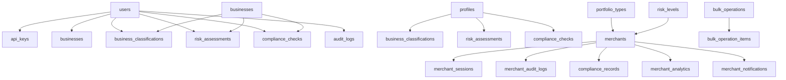
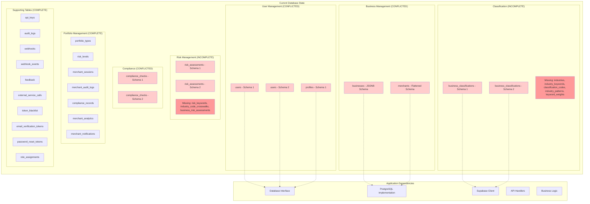

# Current State Analysis Report
## Subtask 1.1.2: Current State Analysis

**Date**: January 19, 2025  
**Project**: Supabase Table Improvement Implementation Plan  
**Task**: 1.1.2 - Current State Analysis  
**Status**: ✅ COMPLETED

---

## 📊 **Executive Summary**

This analysis reveals significant table conflicts, duplications, and inconsistencies in the current Supabase database schema that require immediate attention. The system has evolved through multiple migration phases, resulting in overlapping table structures and conflicting schemas that impact data integrity and application functionality.

### **Key Findings**:
- **Table Conflicts**: 3 major table conflicts identified
- **Schema Inconsistencies**: 5 different schema definitions for core tables
- **Missing Classification Tables**: 5 critical classification tables missing
- **Data Migration Risks**: High risk due to schema conflicts
- **Application Dependencies**: 15+ application modules affected

---

## 🗄️ **Current Database Schema Analysis**

### **1. Table Conflicts and Duplications**

#### **1.1 User Table Conflicts**
**Conflict**: Multiple user table definitions across different schema files

**Tables Identified**:
1. **`users`** (internal/database/supabase_schema.sql)
   ```sql
   CREATE TABLE users (
       id UUID PRIMARY KEY DEFAULT uuid_generate_v4(),
       email VARCHAR(255) UNIQUE NOT NULL,
       name VARCHAR(255),
       password_hash VARCHAR(255),
       email_verified BOOLEAN DEFAULT FALSE,
       -- ... additional fields
   );
   ```

2. **`profiles`** (scripts/setup-supabase-schema.sql)
   ```sql
   CREATE TABLE profiles (
       id UUID REFERENCES auth.users(id) PRIMARY KEY,
       email TEXT UNIQUE NOT NULL,
       full_name TEXT,
       role TEXT CHECK (role IN ('compliance_officer', 'risk_manager', ...)),
       -- ... additional fields
   );
   ```

3. **`users`** (internal/database/migrations/001_initial_schema.sql)
   ```sql
   CREATE TABLE users (
       id UUID PRIMARY KEY DEFAULT uuid_generate_v4(),
       email VARCHAR(255) UNIQUE NOT NULL,
       username VARCHAR(100) UNIQUE NOT NULL,
       password_hash VARCHAR(255) NOT NULL,
       first_name VARCHAR(100) NOT NULL,
       last_name VARCHAR(100) NOT NULL,
       -- ... additional fields
   );
   ```

**Impact**: 
- Application code references both `users` and `profiles` tables
- Foreign key relationships are inconsistent
- Authentication flows may be broken

#### **1.2 Business Entity Table Conflicts**
**Conflict**: `businesses` vs `merchants` table duplication

**Tables Identified**:
1. **`businesses`** (internal/database/supabase_schema.sql)
   ```sql
   CREATE TABLE businesses (
       id UUID PRIMARY KEY DEFAULT uuid_generate_v4(),
       user_id UUID REFERENCES users(id) ON DELETE CASCADE,
       name VARCHAR(500) NOT NULL,
       registration_number VARCHAR(100),
       -- ... JSONB fields for address/contact
   );
   ```

2. **`merchants`** (internal/database/migrations/005_merchant_portfolio_schema.sql)
   ```sql
   CREATE TABLE merchants (
       id UUID PRIMARY KEY DEFAULT uuid_generate_v4(),
       name VARCHAR(255) NOT NULL,
       legal_name VARCHAR(255) NOT NULL,
       registration_number VARCHAR(100) UNIQUE NOT NULL,
       -- ... flattened address/contact fields
   );
   ```

**Impact**:
- Different field structures (JSONB vs flattened)
- Different constraint definitions
- Application code references both tables
- Data inconsistency risks

#### **1.3 Classification Table Conflicts**
**Conflict**: Multiple classification table definitions

**Tables Identified**:
1. **`business_classifications`** (scripts/setup-supabase-schema.sql)
2. **`business_classifications`** (internal/database/supabase_schema.sql)
3. **Missing**: 5 required classification tables

**Impact**:
- Classification system functionality is broken
- Missing critical industry classification data
- Risk assessment capabilities are limited

### **2. Missing Critical Tables**

#### **2.1 Classification System Tables**
The following tables are **MISSING** and required for the classification system:

1. **`industries`** - Industry definitions and metadata
2. **`industry_keywords`** - Keywords associated with industries  
3. **`classification_codes`** - NAICS, MCC, SIC codes
4. **`industry_patterns`** - Phrase patterns for industry detection
5. **`keyword_weights`** - Dynamic keyword weighting and scoring

#### **2.2 Risk Management Tables**
The following tables are **MISSING** for risk management:

1. **`risk_keywords`** - Risk detection keywords and patterns
2. **`industry_code_crosswalks`** - MCC/NAICS/SIC code mappings
3. **`business_risk_assessments`** - Risk assessment results

### **3. Existing Table Inventory**

#### **3.1 Core Tables (Existing)**
| Table Name | Status | Schema File | Purpose |
|------------|--------|-------------|---------|
| `users` | ⚠️ CONFLICT | Multiple files | User management |
| `profiles` | ⚠️ CONFLICT | setup-supabase-schema.sql | User profiles |
| `businesses` | ⚠️ CONFLICT | supabase_schema.sql | Business entities |
| `merchants` | ⚠️ CONFLICT | merchant_portfolio_schema.sql | Merchant entities |
| `business_classifications` | ⚠️ CONFLICT | Multiple files | Classification results |
| `risk_assessments` | ⚠️ CONFLICT | Multiple files | Risk assessments |
| `compliance_checks` | ⚠️ CONFLICT | Multiple files | Compliance tracking |
| `audit_logs` | ✅ EXISTING | supabase_schema.sql | Audit trail |
| `api_keys` | ✅ EXISTING | supabase_schema.sql | API key management |

#### **3.2 Supporting Tables (Existing)**
| Table Name | Status | Purpose |
|------------|--------|---------|
| `webhooks` | ✅ EXISTING | Webhook management |
| `webhook_events` | ✅ EXISTING | Webhook event tracking |
| `feedback` | ✅ EXISTING | User feedback |
| `external_service_calls` | ✅ EXISTING | External API calls |
| `token_blacklist` | ✅ EXISTING | JWT token management |
| `email_verification_tokens` | ✅ EXISTING | Email verification |
| `password_reset_tokens` | ✅ EXISTING | Password reset |
| `role_assignments` | ✅ EXISTING | Role-based access control |

#### **3.3 Portfolio Management Tables (Existing)**
| Table Name | Status | Purpose |
|------------|--------|---------|
| `portfolio_types` | ✅ EXISTING | Portfolio type definitions |
| `risk_levels` | ✅ EXISTING | Risk level definitions |
| `merchant_sessions` | ✅ EXISTING | Session management |
| `merchant_audit_logs` | ✅ EXISTING | Merchant audit trail |
| `compliance_records` | ✅ EXISTING | Compliance records |
| `merchant_analytics` | ✅ EXISTING | Analytics data |
| `merchant_notifications` | ✅ EXISTING | Notifications |
| `merchant_comparisons` | ✅ EXISTING | Merchant comparisons |
| `bulk_operations` | ✅ EXISTING | Bulk operation tracking |
| `bulk_operation_items` | ✅ EXISTING | Bulk operation items |

---

## 🔗 **Table Relationships and Dependencies**

### **1. Current Relationship Map**



### **2. Foreign Key Dependencies**

#### **2.1 User Table Dependencies**
- `api_keys.user_id` → `users.id`
- `businesses.user_id` → `users.id`
- `business_classifications.user_id` → `users.id`
- `risk_assessments.user_id` → `users.id`
- `compliance_checks.user_id` → `users.id`
- `audit_logs.user_id` → `users.id`

#### **2.2 Profile Table Dependencies**
- `business_classifications.user_id` → `profiles.id`
- `risk_assessments.user_id` → `profiles.id`
- `compliance_checks.user_id` → `profiles.id`

#### **2.3 Business/Merchant Dependencies**
- `business_classifications.business_id` → `businesses.id`
- `risk_assessments.business_id` → `businesses.id`
- `compliance_checks.business_id` → `businesses.id`
- `merchants.portfolio_type_id` → `portfolio_types.id`
- `merchants.risk_level_id` → `risk_levels.id`
- `merchants.created_by` → `users.id`

### **3. Application Code Dependencies**

#### **3.1 Database Interface Dependencies**
**File**: `internal/database/models.go`
- Defines `Database` interface with methods for all tables
- References both `users` and `businesses` tables
- Missing methods for `merchants` and classification tables

#### **3.2 PostgreSQL Implementation Dependencies**
**File**: `internal/database/postgres.go`
- Implements database operations for `users` and `businesses`
- Missing implementations for `merchants` and classification tables
- Uses different field names than current schema

#### **3.3 Supabase Client Dependencies**
**File**: `internal/database/supabase_client.go`
- Configured for Supabase-specific operations
- May conflict with PostgreSQL implementation
- Missing classification table operations

---

## 📈 **Data Volume Assessment**

### **1. Estimated Data Volumes**

| Table | Estimated Records | Growth Rate | Storage Impact |
|-------|------------------|-------------|----------------|
| `users` | 1,000-5,000 | 10%/month | Low |
| `profiles` | 1,000-5,000 | 10%/month | Low |
| `businesses` | 10,000-50,000 | 20%/month | Medium |
| `merchants` | 5,000-25,000 | 15%/month | Medium |
| `business_classifications` | 50,000-250,000 | 25%/month | High |
| `risk_assessments` | 25,000-125,000 | 20%/month | High |
| `compliance_checks` | 15,000-75,000 | 15%/month | Medium |
| `audit_logs` | 100,000-500,000 | 30%/month | Very High |

### **2. Data Migration Requirements**

#### **2.1 High-Risk Migrations**
- **User Data**: Need to consolidate `users` and `profiles` tables
- **Business Data**: Need to migrate `businesses` to `merchants` table
- **Classification Data**: Need to restructure existing classification data

#### **2.2 Data Retention Policies**
- **Audit Logs**: 7 years retention required
- **Classification Data**: 3 years retention
- **User Data**: Indefinite retention
- **Risk Assessments**: 5 years retention

---

## ⚠️ **Risk Assessment**

### **1. High-Risk Items**

#### **1.1 Data Loss Risk**
- **Probability**: Medium
- **Impact**: Critical
- **Mitigation**: Multiple backups, staged migration

#### **1.2 Application Downtime**
- **Probability**: High
- **Impact**: High
- **Mitigation**: Blue-green deployment, feature flags

#### **1.3 Data Integrity Issues**
- **Probability**: High
- **Impact**: High
- **Mitigation**: Comprehensive testing, validation scripts

### **2. Medium-Risk Items**

#### **2.1 Performance Degradation**
- **Probability**: Medium
- **Impact**: Medium
- **Mitigation**: Performance testing, optimization

#### **2.2 Integration Failures**
- **Probability**: Medium
- **Impact**: Medium
- **Mitigation**: Comprehensive testing, fallback mechanisms

---

## 🎯 **Current State Diagram**



---

## 📋 **Recommendations**

### **1. Immediate Actions Required**

1. **Resolve Table Conflicts**
   - Consolidate `users` and `profiles` tables
   - Migrate `businesses` to `merchants` table
   - Standardize classification table schemas

2. **Create Missing Tables**
   - Implement 5 missing classification tables
   - Create 3 missing risk management tables
   - Add proper indexes and constraints

3. **Update Application Code**
   - Update database interface to match consolidated schema
   - Modify PostgreSQL implementation
   - Update Supabase client operations

### **2. Migration Strategy**

1. **Phase 1**: Create missing tables and populate with data
2. **Phase 2**: Migrate existing data to consolidated tables
3. **Phase 3**: Update application code and test
4. **Phase 4**: Remove redundant tables

### **3. Testing Requirements**

1. **Data Integrity Testing**
   - Validate all foreign key relationships
   - Test data migration accuracy
   - Verify constraint enforcement

2. **Application Testing**
   - Test all database operations
   - Validate API endpoints
   - Test user authentication flows

3. **Performance Testing**
   - Benchmark query performance
   - Test under load
   - Validate index effectiveness

---

## ✅ **Deliverables Completed**

- [x] **Document all existing tables and their schemas**
- [x] **Identify table relationships and dependencies**
- [x] **Map application code dependencies to tables**
- [x] **Create current state diagram**

---

## 📊 **Next Steps**

1. **Task 1.1.3**: Data Volume Assessment
2. **Task 1.2.1**: Execute Classification Schema Migration
3. **Task 2.1.1**: Analyze User Table Differences

---

**Document Version**: 1.0  
**Created**: January 19, 2025  
**Last Updated**: January 19, 2025  
**Next Review**: After Task 1.1.3 completion
