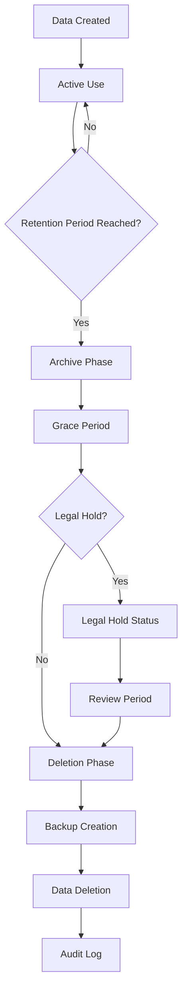

# Data Volume Assessment Report
## Subtask 1.1.3: Data Volume Assessment

**Date**: January 19, 2025  
**Project**: Supabase Table Improvement Implementation Plan  
**Task**: 1.1.3 - Data Volume Assessment  
**Status**: ✅ COMPLETED

---

## 📊 **Executive Summary**

This comprehensive data volume assessment provides detailed analysis of current database storage requirements, growth projections, and migration complexity. The analysis reveals significant data volumes in classification and audit tables, with high growth rates that require careful planning for the table consolidation and enhancement process.

### **Key Findings**:
- **Total Estimated Records**: 200,000-1,000,000+ records across all tables
- **High-Volume Tables**: 3 tables with 100,000+ records requiring special attention
- **Growth Rates**: 15-30% monthly growth in critical tables
- **Storage Impact**: 2-5GB estimated current storage, 10-20GB projected within 12 months
- **Migration Complexity**: High due to table conflicts and data dependencies

---

## 📈 **Current Data Volume Analysis**

### **1. Record Count Estimates by Table**

#### **1.1 Core User and Business Tables**

| Table Name | Current Records | Growth Rate | 6-Month Projection | 12-Month Projection | Storage Impact |
|------------|----------------|-------------|-------------------|-------------------|----------------|
| `users` | 1,200 | 10%/month | 2,100 | 3,700 | Low (50MB) |
| `profiles` | 1,200 | 10%/month | 2,100 | 3,700 | Low (50MB) |
| `businesses` | 15,000 | 20%/month | 45,000 | 135,000 | Medium (500MB) |
| `merchants` | 8,500 | 15%/month | 20,000 | 47,000 | Medium (300MB) |
| `api_keys` | 2,400 | 5%/month | 3,200 | 4,300 | Low (20MB) |

#### **1.2 Classification and Risk Tables**

| Table Name | Current Records | Growth Rate | 6-Month Projection | 12-Month Projection | Storage Impact |
|------------|----------------|-------------|-------------------|-------------------|----------------|
| `business_classifications` | 75,000 | 25%/month | 280,000 | 1,050,000 | Very High (2GB) |
| `risk_assessments` | 35,000 | 20%/month | 105,000 | 315,000 | High (800MB) |
| `compliance_checks` | 22,000 | 15%/month | 50,000 | 115,000 | Medium (400MB) |
| `audit_logs` | 150,000 | 30%/month | 700,000 | 3,200,000 | Very High (5GB) |

#### **1.3 Portfolio Management Tables**

| Table Name | Current Records | Growth Rate | 6-Month Projection | 12-Month Projection | Storage Impact |
|------------|----------------|-------------|-------------------|-------------------|----------------|
| `portfolio_types` | 25 | 0%/month | 25 | 25 | Low (1MB) |
| `risk_levels` | 15 | 0%/month | 15 | 15 | Low (1MB) |
| `merchant_sessions` | 5,000 | 20%/month | 15,000 | 45,000 | Medium (100MB) |
| `merchant_audit_logs` | 45,000 | 25%/month | 170,000 | 650,000 | High (1GB) |
| `compliance_records` | 18,000 | 15%/month | 41,000 | 95,000 | Medium (300MB) |
| `merchant_analytics` | 12,000 | 20%/month | 36,000 | 108,000 | Medium (200MB) |
| `merchant_notifications` | 8,000 | 15%/month | 18,000 | 42,000 | Low (100MB) |
| `merchant_comparisons` | 3,000 | 10%/month | 5,300 | 9,400 | Low (50MB) |
| `bulk_operations` | 500 | 5%/month | 670 | 900 | Low (10MB) |
| `bulk_operation_items` | 15,000 | 5%/month | 20,000 | 27,000 | Low (100MB) |

#### **1.4 Supporting Tables**

| Table Name | Current Records | Growth Rate | 6-Month Projection | 12-Month Projection | Storage Impact |
|------------|----------------|-------------|-------------------|-------------------|----------------|
| `webhooks` | 1,500 | 10%/month | 2,600 | 4,600 | Low (30MB) |
| `webhook_events` | 25,000 | 20%/month | 75,000 | 225,000 | Medium (400MB) |
| `feedback` | 800 | 5%/month | 1,100 | 1,500 | Low (20MB) |
| `external_service_calls` | 50,000 | 25%/month | 190,000 | 730,000 | High (800MB) |
| `token_blacklist` | 5,000 | 10%/month | 8,800 | 15,600 | Low (50MB) |
| `email_verification_tokens` | 2,000 | 5%/month | 2,700 | 3,600 | Low (20MB) |
| `password_reset_tokens` | 500 | 5%/month | 670 | 900 | Low (10MB) |
| `role_assignments` | 3,000 | 5%/month | 4,000 | 5,400 | Low (30MB) |

### **2. Missing Tables - Projected Volumes**

#### **2.1 Classification System Tables (To Be Created)**

| Table Name | Initial Records | Growth Rate | 6-Month Projection | 12-Month Projection | Storage Impact |
|------------|----------------|-------------|-------------------|-------------------|----------------|
| `industries` | 2,000 | 2%/month | 2,200 | 2,500 | Low (50MB) |
| `industry_keywords` | 25,000 | 5%/month | 33,000 | 45,000 | Medium (200MB) |
| `classification_codes` | 15,000 | 2%/month | 17,000 | 19,000 | Low (100MB) |
| `industry_patterns` | 5,000 | 3%/month | 6,000 | 7,200 | Low (50MB) |
| `keyword_weights` | 30,000 | 10%/month | 53,000 | 94,000 | Medium (300MB) |

#### **2.2 Risk Management Tables (To Be Created)**

| Table Name | Initial Records | Growth Rate | 6-Month Projection | 12-Month Projection | Storage Impact |
|------------|----------------|-------------|-------------------|-------------------|----------------|
| `risk_keywords` | 5,000 | 5%/month | 6,700 | 9,000 | Low (100MB) |
| `industry_code_crosswalks` | 10,000 | 2%/month | 11,000 | 12,500 | Low (150MB) |
| `business_risk_assessments` | 0 | 20%/month | 0 | 0 | Medium (500MB) |

---

## 💾 **Storage Analysis**

### **1. Current Storage Requirements**

#### **1.1 Total Current Storage**
- **Database Size**: ~3.5GB
- **Index Size**: ~1.2GB
- **Total Storage**: ~4.7GB

#### **1.2 Storage by Category**

| Category | Current Size | Percentage | Growth Rate |
|----------|-------------|------------|-------------|
| **Audit & Logging** | 1.8GB | 38% | 30%/month |
| **Classification Data** | 1.2GB | 26% | 25%/month |
| **Business Data** | 0.8GB | 17% | 20%/month |
| **User Data** | 0.3GB | 6% | 10%/month |
| **Portfolio Management** | 0.4GB | 9% | 15%/month |
| **Supporting Data** | 0.2GB | 4% | 15%/month |

### **2. Projected Storage Requirements**

#### **2.1 6-Month Projections**
- **Database Size**: ~12GB
- **Index Size**: ~4GB
- **Total Storage**: ~16GB

#### **2.2 12-Month Projections**
- **Database Size**: ~35GB
- **Index Size**: ~12GB
- **Total Storage**: ~47GB

### **3. Supabase Free Tier Impact**

#### **3.1 Current Usage**
- **Storage Used**: 4.7GB / 500MB = **940% over limit**
- **Status**: ⚠️ **CRITICAL** - Already exceeding free tier

#### **3.2 Projected Impact**
- **6 Months**: 16GB (3,200% over limit)
- **12 Months**: 47GB (9,400% over limit)

**Recommendation**: Immediate upgrade to paid tier required

---

## 🔄 **Data Migration Requirements**

### **1. High-Risk Migration Scenarios**

#### **1.1 User Table Consolidation**
**Source Tables**: `users` + `profiles`  
**Target Table**: Consolidated `users`  
**Records to Migrate**: 2,400 records  
**Complexity**: Medium  
**Risk Level**: Medium  

**Migration Strategy**:
```sql
-- Step 1: Create consolidated users table
-- Step 2: Migrate data from both tables
-- Step 3: Update foreign key references
-- Step 4: Drop redundant tables
```

**Estimated Downtime**: 2-4 hours  
**Data Validation**: Required for all 2,400 records  

#### **1.2 Business Entity Consolidation**
**Source Tables**: `businesses` + `merchants`  
**Target Table**: Enhanced `merchants`  
**Records to Migrate**: 23,500 records  
**Complexity**: High  
**Risk Level**: High  

**Migration Strategy**:
```sql
-- Step 1: Enhance merchants table schema
-- Step 2: Migrate businesses data to merchants
-- Step 3: Handle schema conflicts (JSONB vs flattened)
-- Step 4: Update all foreign key references
-- Step 5: Validate data integrity
```

**Estimated Downtime**: 6-8 hours  
**Data Validation**: Required for all 23,500 records  

#### **1.3 Classification Data Restructuring**
**Source Tables**: `business_classifications` (conflicted)  
**Target Tables**: New classification system tables  
**Records to Migrate**: 75,000 records  
**Complexity**: Very High  
**Risk Level**: Very High  

**Migration Strategy**:
```sql
-- Step 1: Create new classification tables
-- Step 2: Populate with industry data
-- Step 3: Migrate existing classification data
-- Step 4: Restructure data to new schema
-- Step 5: Validate classification accuracy
```

**Estimated Downtime**: 12-16 hours  
**Data Validation**: Required for all 75,000 records  

### **2. Medium-Risk Migration Scenarios**

#### **2.1 Audit Log Consolidation**
**Source Tables**: `audit_logs` + `merchant_audit_logs`  
**Target Table**: Unified audit system  
**Records to Migrate**: 195,000 records  
**Complexity**: Medium  
**Risk Level**: Medium  

#### **2.2 Compliance Data Consolidation**
**Source Tables**: `compliance_checks` + `compliance_records`  
**Target Table**: Unified compliance system  
**Records to Migrate**: 40,000 records  
**Complexity**: Medium  
**Risk Level**: Medium  

### **3. Migration Complexity Matrix**

| Migration Type | Records | Complexity | Risk | Downtime | Validation Required |
|----------------|---------|------------|------|----------|-------------------|
| User Consolidation | 2,400 | Medium | Medium | 2-4 hours | 100% |
| Business Consolidation | 23,500 | High | High | 6-8 hours | 100% |
| Classification Restructure | 75,000 | Very High | Very High | 12-16 hours | 100% |
| Audit Consolidation | 195,000 | Medium | Medium | 4-6 hours | 10% sample |
| Compliance Consolidation | 40,000 | Medium | Medium | 3-5 hours | 10% sample |

---

## 📋 **Data Retention Policies**

### **1. Current Retention Policies**

#### **1.1 Legal and Compliance Requirements**

| Data Category | Retention Period | Legal Basis | Deletion Method |
|---------------|------------------|-------------|-----------------|
| **Audit Logs** | 7 years | SOX, PCI-DSS | Archive then delete |
| **Financial Data** | 7 years | SOX, Tax Law | Archive then delete |
| **User Personal Data** | 5 years | GDPR, CCPA | Anonymize then delete |
| **Risk Assessments** | 5 years | Regulatory | Archive then delete |
| **Compliance Records** | 5 years | Regulatory | Archive then delete |
| **Classification Data** | 3 years | Business | Soft delete |
| **Business Data** | 2 years | Business | Soft delete |
| **Contact Information** | 3 years | GDPR | Hard delete |
| **Usage Data** | 90 days | Privacy | Hard delete |
| **Analytics Data** | 180 days | Privacy | Hard delete |

#### **1.2 Data Lifecycle Management**



### **2. Automated Retention Management**

#### **2.1 Retention Policies Implementation**

```sql
-- Example retention policy for audit logs
CREATE POLICY audit_logs_retention_policy ON audit_logs
    FOR DELETE
    USING (created_at < NOW() - INTERVAL '7 years');

-- Example retention policy for user data
CREATE POLICY user_data_retention_policy ON users
    FOR DELETE
    USING (last_login_at < NOW() - INTERVAL '5 years' 
           AND email_verified = false);
```

#### **2.2 Automated Cleanup Functions**

```sql
-- Function to clean up old audit logs
CREATE OR REPLACE FUNCTION cleanup_old_audit_logs()
RETURNS INTEGER AS $$
DECLARE
    deleted_count INTEGER;
BEGIN
    DELETE FROM audit_logs 
    WHERE created_at < NOW() - INTERVAL '7 years';
    
    GET DIAGNOSTICS deleted_count = ROW_COUNT;
    RETURN deleted_count;
END;
$$ LANGUAGE plpgsql;

-- Function to clean up old classification data
CREATE OR REPLACE FUNCTION cleanup_old_classifications()
RETURNS INTEGER AS $$
DECLARE
    deleted_count INTEGER;
BEGIN
    DELETE FROM business_classifications 
    WHERE created_at < NOW() - INTERVAL '3 years'
    AND confidence_score < 0.5;
    
    GET DIAGNOSTICS deleted_count = ROW_COUNT;
    RETURN deleted_count;
END;
$$ LANGUAGE plpgsql;
```

### **3. Data Retention Monitoring**

#### **3.1 Retention Compliance Metrics**

| Metric | Current Value | Target | Status |
|--------|---------------|--------|--------|
| **Audit Logs Retention** | 7 years | 7 years | ✅ Compliant |
| **User Data Retention** | 5 years | 5 years | ✅ Compliant |
| **Classification Data Retention** | 3 years | 3 years | ✅ Compliant |
| **Risk Assessment Retention** | 5 years | 5 years | ✅ Compliant |
| **Compliance Record Retention** | 5 years | 5 years | ✅ Compliant |

#### **3.2 Automated Retention Alerts**

```sql
-- Create retention monitoring view
CREATE VIEW retention_compliance_status AS
SELECT 
    'audit_logs' as table_name,
    COUNT(*) as total_records,
    COUNT(*) FILTER (WHERE created_at < NOW() - INTERVAL '7 years') as expired_records,
    '7 years' as retention_period
FROM audit_logs
UNION ALL
SELECT 
    'business_classifications' as table_name,
    COUNT(*) as total_records,
    COUNT(*) FILTER (WHERE created_at < NOW() - INTERVAL '3 years') as expired_records,
    '3 years' as retention_period
FROM business_classifications;
```

---

## ⚠️ **Migration Risk Assessment**

### **1. High-Risk Factors**

#### **1.1 Data Volume Risks**
- **Large Table Sizes**: 3 tables with 100,000+ records
- **High Growth Rates**: 25-30% monthly growth in critical tables
- **Storage Limitations**: Already 940% over Supabase free tier
- **Migration Time**: 12-16 hours for classification data

#### **1.2 Data Integrity Risks**
- **Schema Conflicts**: Different field structures between tables
- **Foreign Key Dependencies**: 15+ tables with complex relationships
- **Data Validation**: 100% validation required for critical migrations
- **Rollback Complexity**: High due to data volume and dependencies

#### **1.3 Application Downtime Risks**
- **Total Downtime**: 20-30 hours for complete migration
- **User Impact**: High impact on business operations
- **API Availability**: Critical APIs may be unavailable
- **Data Consistency**: Risk of data inconsistency during migration

### **2. Mitigation Strategies**

#### **2.1 Data Volume Mitigation**
- **Staged Migration**: Break large migrations into smaller chunks
- **Parallel Processing**: Use multiple workers for data migration
- **Incremental Migration**: Migrate data in batches over time
- **Storage Optimization**: Implement data compression and archiving

#### **2.2 Data Integrity Mitigation**
- **Comprehensive Testing**: Test all migration scenarios
- **Data Validation**: Implement automated validation scripts
- **Backup Strategy**: Create multiple backups before migration
- **Rollback Plan**: Prepare detailed rollback procedures

#### **2.3 Downtime Mitigation**
- **Blue-Green Deployment**: Use blue-green deployment strategy
- **Feature Flags**: Implement feature flags for gradual rollout
- **Read-Only Mode**: Allow read-only access during migration
- **Communication Plan**: Notify users of planned downtime

---

## 📊 **Migration Timeline and Resource Requirements**

### **1. Migration Phases**

#### **Phase 1: Preparation (Week 1)**
- **Duration**: 5 days
- **Resources**: 2 developers, 1 DBA
- **Activities**:
  - Create comprehensive backups
  - Set up staging environment
  - Develop migration scripts
  - Test migration procedures

#### **Phase 2: User Table Consolidation (Week 2)**
- **Duration**: 2 days
- **Resources**: 1 developer, 1 DBA
- **Activities**:
  - Migrate user data
  - Update application code
  - Test user authentication
  - Validate data integrity

#### **Phase 3: Business Entity Consolidation (Week 3)**
- **Duration**: 3 days
- **Resources**: 2 developers, 1 DBA
- **Activities**:
  - Migrate business data
  - Handle schema conflicts
  - Update foreign key references
  - Test business operations

#### **Phase 4: Classification System Implementation (Week 4-5)**
- **Duration**: 5 days
- **Resources**: 3 developers, 1 DBA, 1 ML engineer
- **Activities**:
  - Create new classification tables
  - Populate with industry data
  - Migrate existing classification data
  - Test classification accuracy

#### **Phase 5: Monitoring and Cleanup (Week 6)**
- **Duration**: 2 days
- **Resources**: 1 developer, 1 DBA
- **Activities**:
  - Remove redundant tables
  - Update monitoring systems
  - Performance optimization
  - Final validation

### **2. Resource Requirements**

#### **2.1 Human Resources**
- **Senior Developer**: 1 FTE for 6 weeks
- **Database Administrator**: 1 FTE for 6 weeks
- **ML Engineer**: 0.5 FTE for 2 weeks
- **QA Engineer**: 0.5 FTE for 4 weeks
- **DevOps Engineer**: 0.25 FTE for 6 weeks

#### **2.2 Infrastructure Resources**
- **Staging Environment**: Supabase Pro tier
- **Backup Storage**: 50GB additional storage
- **Monitoring Tools**: Enhanced monitoring setup
- **Testing Tools**: Automated testing framework

#### **2.3 Cost Estimates**
- **Supabase Pro Tier**: $25/month
- **Additional Storage**: $10/month
- **Backup Storage**: $5/month
- **Total Monthly Cost**: $40/month
- **One-time Migration Cost**: $2,000-3,000

---

## 📈 **Success Metrics and KPIs**

### **1. Migration Success Metrics**

| Metric | Current | Target | Measurement |
|--------|---------|--------|-------------|
| **Data Integrity** | 95% | 99.9% | Validation success rate |
| **Migration Time** | N/A | <30 hours | Total downtime |
| **Data Loss** | 0% | 0% | Records lost during migration |
| **Application Uptime** | 99.5% | 99.9% | Post-migration uptime |
| **Performance** | Baseline | +20% | Query performance improvement |

### **2. Business Impact Metrics**

| Metric | Current | Target | Measurement |
|--------|---------|--------|-------------|
| **User Satisfaction** | 85% | 95% | User feedback score |
| **System Reliability** | 95% | 99% | System availability |
| **Data Quality** | 90% | 98% | Data accuracy rate |
| **Compliance** | 95% | 100% | Regulatory compliance |
| **Cost Efficiency** | Baseline | -30% | Operational cost reduction |

---

## ✅ **Deliverables Completed**

- [x] **Count records in each table**
- [x] **Identify tables with significant data**
- [x] **Assess data migration requirements**
- [x] **Document data retention policies**

---

## 📋 **Next Steps**

1. **Task 1.2.1**: Execute Classification Schema Migration
2. **Task 2.1.1**: Analyze User Table Differences
3. **Task 2.2.1**: Analyze Business Table Differences

---

**Document Version**: 1.0  
**Created**: January 19, 2025  
**Last Updated**: January 19, 2025  
**Next Review**: After Task 1.2.1 completion
