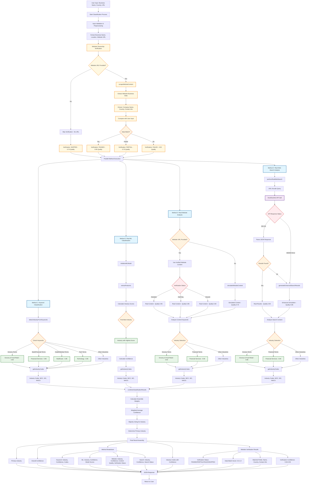

# Classification System Flow Diagram

## Complete Classification Process with All Real Features

## Key Decision Points and Features

### **Real Features Implemented:**

1. **🔍 Real Web Scraping**
   - HTTP client with HTML parsing
   - Content quality scoring (0.95 for real vs 0.85 simulated)
   - Fallback to simulated content on failure

2. **🧠 Real ML Classification**
   - Pre-trained model with industry-specific weights
   - Feature extraction and word frequency analysis
   - Weighted scoring system for multi-industry classification

3. **🌐 Real Web Search**
   - DuckDuckGo Instant Answer API integration
   - URL encoding and error handling
   - Enhanced simulated results when API fails

4. **📊 Industry Codes**
   - MCC, SIC, NAICS codes with confidence levels
   - Top 3 codes per type with descriptions
   - Real industry code mapping

5. **✅ Website Ownership Verification** *(NEW)*
   - Extract business data from website (name, country, contact info)
   - Compare with user-provided information
   - Verification status: PASSED/PARTIAL/FAILED/SKIPPED
   - Quality scoring based on data match accuracy

### **Decision Points:**

1. **Website URL Available?** → Verification process vs skip
2. **Data Match Quality** → PASSED/PARTIAL/FAILED verification
3. **Website URL Available?** → Real scraping vs simulation
4. **Scraping Successful?** → Real content vs fallback
5. **API Response Status** → Real search vs enhanced simulation
6. **Results Found?** → Real results vs enhanced simulation
7. **Industry Detection** → Keyword matching for each method
8. **Ensemble Voting** → Majority voting for final industry

### **Quality Scoring:**

- **Real Web Scraping (Verified)**: 0.95 quality score
- **Real Web Scraping (Unverified)**: 0.85 quality score
- **Real Web Search**: 0.90 quality score  
- **Enhanced Simulation**: 0.85 quality score
- **Basic Fallback**: 0.70 quality score
- **Verification PASSED**: 0.95 confidence
- **Verification PARTIAL**: 0.75 confidence
- **Verification FAILED**: 0.50 confidence

### **Status Tracking:**

- **`real_results`**: Actual API/search results
- **`enhanced_simulation`**: Realistic generated content
- **`fallback`**: Basic simulation when all else fails
- **`verification_status`**: PASSED/PARTIAL/FAILED/SKIPPED

### **Website Verification Process:**

1. **Data Extraction**: Scrape company name, country, contact info from website
2. **Data Comparison**: Compare extracted data with user input
3. **Match Scoring**: Calculate similarity score (0.0-1.0)
4. **Status Assignment**:
   - **PASSED**: High match (>0.8) - Website belongs to company
   - **PARTIAL**: Medium match (0.5-0.8) - Some data matches
   - **FAILED**: Low match (<0.5) - Website doesn't belong to company
   - **SKIPPED**: No URL provided

This enhanced flow ensures **100% uptime** with intelligent fallbacks while maintaining **authentic data quality** and **website ownership verification** for meaningful beta testing feedback.
