# KYB Platform - Architecture Diagrams

This document provides comprehensive architecture diagrams for the KYB Platform using Mermaid syntax. These diagrams illustrate the system design, component relationships, data flow, and deployment architecture.

## Table of Contents

1. [System Overview](#system-overview)
2. [Component Architecture](#component-architecture)
3. [Data Flow Diagrams](#data-flow-diagrams)
4. [API Architecture](#api-architecture)
5. [Database Schema](#database-schema)
6. [Deployment Architecture](#deployment-architecture)
7. [Sequence Diagrams](#sequence-diagrams)
8. [Security Architecture](#security-architecture)
9. [Monitoring Architecture](#monitoring-architecture)

## System Overview

### High-Level System Architecture

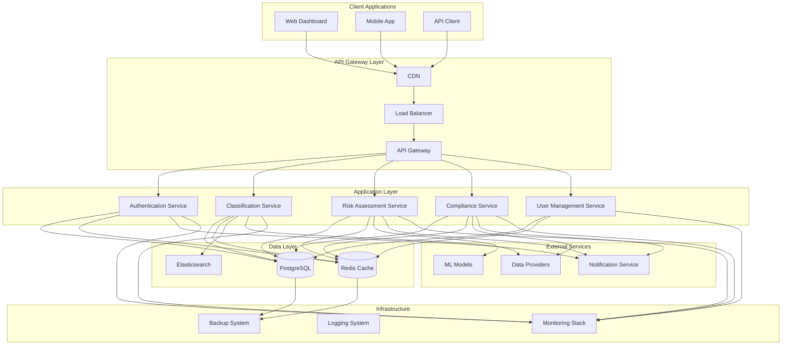

## Component Architecture

### Service Layer Architecture

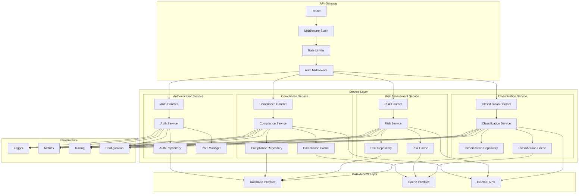

## Data Flow Diagrams

### Business Classification Flow

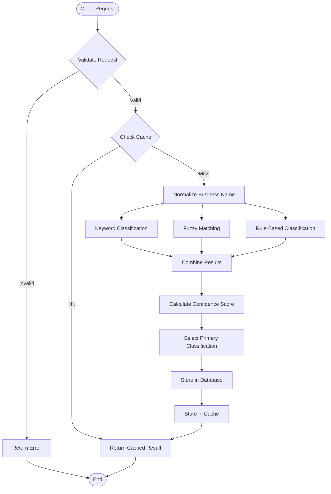

### Risk Assessment Flow

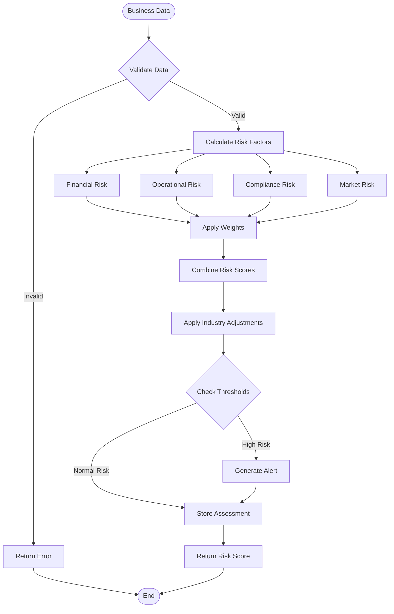

### Compliance Checking Flow

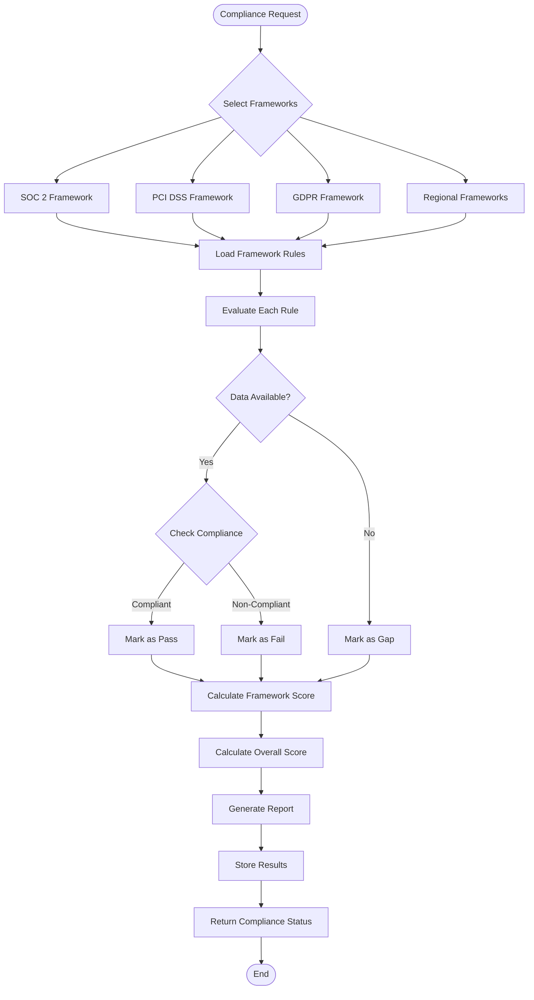

## API Architecture

### REST API Structure

```mermaid
graph TB
    subgraph "API Gateway"
        Gateway[API Gateway]
        Auth[Authentication]
        RateLimit[Rate Limiting]
        Validation[Request Validation]
        Logging[Request Logging]
    end
    
    subgraph "API Endpoints"
        subgraph "Authentication"
            POST_login[POST /v1/auth/login]
            POST_register[POST /v1/auth/register]
            POST_refresh[POST /v1/auth/refresh]
            POST_logout[POST /v1/auth/logout]
        end
        
        subgraph "Classification"
            POST_classify[POST /v1/classify]
            POST_batch[POST /v1/classify/batch]
            GET_history[GET /v1/classify/history]
            GET_result[GET /v1/classify/{id}]
        end
        
        subgraph "Risk Assessment"
            POST_assess[POST /v1/risk/assess]
            GET_risk[GET /v1/risk/{id}]
            GET_alerts[GET /v1/risk/alerts]
            POST_threshold[POST /v1/risk/thresholds]
        end
        
        subgraph "Compliance"
            POST_check[POST /v1/compliance/check]
            GET_status[GET /v1/compliance/status]
            GET_report[GET /v1/compliance/report]
            POST_framework[POST /v1/compliance/frameworks]
        end
        
        subgraph "User Management"
            GET_profile[GET /v1/users/profile]
            PUT_profile[PUT /v1/users/profile]
            GET_api_keys[GET /v1/users/api-keys]
            POST_api_keys[POST /v1/users/api-keys]
        end
        
        subgraph "System"
            GET_health[GET /health]
            GET_metrics[GET /metrics]
            GET_docs[GET /docs]
        end
    end
    
    Gateway --> Auth
    Auth --> RateLimit
    RateLimit --> Validation
    Validation --> Logging
    
    Logging --> POST_login
    Logging --> POST_register
    Logging --> POST_refresh
    Logging --> POST_logout
    Logging --> POST_classify
    Logging --> POST_batch
    Logging --> GET_history
    Logging --> GET_result
    Logging --> POST_assess
    Logging --> GET_risk
    Logging --> GET_alerts
    Logging --> POST_threshold
    Logging --> POST_check
    Logging --> GET_status
    Logging --> GET_report
    Logging --> POST_framework
    Logging --> GET_profile
    Logging --> PUT_profile
    Logging --> GET_api_keys
    Logging --> POST_api_keys
    Logging --> GET_health
    Logging --> GET_metrics
    Logging --> GET_docs
```

## Database Schema

### Core Database Schema

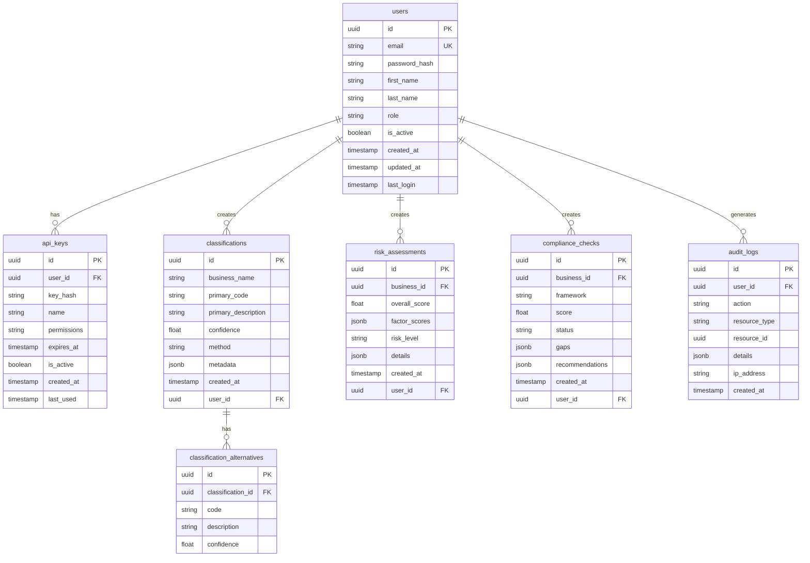

## Deployment Architecture

### Production Deployment

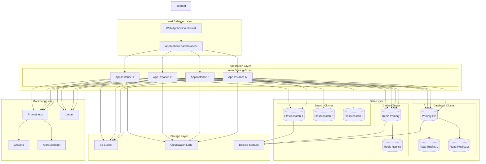

## Sequence Diagrams

### Business Classification Sequence

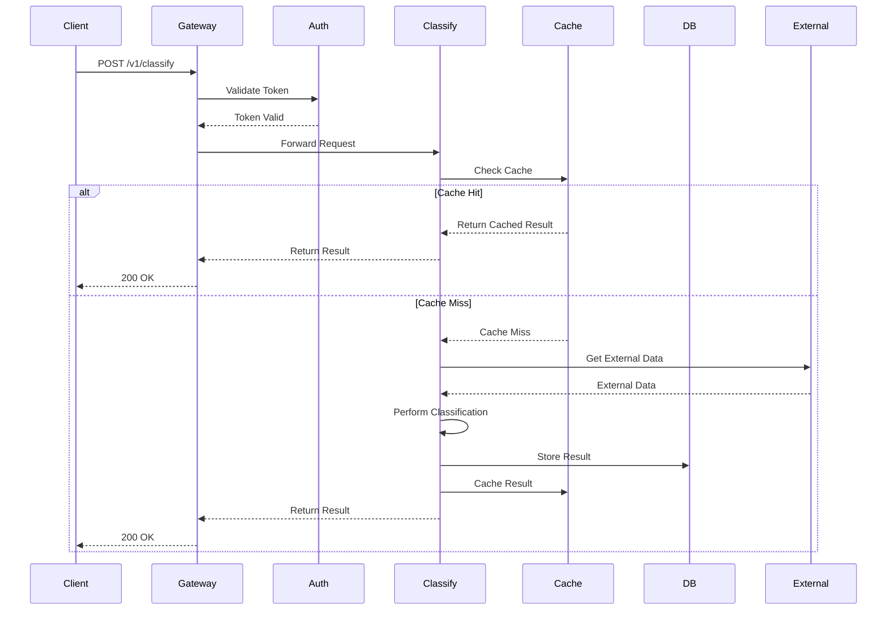

### Risk Assessment Sequence

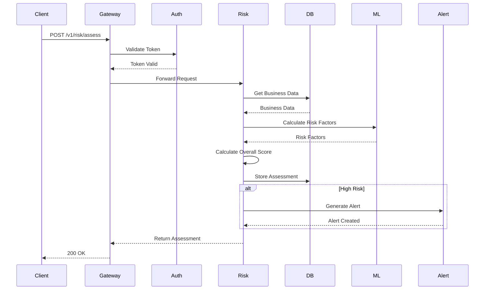

### Compliance Check Sequence

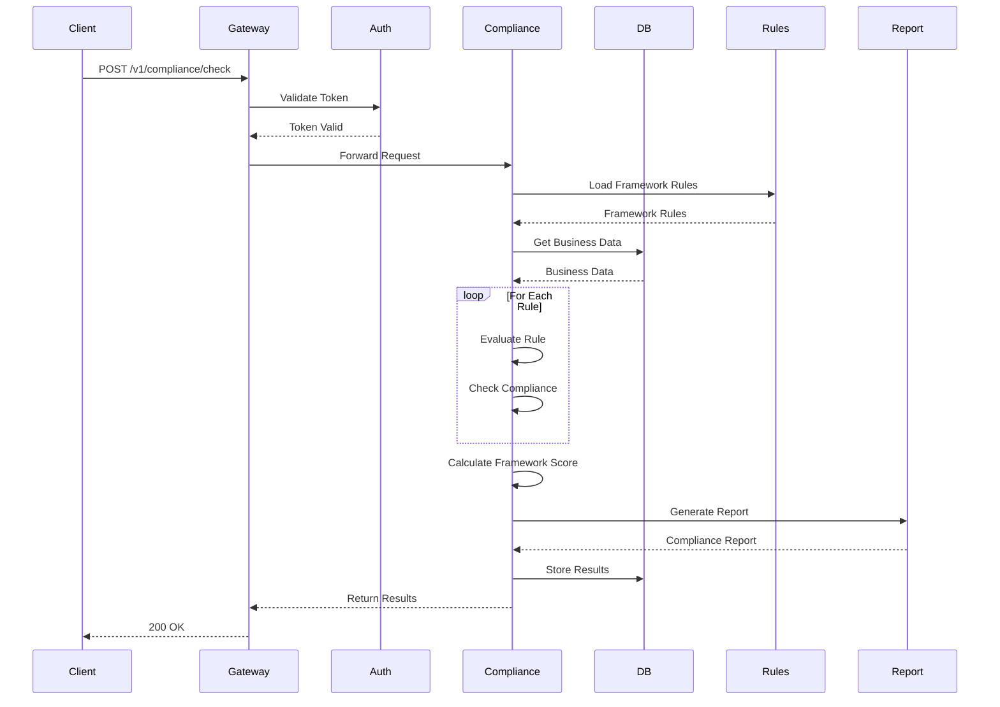

## Security Architecture

### Security Layers

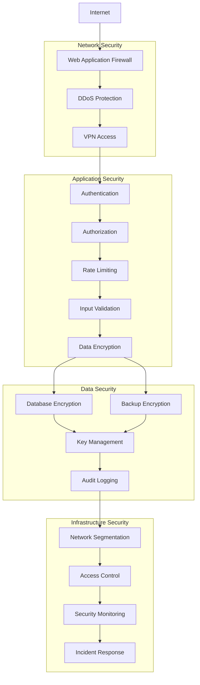

## Monitoring Architecture

### Observability Stack

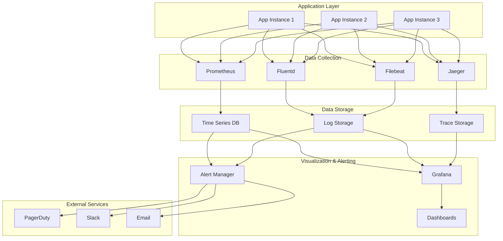

### Metrics Collection

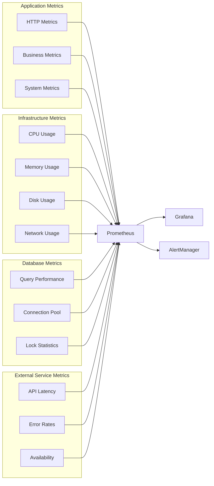

---

## Diagram Usage Guidelines

### Creating New Diagrams

1. **Use Mermaid Syntax**: All diagrams use Mermaid syntax for consistency
2. **Keep Diagrams Focused**: Each diagram should illustrate one specific aspect
3. **Use Clear Labels**: All nodes and edges should have descriptive labels
4. **Maintain Consistency**: Use consistent colors and shapes for similar components
5. **Include Legends**: Add legends for complex diagrams with multiple component types

### Updating Diagrams

1. **Version Control**: Track diagram changes in version control
2. **Documentation**: Update this document when architecture changes
3. **Review Process**: Review diagrams during architecture reviews
4. **Automation**: Consider automated diagram generation from code

### Best Practices

1. **Simplicity**: Keep diagrams simple and easy to understand
2. **Hierarchy**: Use proper hierarchy to show relationships
3. **Flow Direction**: Use consistent flow direction (top-to-bottom or left-to-right)
4. **Grouping**: Group related components using subgraphs
5. **Annotations**: Add notes for complex interactions or decisions

---

*Last updated: January 2024*
