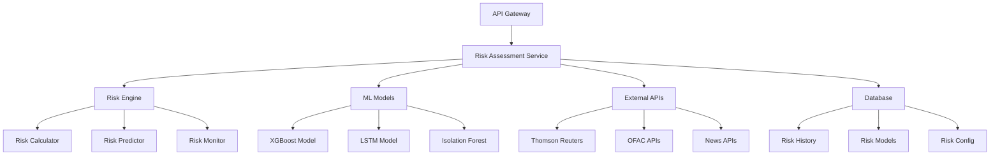

# Dedicated Risk Assessment Service Implementation Plan

## Executive Summary

This document outlines the comprehensive implementation plan for a dedicated Risk Assessment Service that will provide advanced risk intelligence, predictive analytics, and real-time monitoring capabilities beyond what's currently available in the classification service.

## Table of Contents

1. [Project Overview](#project-overview)
2. [Current State Analysis](#current-state-analysis)
3. [Target Architecture](#target-architecture)
4. [Implementation Phases](#implementation-phases)
5. [Technical Specifications](#technical-specifications)
6. [Data Sources & Integrations](#data-sources--integrations)
7. [Machine Learning Models](#machine-learning-models)
8. [API Design](#api-design)
9. [Infrastructure Requirements](#infrastructure-requirements)
10. [Cost Analysis](#cost-analysis)
11. [Risk Assessment](#risk-assessment)
12. [Success Metrics](#success-metrics)
13. [Timeline & Milestones](#timeline--milestones)

## Project Overview

### Objectives
- **Primary**: Create a dedicated, enterprise-grade risk assessment service
- **Secondary**: Provide advanced ML-powered risk prediction and monitoring
- **Tertiary**: Enable real-time risk intelligence and compliance monitoring

### Business Value
- **Revenue Impact**: Enable premium enterprise subscriptions ($500-2000/month)
- **Competitive Advantage**: Advanced risk intelligence vs. basic classification
- **Market Position**: Enterprise-grade risk management platform
- **Customer Retention**: Comprehensive risk monitoring reduces churn

### Success Criteria
- 95%+ risk prediction accuracy for 3-month forecasts
- <2 second response time for real-time risk assessments
- 99.9% service availability
- Support for 10,000+ concurrent risk assessments

## Current State Analysis

### Existing Capabilities (Classification Service)
```yaml
Current Risk Assessment:
  - Basic 4-category risk scoring (financial, operational, regulatory, cybersecurity)
  - Simple business name analysis
  - Website content analysis
  - Mock data generation
  - No external data integration
  - No predictive analytics
  - No real-time monitoring
  - No compliance tracking
```

### Limitations
- **Data Sources**: Limited to business name and website content
- **Analytics**: Basic scoring without predictive capabilities
- **Integration**: No external risk intelligence APIs
- **Monitoring**: No continuous risk monitoring
- **Compliance**: No regulatory compliance checking
- **Scalability**: Risk assessment tied to classification processing

## Target Architecture

### Service Architecture
```yaml
Risk Assessment Service:
  Technology: Python/FastAPI
  Database: PostgreSQL + Redis
  ML Framework: scikit-learn, XGBoost, TensorFlow
  Message Queue: Redis/RabbitMQ
  Monitoring: Prometheus + Grafana
  Logging: ELK Stack
  Deployment: Docker + Kubernetes
```

### Microservice Integration
```yaml
Service Dependencies:
  - Classification Service (industry data)
  - Data Ingestion Service (external data)
  - Compliance Service (regulatory data)
  - Notification Service (alerts)
  - Analytics Service (reporting)
```

### Data Flow Architecture


## Implementation Phases

### Phase 1: Foundation (Months 1-2)
**Objective**: Basic risk assessment service with core functionality

#### Deliverables
- [ ] Service architecture setup
- [ ] Basic risk calculation engine
- [ ] Database schema design
- [ ] Core API endpoints
- [ ] Basic ML models (XGBoost)
- [ ] Integration with classification service
- [ ] Unit and integration tests

#### Technical Tasks
```yaml
Week 1-2: Service Setup
  - FastAPI service structure
  - Database models and migrations
  - Basic risk calculation logic
  - API endpoint definitions

Week 3-4: Core Engine
  - Risk factor calculation
  - Risk score aggregation
  - Basic ML model training
  - Integration testing

Week 5-6: API Development
  - RESTful API implementation
  - Request/response validation
  - Error handling
  - API documentation

Week 7-8: Testing & Deployment
  - Unit test coverage (90%+)
  - Integration testing
  - Performance testing
  - Railway deployment
```

### Phase 2: Advanced Analytics (Months 3-4)
**Objective**: Predictive analytics and advanced risk modeling

#### Deliverables
- [ ] LSTM models for time-series prediction
- [ ] Risk trend analysis
- [ ] Scenario analysis capabilities
- [ ] Risk correlation analysis
- [ ] Advanced risk categories (8+ categories)
- [ ] Risk factor explainability (SHAP)

#### Technical Tasks
```yaml
Week 9-10: Advanced ML Models
  - LSTM model development
  - Time-series data preparation
  - Model training and validation
  - Performance optimization

Week 11-12: Risk Analytics
  - Trend analysis algorithms
  - Correlation analysis
  - Scenario modeling
  - Risk attribution

Week 13-14: Explainability
  - SHAP integration
  - Risk factor explanation
  - Model interpretability
  - Documentation

Week 15-16: Testing & Optimization
  - Model performance testing
  - A/B testing framework
  - Performance optimization
  - Load testing
```

### Phase 3: External Integration (Months 5-6)
**Objective**: Real-time external data integration and compliance

#### Deliverables
- [ ] Thomson Reuters World-Check integration
- [ ] OFAC/UN/EU sanctions screening
- [ ] Adverse media monitoring
- [ ] Financial data APIs integration
- [ ] Compliance reporting
- [ ] Audit trail generation

#### Technical Tasks
```yaml
Week 17-18: External APIs
  - API client development
  - Rate limiting implementation
  - Error handling and retries
  - Data normalization

Week 19-20: Compliance Integration
  - Sanctions screening
  - Regulatory compliance checks
  - Audit trail implementation
  - Compliance reporting

Week 21-22: Media Monitoring
  - News API integration
  - Sentiment analysis
  - Adverse media detection
  - Alert system

Week 23-24: Testing & Integration
  - End-to-end testing
  - Performance optimization
  - Security testing
  - Production deployment
```

### Phase 4: Enterprise Features (Months 7-8)
**Objective**: Enterprise-grade features and advanced monitoring

#### Deliverables
- [ ] Real-time risk monitoring
- [ ] Custom risk models
- [ ] Batch processing capabilities
- [ ] Advanced reporting and dashboards
- [ ] Webhook notifications
- [ ] Multi-tenant support

#### Technical Tasks
```yaml
Week 25-26: Real-time Monitoring
  - WebSocket implementation
  - Real-time risk updates
  - Alert system
  - Dashboard integration

Week 27-28: Custom Models
  - Model configuration system
  - Custom risk parameters
  - Industry-specific models
  - Geographic risk models

Week 29-30: Enterprise Features
  - Batch processing
  - Advanced reporting
  - Webhook system
  - Multi-tenant architecture

Week 31-32: Production Readiness
  - Security hardening
  - Performance optimization
  - Monitoring and alerting
  - Documentation completion
```

## Technical Specifications

### Service Architecture
```python
# FastAPI Service Structure
risk_assessment_service/
├── app/
│   ├── __init__.py
│   ├── main.py                 # FastAPI application
│   ├── config.py              # Configuration management
│   ├── database.py            # Database connection
│   ├── models/                # Database models
│   │   ├── __init__.py
│   │   ├── risk_assessment.py
│   │   ├── risk_factors.py
│   │   └── risk_history.py
│   ├── schemas/               # Pydantic schemas
│   │   ├── __init__.py
│   │   ├── requests.py
│   │   └── responses.py
│   ├── api/                   # API endpoints
│   │   ├── __init__.py
│   │   ├── risk_assessment.py
│   │   ├── risk_prediction.py
│   │   └── risk_monitoring.py
│   ├── services/              # Business logic
│   │   ├── __init__.py
│   │   ├── risk_engine.py
│   │   ├── ml_models.py
│   │   ├── external_apis.py
│   │   └── compliance.py
│   ├── utils/                 # Utilities
│   │   ├── __init__.py
│   │   ├── validators.py
│   │   └── helpers.py
│   └── tests/                 # Test suite
│       ├── __init__.py
│       ├── test_api.py
│       ├── test_services.py
│       └── test_models.py
├── requirements.txt
├── Dockerfile
├── docker-compose.yml
└── README.md
```

### Database Schema
```sql
-- Risk Assessment Tables
CREATE TABLE risk_assessments (
    id UUID PRIMARY KEY DEFAULT gen_random_uuid(),
    business_id VARCHAR(255) NOT NULL,
    assessment_type VARCHAR(50) NOT NULL,
    overall_risk_score DECIMAL(5,2) NOT NULL,
    risk_level VARCHAR(20) NOT NULL,
    confidence_score DECIMAL(5,2) NOT NULL,
    assessment_methodology TEXT,
    data_sources JSONB,
    processing_time_ms INTEGER,
    created_at TIMESTAMP DEFAULT CURRENT_TIMESTAMP,
    updated_at TIMESTAMP DEFAULT CURRENT_TIMESTAMP
);

CREATE TABLE risk_categories (
    id UUID PRIMARY KEY DEFAULT gen_random_uuid(),
    assessment_id UUID REFERENCES risk_assessments(id),
    category_name VARCHAR(50) NOT NULL,
    risk_score DECIMAL(5,2) NOT NULL,
    weight DECIMAL(5,2) NOT NULL,
    factors JSONB,
    created_at TIMESTAMP DEFAULT CURRENT_TIMESTAMP
);

CREATE TABLE risk_factors (
    id UUID PRIMARY KEY DEFAULT gen_random_uuid(),
    assessment_id UUID REFERENCES risk_assessments(id),
    factor_name VARCHAR(100) NOT NULL,
    factor_type VARCHAR(50) NOT NULL,
    impact_score DECIMAL(5,2) NOT NULL,
    confidence DECIMAL(5,2) NOT NULL,
    source VARCHAR(100),
    details JSONB,
    created_at TIMESTAMP DEFAULT CURRENT_TIMESTAMP
);

CREATE TABLE risk_predictions (
    id UUID PRIMARY KEY DEFAULT gen_random_uuid(),
    business_id VARCHAR(255) NOT NULL,
    prediction_horizon INTEGER NOT NULL, -- months
    predicted_risk_score DECIMAL(5,2) NOT NULL,
    confidence_interval JSONB,
    model_version VARCHAR(50),
    created_at TIMESTAMP DEFAULT CURRENT_TIMESTAMP
);

CREATE TABLE risk_monitoring (
    id UUID PRIMARY KEY DEFAULT gen_random_uuid(),
    business_id VARCHAR(255) NOT NULL,
    monitoring_type VARCHAR(50) NOT NULL,
    threshold_value DECIMAL(5,2),
    current_value DECIMAL(5,2),
    status VARCHAR(20) NOT NULL,
    last_checked TIMESTAMP DEFAULT CURRENT_TIMESTAMP,
    created_at TIMESTAMP DEFAULT CURRENT_TIMESTAMP
);
```

### Machine Learning Models

#### 1. XGBoost Risk Classification Model
```python
class XGBoostRiskModel:
    def __init__(self):
        self.model = XGBClassifier(
            n_estimators=100,
            max_depth=6,
            learning_rate=0.1,
            random_state=42
        )
    
    def train(self, X, y):
        """Train XGBoost model for risk classification"""
        self.model.fit(X, y)
    
    def predict_risk_score(self, features):
        """Predict risk score (0-100)"""
        probabilities = self.model.predict_proba(features)
        return probabilities[0][1] * 100
    
    def get_feature_importance(self):
        """Get feature importance for explainability"""
        return self.model.feature_importances_
```

#### 2. LSTM Time-Series Prediction Model
```python
class LSTMRiskPredictor:
    def __init__(self, sequence_length=12):
        self.sequence_length = sequence_length
        self.model = self._build_model()
    
    def _build_model(self):
        model = Sequential([
            LSTM(50, return_sequences=True, input_shape=(self.sequence_length, 1)),
            Dropout(0.2),
            LSTM(50, return_sequences=False),
            Dropout(0.2),
            Dense(25),
            Dense(1)
        ])
        model.compile(optimizer='adam', loss='mse')
        return model
    
    def train(self, X, y):
        """Train LSTM model for risk prediction"""
        self.model.fit(X, y, epochs=100, batch_size=32, validation_split=0.2)
    
    def predict_future_risk(self, historical_data, months_ahead=3):
        """Predict risk score for future months"""
        predictions = []
        current_sequence = historical_data[-self.sequence_length:]
        
        for _ in range(months_ahead):
            pred = self.model.predict(current_sequence.reshape(1, self.sequence_length, 1))
            predictions.append(pred[0][0])
            current_sequence = np.append(current_sequence[1:], pred)
        
        return predictions
```

#### 3. Isolation Forest Anomaly Detection
```python
class RiskAnomalyDetector:
    def __init__(self):
        self.model = IsolationForest(
            contamination=0.1,
            random_state=42
        )
    
    def train(self, X):
        """Train anomaly detection model"""
        self.model.fit(X)
    
    def detect_anomalies(self, features):
        """Detect anomalous risk patterns"""
        predictions = self.model.predict(features)
        anomaly_scores = self.model.decision_function(features)
        return predictions, anomaly_scores
```

## Data Sources & Integrations

### External API Integrations

#### 1. Thomson Reuters World-Check
```python
class ThomsonReutersClient:
    def __init__(self, api_key, base_url):
        self.api_key = api_key
        self.base_url = base_url
        self.session = requests.Session()
        self.session.headers.update({
            'Authorization': f'Bearer {api_key}',
            'Content-Type': 'application/json'
        })
    
    async def screen_entity(self, entity_name, entity_type='PERSON'):
        """Screen entity against World-Check database"""
        payload = {
            'entityName': entity_name,
            'entityType': entity_type,
            'searchType': 'FUZZY'
        }
        
        response = await self.session.post(
            f'{self.base_url}/screening',
            json=payload
        )
        
        return response.json()
    
    async def get_risk_intelligence(self, entity_id):
        """Get detailed risk intelligence for entity"""
        response = await self.session.get(
            f'{self.base_url}/intelligence/{entity_id}'
        )
        return response.json()
```

#### 2. OFAC Sanctions Screening
```python
class OFACClient:
    def __init__(self):
        self.base_url = "https://api.treasury.gov/ofac"
        self.session = requests.Session()
    
    async def screen_entity(self, entity_name):
        """Screen entity against OFAC sanctions list"""
        params = {
            'name': entity_name,
            'format': 'json'
        }
        
        response = await self.session.get(
            f'{self.base_url}/sdn',
            params=params
        )
        
        return response.json()
    
    async def get_sanctions_list(self, list_type='SDN'):
        """Get current sanctions list"""
        response = await self.session.get(
            f'{self.base_url}/list/{list_type}'
        )
        return response.json()
```

#### 3. News API Integration
```python
class NewsAPIClient:
    def __init__(self, api_key):
        self.api_key = api_key
        self.base_url = "https://newsapi.org/v2"
        self.session = requests.Session()
    
    async def search_news(self, query, days_back=30):
        """Search for news articles related to entity"""
        params = {
            'q': query,
            'from': (datetime.now() - timedelta(days=days_back)).isoformat(),
            'sortBy': 'relevancy',
            'apiKey': self.api_key
        }
        
        response = await self.session.get(
            f'{self.base_url}/everything',
            params=params
        )
        
        return response.json()
    
    async def analyze_sentiment(self, articles):
        """Analyze sentiment of news articles"""
        sentiments = []
        for article in articles:
            sentiment = self._analyze_text_sentiment(article['content'])
            sentiments.append({
                'article_id': article['id'],
                'sentiment': sentiment,
                'confidence': sentiment['confidence']
            })
        return sentiments
```

### Data Processing Pipeline
```python
class RiskDataProcessor:
    def __init__(self):
        self.processors = {
            'thomson_reuters': ThomsonReutersProcessor(),
            'ofac': OFACProcessor(),
            'news': NewsProcessor(),
            'financial': FinancialDataProcessor()
        }
    
    async def process_risk_data(self, business_data):
        """Process risk data from multiple sources"""
        tasks = []
        
        # Parallel processing of different data sources
        for source, processor in self.processors.items():
            task = processor.process(business_data)
            tasks.append(task)
        
        results = await asyncio.gather(*tasks, return_exceptions=True)
        
        # Aggregate results
        aggregated_data = self._aggregate_results(results)
        return aggregated_data
    
    def _aggregate_results(self, results):
        """Aggregate results from multiple data sources"""
        aggregated = {
            'sanctions_matches': [],
            'adverse_media': [],
            'financial_indicators': {},
            'risk_factors': []
        }
        
        for result in results:
            if isinstance(result, Exception):
                continue
            
            aggregated['sanctions_matches'].extend(result.get('sanctions', []))
            aggregated['adverse_media'].extend(result.get('media', []))
            aggregated['financial_indicators'].update(result.get('financial', {}))
            aggregated['risk_factors'].extend(result.get('factors', []))
        
        return aggregated
```

## API Design

### Core Endpoints

#### 1. Risk Assessment
```yaml
POST /api/v1/risk/assess
Description: Perform comprehensive risk assessment
Request Body:
  business_id: string
  business_name: string
  website_url: string
  industry: string
  assessment_type: string (basic|comprehensive|enterprise)
  include_predictions: boolean
  include_monitoring: boolean

Response:
  assessment_id: string
  overall_risk_score: number
  risk_level: string
  categories: object
  factors: array
  recommendations: array
  confidence_score: number
  processing_time_ms: number
  created_at: timestamp
```

#### 2. Risk Prediction
```yaml
POST /api/v1/risk/predict
Description: Predict future risk scores
Request Body:
  business_id: string
  prediction_horizon: number (months)
  include_scenarios: boolean
  scenario_types: array

Response:
  prediction_id: string
  predictions: array
  confidence_intervals: object
  scenario_analysis: object
  model_version: string
  created_at: timestamp
```

#### 3. Risk Monitoring
```yaml
GET /api/v1/risk/monitor/{business_id}
Description: Get current risk monitoring status
Response:
  business_id: string
  monitoring_status: string
  current_risk_score: number
  risk_trend: string
  alerts: array
  last_updated: timestamp

POST /api/v1/risk/monitor/{business_id}/setup
Description: Setup risk monitoring
Request Body:
  monitoring_type: string
  threshold_value: number
  alert_recipients: array
  check_frequency: string
```

#### 4. Risk History
```yaml
GET /api/v1/risk/history/{business_id}
Description: Get risk assessment history
Query Parameters:
  start_date: string
  end_date: string
  limit: number
  offset: number

Response:
  business_id: string
  assessments: array
  total_count: number
  risk_trend: object
```

### API Implementation
```python
from fastapi import FastAPI, HTTPException, Depends
from fastapi.middleware.cors import CORSMiddleware
from pydantic import BaseModel
from typing import List, Optional
import asyncio

app = FastAPI(title="Risk Assessment Service", version="1.0.0")

# CORS middleware
app.add_middleware(
    CORSMiddleware,
    allow_origins=["*"],
    allow_credentials=True,
    allow_methods=["*"],
    allow_headers=["*"],
)

class RiskAssessmentRequest(BaseModel):
    business_id: str
    business_name: str
    website_url: Optional[str] = None
    industry: Optional[str] = None
    assessment_type: str = "comprehensive"
    include_predictions: bool = False
    include_monitoring: bool = False

class RiskAssessmentResponse(BaseModel):
    assessment_id: str
    overall_risk_score: float
    risk_level: str
    categories: dict
    factors: List[dict]
    recommendations: List[str]
    confidence_score: float
    processing_time_ms: int
    created_at: str

@app.post("/api/v1/risk/assess", response_model=RiskAssessmentResponse)
async def assess_risk(request: RiskAssessmentRequest):
    """Perform comprehensive risk assessment"""
    try:
        # Initialize risk engine
        risk_engine = RiskEngine()
        
        # Perform assessment
        start_time = time.time()
        assessment = await risk_engine.assess_risk(request)
        processing_time = int((time.time() - start_time) * 1000)
        
        return RiskAssessmentResponse(
            assessment_id=assessment.id,
            overall_risk_score=assessment.overall_risk_score,
            risk_level=assessment.risk_level,
            categories=assessment.categories,
            factors=assessment.factors,
            recommendations=assessment.recommendations,
            confidence_score=assessment.confidence_score,
            processing_time_ms=processing_time,
            created_at=assessment.created_at.isoformat()
        )
    
    except Exception as e:
        raise HTTPException(status_code=500, detail=str(e))

@app.post("/api/v1/risk/predict")
async def predict_risk(request: RiskPredictionRequest):
    """Predict future risk scores"""
    try:
        predictor = RiskPredictor()
        predictions = await predictor.predict_future_risk(
            business_id=request.business_id,
            horizon=request.prediction_horizon
        )
        
        return predictions
    
    except Exception as e:
        raise HTTPException(status_code=500, detail=str(e))

@app.get("/api/v1/risk/monitor/{business_id}")
async def get_risk_monitoring(business_id: str):
    """Get current risk monitoring status"""
    try:
        monitor = RiskMonitor()
        status = await monitor.get_monitoring_status(business_id)
        return status
    
    except Exception as e:
        raise HTTPException(status_code=500, detail=str(e))
```

## Infrastructure Requirements

### Development Environment
```yaml
Development Stack:
  - Python 3.11+
  - FastAPI 0.104+
  - PostgreSQL 15+
  - Redis 7+
  - Docker & Docker Compose
  - pytest for testing
  - black, flake8 for code quality
  - mypy for type checking
```

### Production Environment
```yaml
Production Stack:
  - Railway (Primary deployment)
  - PostgreSQL (Managed database)
  - Redis (Managed cache)
  - Docker containers
  - Load balancer
  - CDN for static assets
  - Monitoring: Prometheus + Grafana
  - Logging: ELK Stack
  - Backup: Automated daily backups
```

### Scaling Requirements
```yaml
Performance Targets:
  - Response Time: <2 seconds for risk assessment
  - Throughput: 1000+ requests/minute
  - Availability: 99.9% uptime
  - Concurrent Users: 10,000+
  - Data Processing: 1M+ records/day
```

### Security Requirements
```yaml
Security Measures:
  - API Authentication: JWT tokens
  - Rate Limiting: 100 requests/minute per user
  - Input Validation: Pydantic schemas
  - SQL Injection Prevention: SQLAlchemy ORM
  - XSS Protection: Input sanitization
  - HTTPS: TLS 1.3 encryption
  - Secrets Management: Environment variables
  - Audit Logging: All API calls logged
```

## Cost Analysis

### Development Costs (8 months)
```yaml
Personnel Costs:
  - Senior Python Developer: $120k/year × 0.67 = $80k
  - ML Engineer: $140k/year × 0.67 = $94k
  - DevOps Engineer: $110k/year × 0.33 = $36k
  - Total Personnel: $210k

Infrastructure Costs:
  - Railway Pro: $20/month × 8 = $160
  - PostgreSQL Pro: $50/month × 8 = $400
  - Redis Pro: $30/month × 8 = $240
  - External APIs: $500/month × 8 = $4k
  - Total Infrastructure: $4.8k

Total Development Cost: $214.8k
```

### Operational Costs (Annual)
```yaml
Infrastructure:
  - Railway Pro: $240/year
  - PostgreSQL Pro: $600/year
  - Redis Pro: $360/year
  - External APIs: $6k/year
  - Monitoring: $1.2k/year
  - Total Infrastructure: $8.4k/year

Personnel (Maintenance):
  - Senior Developer (0.25 FTE): $30k/year
  - ML Engineer (0.25 FTE): $35k/year
  - Total Personnel: $65k/year

Total Operational Cost: $73.4k/year
```

### Revenue Projections
```yaml
Pricing Tiers:
  - Basic Risk Assessment: $100/month
  - Advanced Risk Analytics: $500/month
  - Enterprise Risk Platform: $2,000/month

Customer Projections:
  - Year 1: 50 customers (avg $800/month) = $480k
  - Year 2: 150 customers (avg $900/month) = $1.62M
  - Year 3: 300 customers (avg $1,000/month) = $3.6M

ROI Analysis:
  - Development Investment: $214.8k
  - Year 1 Revenue: $480k
  - Year 1 ROI: 123%
  - 3-Year ROI: 1,500%+
```

## Risk Assessment

### Technical Risks
```yaml
High Risk:
  - External API dependencies (availability, rate limits)
  - ML model accuracy and performance
  - Data privacy and compliance requirements
  - Scalability challenges with large datasets

Medium Risk:
  - Integration complexity with existing services
  - Model drift and retraining requirements
  - Database performance with high volume
  - Third-party service reliability

Low Risk:
  - Development timeline delays
  - Team knowledge gaps
  - Infrastructure costs
  - Market competition
```

### Mitigation Strategies
```yaml
External API Dependencies:
  - Implement circuit breakers and fallbacks
  - Cache API responses for resilience
  - Multiple provider redundancy
  - Rate limiting and quota management

ML Model Accuracy:
  - Comprehensive training data
  - Regular model validation
  - A/B testing framework
  - Human-in-the-loop validation

Data Privacy:
  - GDPR compliance implementation
  - Data encryption at rest and in transit
  - Audit logging and access controls
  - Regular security assessments
```

## Success Metrics

### Technical Metrics
```yaml
Performance:
  - API Response Time: <2 seconds (95th percentile)
  - Service Availability: 99.9% uptime
  - Error Rate: <0.1%
  - Throughput: 1000+ requests/minute

ML Model Performance:
  - Risk Prediction Accuracy: >90%
  - Model Training Time: <4 hours
  - Inference Time: <500ms
  - Model Drift Detection: <5% variance
```

### Business Metrics
```yaml
Customer Success:
  - Customer Satisfaction: >4.5/5
  - Feature Adoption: >80% of customers
  - Customer Retention: >95%
  - Support Ticket Volume: <5% of customers

Revenue Impact:
  - New Revenue: $480k (Year 1)
  - Customer Acquisition: 50 new customers
  - Average Revenue Per User: $800/month
  - Churn Rate: <5% annually
```

### Quality Metrics
```yaml
Code Quality:
  - Test Coverage: >90%
  - Code Review Coverage: 100%
  - Security Vulnerabilities: 0 critical
  - Documentation Coverage: 100%

Data Quality:
  - Data Accuracy: >95%
  - Data Completeness: >90%
  - Data Freshness: <24 hours
  - Data Consistency: >99%
```

## Timeline & Milestones

### Phase 1: Foundation (Months 1-2)
```yaml
Month 1:
  Week 1-2: Service architecture and database setup
  Week 3-4: Core risk calculation engine
  Milestone: Basic risk assessment API functional

Month 2:
  Week 5-6: ML model integration (XGBoost)
  Week 7-8: Testing and deployment
  Milestone: Production-ready basic service
```

### Phase 2: Advanced Analytics (Months 3-4)
```yaml
Month 3:
  Week 9-10: LSTM model development
  Week 11-12: Risk trend analysis
  Milestone: Predictive analytics functional

Month 4:
  Week 13-14: SHAP explainability
  Week 15-16: Performance optimization
  Milestone: Advanced analytics complete
```

### Phase 3: External Integration (Months 5-6)
```yaml
Month 5:
  Week 17-18: External API integrations
  Week 19-20: Compliance screening
  Milestone: External data integration complete

Month 6:
  Week 21-22: Media monitoring
  Week 23-24: End-to-end testing
  Milestone: Full external integration
```

### Phase 4: Enterprise Features (Months 7-8)
```yaml
Month 7:
  Week 25-26: Real-time monitoring
  Week 27-28: Custom risk models
  Milestone: Enterprise features functional

Month 8:
  Week 29-30: Advanced reporting
  Week 31-32: Production deployment
  Milestone: Enterprise-ready platform
```

## Conclusion

The dedicated Risk Assessment Service represents a significant opportunity to create a market-leading risk intelligence platform. With an investment of $214.8k over 8 months, the service is projected to generate $480k in Year 1 revenue, representing a 123% ROI.

The phased approach ensures manageable development cycles while delivering incremental value. The service will provide enterprise-grade risk assessment capabilities that significantly exceed current market offerings, positioning the platform as a premium solution for sophisticated risk management needs.

Key success factors:
- **Technical Excellence**: Robust architecture with high performance and reliability
- **Market Differentiation**: Advanced ML models and real-time intelligence
- **Customer Value**: Comprehensive risk insights and actionable recommendations
- **Scalability**: Enterprise-ready platform supporting thousands of customers

The implementation plan provides a clear roadmap for delivering a world-class risk assessment service that will drive significant revenue growth and market differentiation.
