# Risk Assessment Service Architecture

## Overview

The Risk Assessment Service is a microservice-based architecture designed for high availability, scalability, and performance. It provides comprehensive business risk assessment capabilities using advanced machine learning models and real-time data analysis.

## System Architecture

### High-Level Architecture

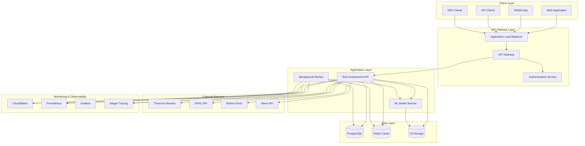
```mermaid
graph TB
    subgraph "Client Layer"
        WebApp[Web Application]
        MobileApp[Mobile App]
        API[API Clients]
        SDK[SDK Clients]
    end
    
    subgraph "API Gateway Layer"
        ALB[Application Load Balancer]
        API_GW[API Gateway]
        Auth[Authentication Service]
    end
    
    subgraph "Application Layer"
        API_Service[Risk Assessment API]
        Worker[Background Worker]
        ML_Service[ML Model Service]
    end
    
    subgraph "Data Layer"
        PostgreSQL[(PostgreSQL)]
        Redis[(Redis Cache)]
        S3[(S3 Storage)]
    end
    
    subgraph "External Services"
        ThomsonReuters[Thomson Reuters]
        OFAC[OFAC API]
        WorldCheck[World-Check]
        NewsAPI[News API]
    end
    
    subgraph "Monitoring & Observability"
        CloudWatch[CloudWatch]
        Prometheus[Prometheus]
        Grafana[Grafana]
        Jaeger[Jaeger Tracing]
    end
    
    WebApp --> ALB
    MobileApp --> ALB
    API --> ALB
    SDK --> ALB
    
    ALB --> API_GW
    API_GW --> Auth
    API_GW --> API_Service
    
    API_Service --> PostgreSQL
    API_Service --> Redis
    API_Service --> ML_Service
    API_Service --> S3
    
    Worker --> PostgreSQL
    Worker --> Redis
    Worker --> ML_Service
    
    ML_Service --> S3
    
    API_Service --> ThomsonReuters
    API_Service --> OFAC
    API_Service --> WorldCheck
    API_Service --> NewsAPI
    
    API_Service --> CloudWatch
    API_Service --> Prometheus
    API_Service --> Jaeger
    
    Worker --> CloudWatch
    Worker --> Prometheus
    Worker --> Jaeger
```

## Component Architecture

### 1. API Service Component

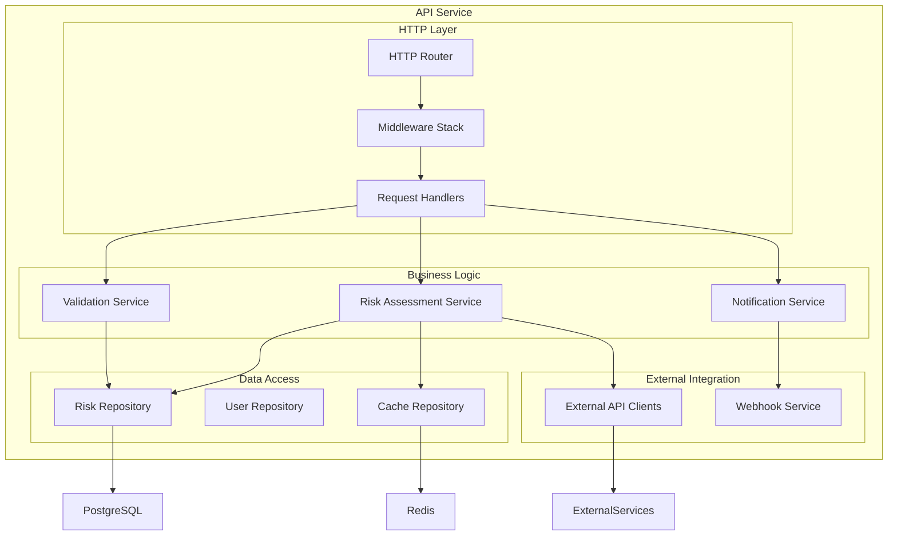
```mermaid
graph TB
    subgraph "API Service"
        subgraph "HTTP Layer"
            Router[HTTP Router]
            Middleware[Middleware Stack]
            Handlers[Request Handlers]
        end
        
        subgraph "Business Logic"
            RiskService[Risk Assessment Service]
            ValidationService[Validation Service]
            NotificationService[Notification Service]
        end
        
        subgraph "Data Access"
            RiskRepo[Risk Repository]
            UserRepo[User Repository]
            CacheRepo[Cache Repository]
        end
        
        subgraph "External Integration"
            ExternalAPIs[External API Clients]
            WebhookService[Webhook Service]
        end
    end
    
    Router --> Middleware
    Middleware --> Handlers
    Handlers --> RiskService
    Handlers --> ValidationService
    Handlers --> NotificationService
    
    RiskService --> RiskRepo
    RiskService --> CacheRepo
    RiskService --> ExternalAPIs
    
    ValidationService --> RiskRepo
    NotificationService --> WebhookService
    
    RiskRepo --> PostgreSQL
    CacheRepo --> Redis
    ExternalAPIs --> ExternalServices
```

### 2. ML Model Service Component

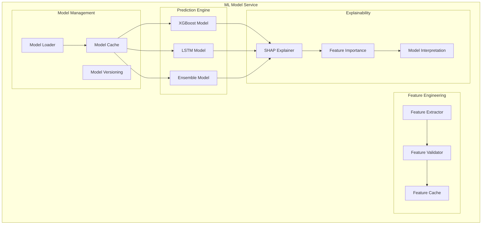
```mermaid
graph TB
    subgraph "ML Model Service"
        subgraph "Model Management"
            ModelLoader[Model Loader]
            ModelCache[Model Cache]
            ModelVersioning[Model Versioning]
        end
        
        subgraph "Prediction Engine"
            XGBoostModel[XGBoost Model]
            LSTMModel[LSTM Model]
            EnsembleModel[Ensemble Model]
        end
        
        subgraph "Feature Engineering"
            FeatureExtractor[Feature Extractor]
            FeatureValidator[Feature Validator]
            FeatureCache[Feature Cache]
        end
        
        subgraph "Explainability"
            SHAPExplainer[SHAP Explainer]
            FeatureImportance[Feature Importance]
            ModelInterpretation[Model Interpretation]
        end
    end
    
    ModelLoader --> ModelCache
    ModelCache --> XGBoostModel
    ModelCache --> LSTMModel
    ModelCache --> EnsembleModel
    
    FeatureExtractor --> FeatureValidator
    FeatureValidator --> FeatureCache
    
    XGBoostModel --> SHAPExplainer
    LSTMModel --> SHAPExplainer
    EnsembleModel --> SHAPExplainer
    
    SHAPExplainer --> FeatureImportance
    FeatureImportance --> ModelInterpretation
```

### 3. Background Worker Component

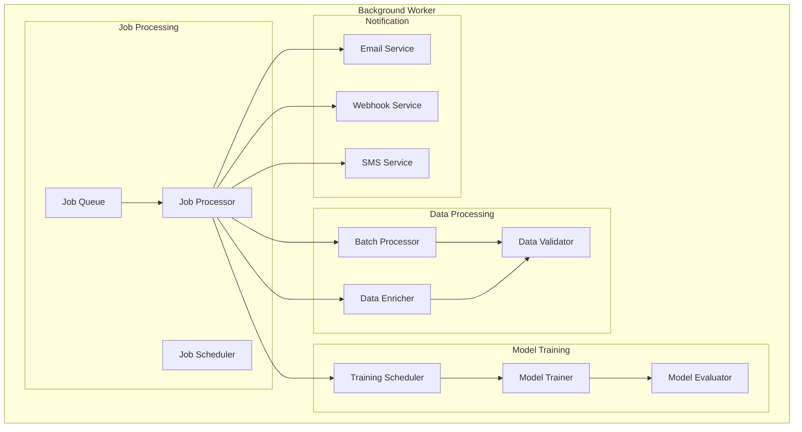
```mermaid
graph TB
    subgraph "Background Worker"
        subgraph "Job Processing"
            JobQueue[Job Queue]
            JobProcessor[Job Processor]
            JobScheduler[Job Scheduler]
        end
        
        subgraph "Data Processing"
            BatchProcessor[Batch Processor]
            DataEnricher[Data Enricher]
            DataValidator[Data Validator]
        end
        
        subgraph "Model Training"
            TrainingScheduler[Training Scheduler]
            ModelTrainer[Model Trainer]
            ModelEvaluator[Model Evaluator]
        end
        
        subgraph "Notification"
            EmailService[Email Service]
            WebhookService[Webhook Service]
            SMSService[SMS Service]
        end
    end
    
    JobQueue --> JobProcessor
    JobProcessor --> BatchProcessor
    JobProcessor --> DataEnricher
    JobProcessor --> TrainingScheduler
    
    BatchProcessor --> DataValidator
    DataEnricher --> DataValidator
    
    TrainingScheduler --> ModelTrainer
    ModelTrainer --> ModelEvaluator
    
    JobProcessor --> EmailService
    JobProcessor --> WebhookService
    JobProcessor --> SMSService
```

## Data Flow Architecture

### 1. Risk Assessment Request Flow

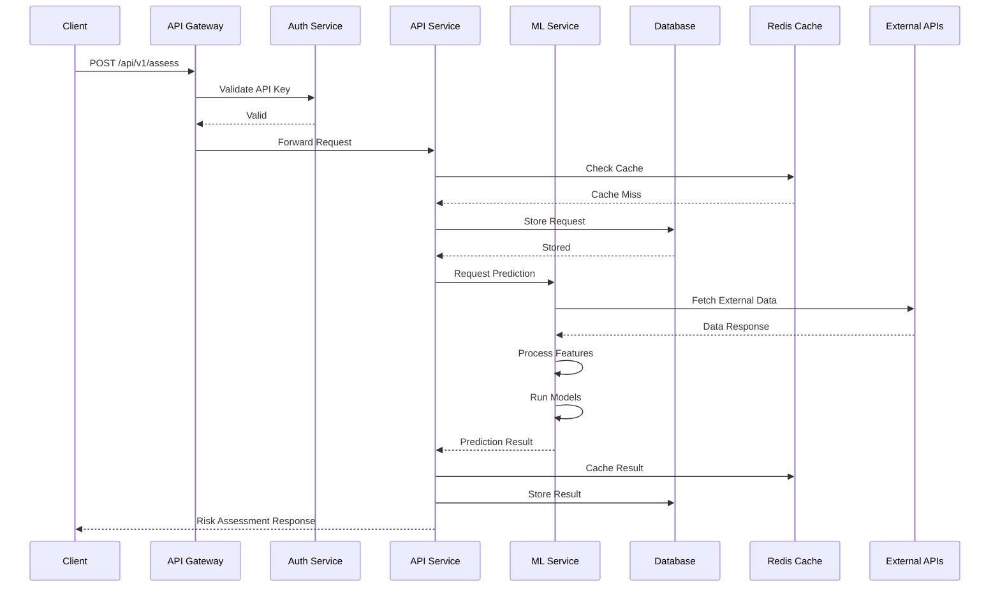
```mermaid
sequenceDiagram
    participant Client
    participant API_GW as API Gateway
    participant Auth as Auth Service
    participant API as API Service
    participant ML as ML Service
    participant DB as Database
    participant Cache as Redis Cache
    participant External as External APIs
    
    Client->>API_GW: POST /api/v1/assess
    API_GW->>Auth: Validate API Key
    Auth-->>API_GW: Valid
    API_GW->>API: Forward Request
    
    API->>Cache: Check Cache
    Cache-->>API: Cache Miss
    
    API->>DB: Store Request
    DB-->>API: Stored
    
    API->>ML: Request Prediction
    ML->>External: Fetch External Data
    External-->>ML: Data Response
    ML->>ML: Process Features
    ML->>ML: Run Models
    ML-->>API: Prediction Result
    
    API->>Cache: Cache Result
    API->>DB: Store Result
    API-->>Client: Risk Assessment Response
```

### 2. Batch Processing Flow

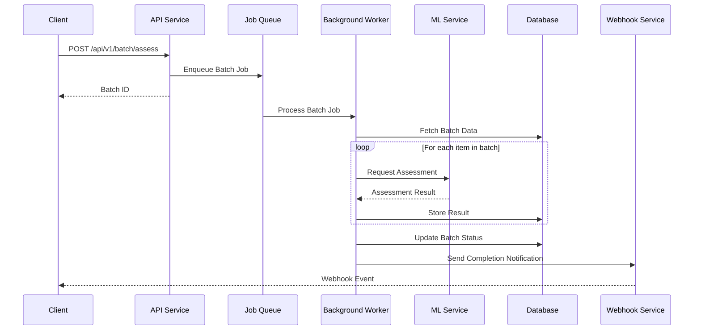
```mermaid
sequenceDiagram
    participant Client
    participant API as API Service
    participant Queue as Job Queue
    participant Worker as Background Worker
    participant ML as ML Service
    participant DB as Database
    participant Webhook as Webhook Service
    
    Client->>API: POST /api/v1/batch/assess
    API->>Queue: Enqueue Batch Job
    API-->>Client: Batch ID
    
    Queue->>Worker: Process Batch Job
    Worker->>DB: Fetch Batch Data
    
    loop For each item in batch
        Worker->>ML: Request Assessment
        ML-->>Worker: Assessment Result
        Worker->>DB: Store Result
    end
    
    Worker->>DB: Update Batch Status
    Worker->>Webhook: Send Completion Notification
    Webhook-->>Client: Webhook Event
```

### 3. Model Training Flow

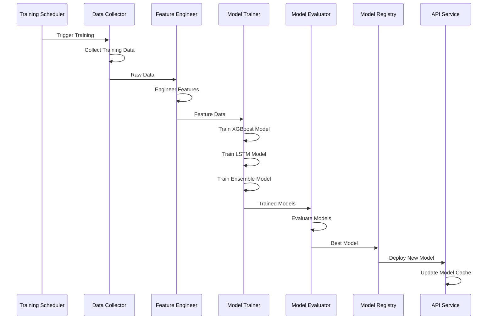
```mermaid
sequenceDiagram
    participant Scheduler as Training Scheduler
    participant DataCollector as Data Collector
    participant FeatureEngineer as Feature Engineer
    participant ModelTrainer as Model Trainer
    participant ModelEvaluator as Model Evaluator
    participant ModelRegistry as Model Registry
    participant API as API Service
    
    Scheduler->>DataCollector: Trigger Training
    DataCollector->>DataCollector: Collect Training Data
    DataCollector->>FeatureEngineer: Raw Data
    
    FeatureEngineer->>FeatureEngineer: Engineer Features
    FeatureEngineer->>ModelTrainer: Feature Data
    
    ModelTrainer->>ModelTrainer: Train XGBoost Model
    ModelTrainer->>ModelTrainer: Train LSTM Model
    ModelTrainer->>ModelTrainer: Train Ensemble Model
    
    ModelTrainer->>ModelEvaluator: Trained Models
    ModelEvaluator->>ModelEvaluator: Evaluate Models
    ModelEvaluator->>ModelRegistry: Best Model
    
    ModelRegistry->>API: Deploy New Model
    API->>API: Update Model Cache
```

## Database Architecture

### 1. Database Schema

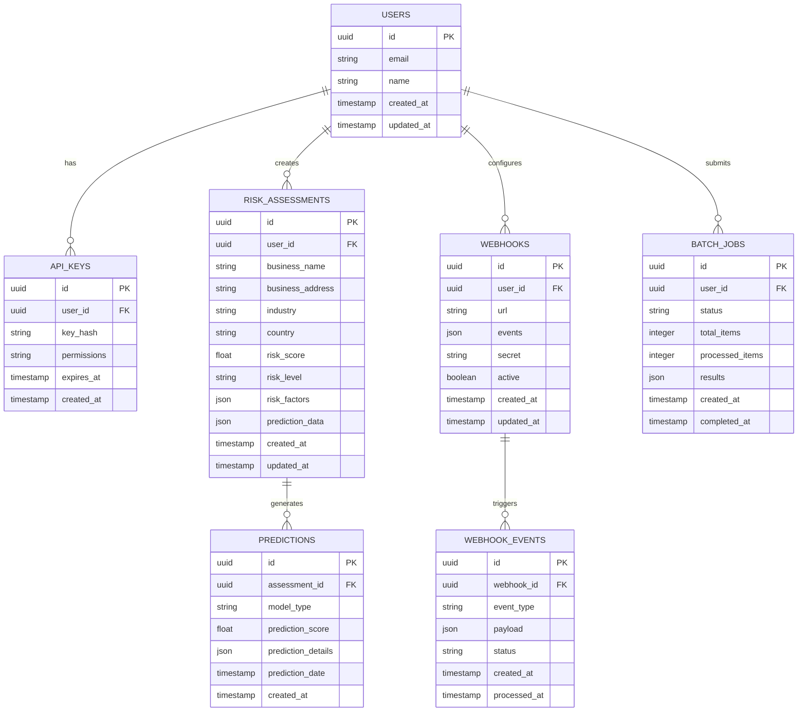
```mermaid
erDiagram
    USERS {
        uuid id PK
        string email
        string name
        timestamp created_at
        timestamp updated_at
    }
    
    API_KEYS {
        uuid id PK
        uuid user_id FK
        string key_hash
        string permissions
        timestamp expires_at
        timestamp created_at
    }
    
    RISK_ASSESSMENTS {
        uuid id PK
        uuid user_id FK
        string business_name
        string business_address
        string industry
        string country
        float risk_score
        string risk_level
        json risk_factors
        json prediction_data
        timestamp created_at
        timestamp updated_at
    }
    
    PREDICTIONS {
        uuid id PK
        uuid assessment_id FK
        string model_type
        float prediction_score
        json prediction_details
        timestamp prediction_date
        timestamp created_at
    }
    
    WEBHOOKS {
        uuid id PK
        uuid user_id FK
        string url
        json events
        string secret
        boolean active
        timestamp created_at
        timestamp updated_at
    }
    
    WEBHOOK_EVENTS {
        uuid id PK
        uuid webhook_id FK
        string event_type
        json payload
        string status
        timestamp created_at
        timestamp processed_at
    }
    
    BATCH_JOBS {
        uuid id PK
        uuid user_id FK
        string status
        integer total_items
        integer processed_items
        json results
        timestamp created_at
        timestamp completed_at
    }
    
    USERS ||--o{ API_KEYS : has
    USERS ||--o{ RISK_ASSESSMENTS : creates
    USERS ||--o{ WEBHOOKS : configures
    USERS ||--o{ BATCH_JOBS : submits
    
    RISK_ASSESSMENTS ||--o{ PREDICTIONS : generates
    WEBHOOKS ||--o{ WEBHOOK_EVENTS : triggers
```

### 2. Data Partitioning Strategy

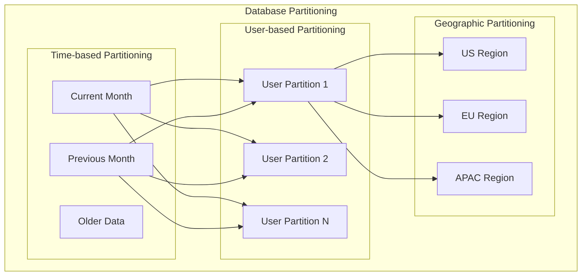
```mermaid
graph TB
    subgraph "Database Partitioning"
        subgraph "Time-based Partitioning"
            CurrentMonth[Current Month]
            PreviousMonth[Previous Month]
            OlderData[Older Data]
        end
        
        subgraph "User-based Partitioning"
            UserPartition1[User Partition 1]
            UserPartition2[User Partition 2]
            UserPartitionN[User Partition N]
        end
        
        subgraph "Geographic Partitioning"
            USRegion[US Region]
            EURegion[EU Region]
            APACRegion[APAC Region]
        end
    end
    
    CurrentMonth --> UserPartition1
    CurrentMonth --> UserPartition2
    CurrentMonth --> UserPartitionN
    
    PreviousMonth --> UserPartition1
    PreviousMonth --> UserPartition2
    PreviousMonth --> UserPartitionN
    
    UserPartition1 --> USRegion
    UserPartition1 --> EURegion
    UserPartition1 --> APACRegion
```

## Security Architecture

### 1. Security Layers

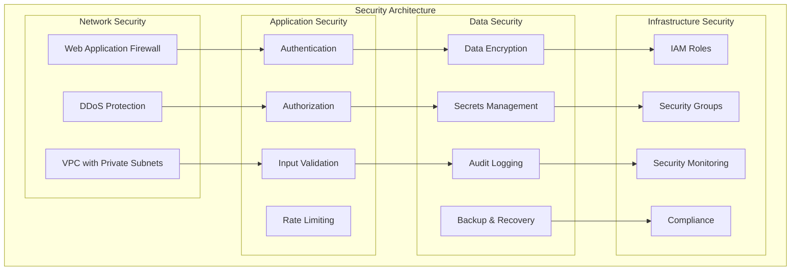
```mermaid
graph TB
    subgraph "Security Architecture"
        subgraph "Network Security"
            WAF[Web Application Firewall]
            DDoS[DDoS Protection]
            VPC[VPC with Private Subnets]
        end
        
        subgraph "Application Security"
            Auth[Authentication]
            Authz[Authorization]
            InputValidation[Input Validation]
            RateLimiting[Rate Limiting]
        end
        
        subgraph "Data Security"
            Encryption[Data Encryption]
            Secrets[Secrets Management]
            Audit[Audit Logging]
            Backup[Backup & Recovery]
        end
        
        subgraph "Infrastructure Security"
            IAM[IAM Roles]
            SecurityGroups[Security Groups]
            Monitoring[Security Monitoring]
            Compliance[Compliance]
        end
    end
    
    WAF --> Auth
    DDoS --> Authz
    VPC --> InputValidation
    
    Auth --> Encryption
    Authz --> Secrets
    InputValidation --> Audit
    
    Encryption --> IAM
    Secrets --> SecurityGroups
    Audit --> Monitoring
    Backup --> Compliance
```

### 2. Authentication Flow

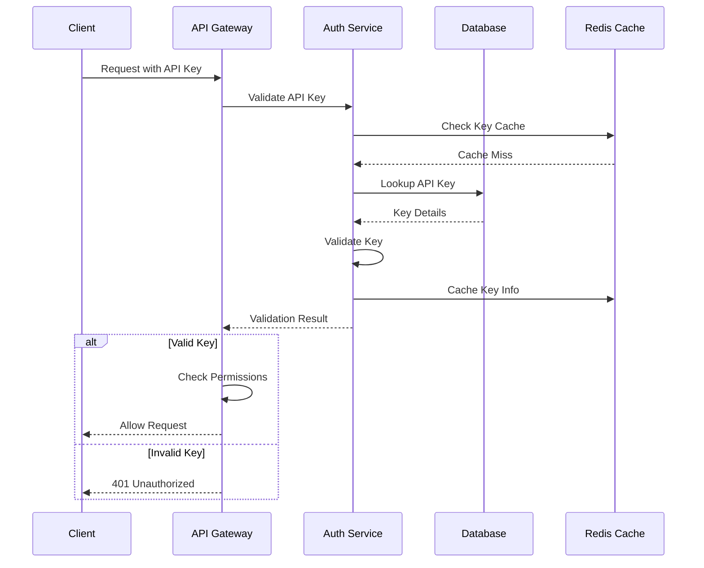
```mermaid
sequenceDiagram
    participant Client
    participant API_GW as API Gateway
    participant Auth as Auth Service
    participant DB as Database
    participant Cache as Redis Cache
    
    Client->>API_GW: Request with API Key
    API_GW->>Auth: Validate API Key
    
    Auth->>Cache: Check Key Cache
    Cache-->>Auth: Cache Miss
    
    Auth->>DB: Lookup API Key
    DB-->>Auth: Key Details
    
    Auth->>Auth: Validate Key
    Auth->>Cache: Cache Key Info
    Auth-->>API_GW: Validation Result
    
    alt Valid Key
        API_GW->>API_GW: Check Permissions
        API_GW-->>Client: Allow Request
    else Invalid Key
        API_GW-->>Client: 401 Unauthorized
    end
```

## Deployment Architecture

### 1. AWS ECS Deployment

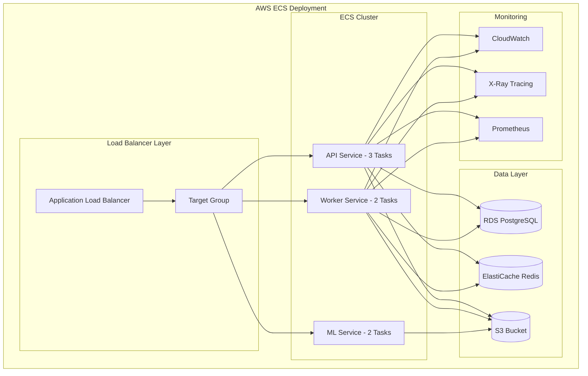
```mermaid
graph TB
    subgraph "AWS ECS Deployment"
        subgraph "Load Balancer Layer"
            ALB[Application Load Balancer]
            TargetGroup[Target Group]
        end
        
        subgraph "ECS Cluster"
            Service1[API Service - 3 Tasks]
            Service2[Worker Service - 2 Tasks]
            Service3[ML Service - 2 Tasks]
        end
        
        subgraph "Data Layer"
            RDS[(RDS PostgreSQL)]
            ElastiCache[(ElastiCache Redis)]
            S3[(S3 Bucket)]
        end
        
        subgraph "Monitoring"
            CloudWatch[CloudWatch]
            XRay[X-Ray Tracing]
            Prometheus[Prometheus]
        end
    end
    
    ALB --> TargetGroup
    TargetGroup --> Service1
    TargetGroup --> Service2
    TargetGroup --> Service3
    
    Service1 --> RDS
    Service1 --> ElastiCache
    Service1 --> S3
    
    Service2 --> RDS
    Service2 --> ElastiCache
    Service2 --> S3
    
    Service3 --> S3
    
    Service1 --> CloudWatch
    Service1 --> XRay
    Service1 --> Prometheus
    
    Service2 --> CloudWatch
    Service2 --> XRay
    Service2 --> Prometheus
```

### 2. Kubernetes Deployment

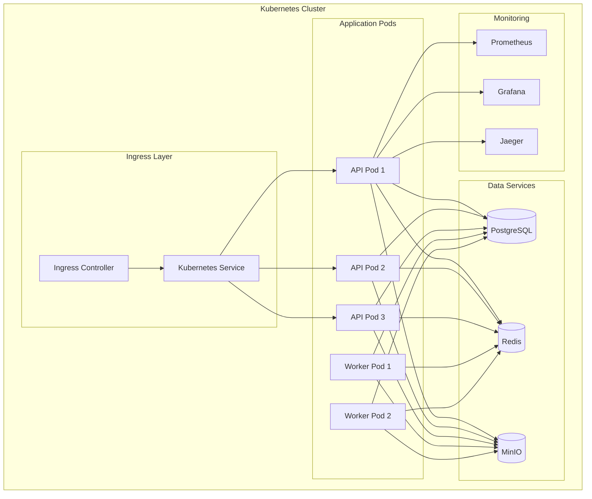
```mermaid
graph TB
    subgraph "Kubernetes Cluster"
        subgraph "Ingress Layer"
            Ingress[Ingress Controller]
            Service[Kubernetes Service]
        end
        
        subgraph "Application Pods"
            API_Pod1[API Pod 1]
            API_Pod2[API Pod 2]
            API_Pod3[API Pod 3]
            Worker_Pod1[Worker Pod 1]
            Worker_Pod2[Worker Pod 2]
        end
        
        subgraph "Data Services"
            PostgreSQL[(PostgreSQL)]
            Redis[(Redis)]
            MinIO[(MinIO)]
        end
        
        subgraph "Monitoring"
            Prometheus[Prometheus]
            Grafana[Grafana]
            Jaeger[Jaeger]
        end
    end
    
    Ingress --> Service
    Service --> API_Pod1
    Service --> API_Pod2
    Service --> API_Pod3
    
    API_Pod1 --> PostgreSQL
    API_Pod1 --> Redis
    API_Pod1 --> MinIO
    
    API_Pod2 --> PostgreSQL
    API_Pod2 --> Redis
    API_Pod2 --> MinIO
    
    API_Pod3 --> PostgreSQL
    API_Pod3 --> Redis
    API_Pod3 --> MinIO
    
    Worker_Pod1 --> PostgreSQL
    Worker_Pod1 --> Redis
    Worker_Pod1 --> MinIO
    
    Worker_Pod2 --> PostgreSQL
    Worker_Pod2 --> Redis
    Worker_Pod2 --> MinIO
    
    API_Pod1 --> Prometheus
    API_Pod1 --> Grafana
    API_Pod1 --> Jaeger
```

## Monitoring and Observability

### 1. Monitoring Stack

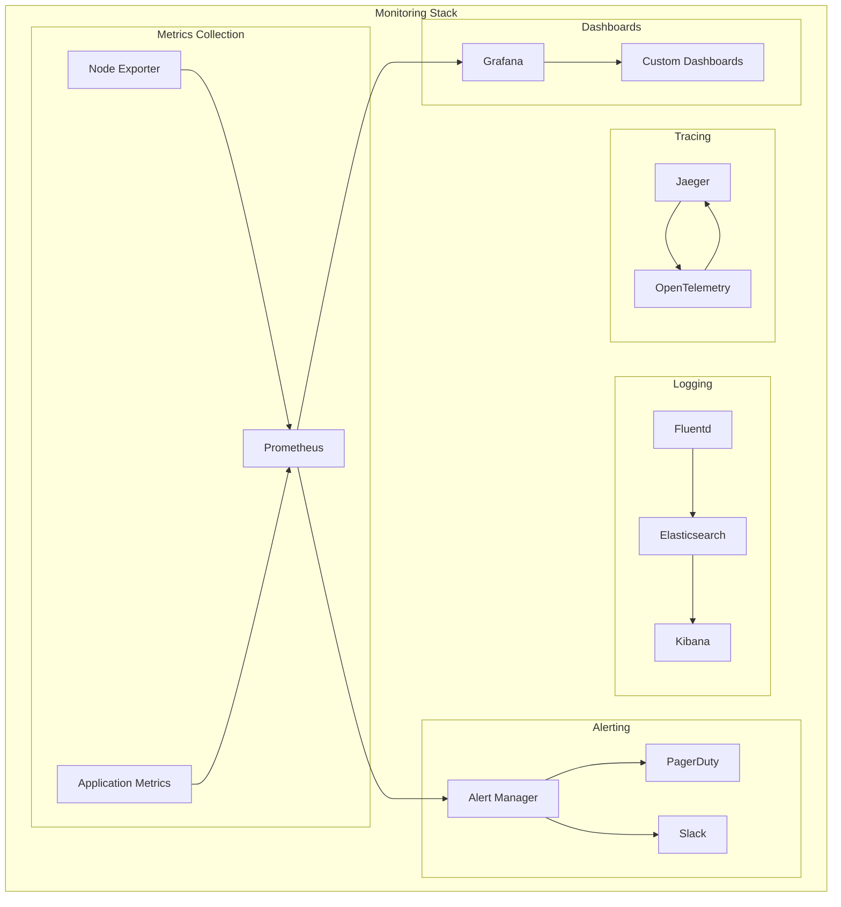
```mermaid
graph TB
    subgraph "Monitoring Stack"
        subgraph "Metrics Collection"
            Prometheus[Prometheus]
            NodeExporter[Node Exporter]
            AppMetrics[Application Metrics]
        end
        
        subgraph "Logging"
            Fluentd[Fluentd]
            Elasticsearch[Elasticsearch]
            Kibana[Kibana]
        end
        
        subgraph "Tracing"
            Jaeger[Jaeger]
            OpenTelemetry[OpenTelemetry]
        end
        
        subgraph "Alerting"
            AlertManager[Alert Manager]
            PagerDuty[PagerDuty]
            Slack[Slack]
        end
        
        subgraph "Dashboards"
            Grafana[Grafana]
            CustomDashboards[Custom Dashboards]
        end
    end
    
    Prometheus --> Grafana
    NodeExporter --> Prometheus
    AppMetrics --> Prometheus
    
    Fluentd --> Elasticsearch
    Elasticsearch --> Kibana
    
    Jaeger --> OpenTelemetry
    OpenTelemetry --> Jaeger
    
    Prometheus --> AlertManager
    AlertManager --> PagerDuty
    AlertManager --> Slack
    
    Grafana --> CustomDashboards
```

### 2. Health Check Architecture

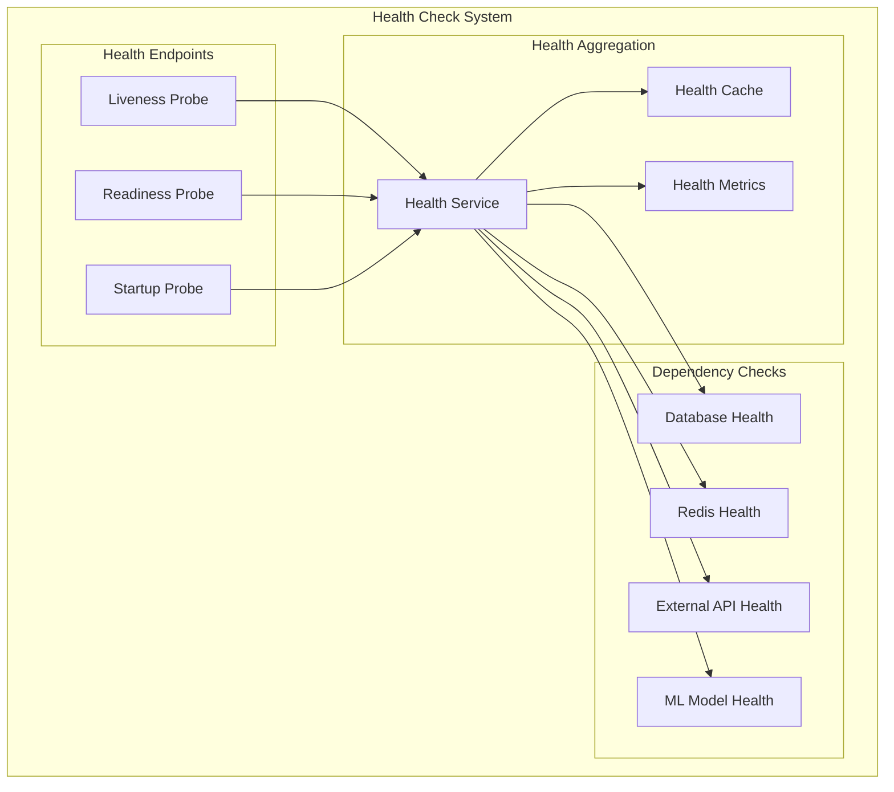
```mermaid
graph TB
    subgraph "Health Check System"
        subgraph "Health Endpoints"
            Liveness[Liveness Probe]
            Readiness[Readiness Probe]
            Startup[Startup Probe]
        end
        
        subgraph "Dependency Checks"
            Database[Database Health]
            Redis[Redis Health]
            ExternalAPIs[External API Health]
            MLModels[ML Model Health]
        end
        
        subgraph "Health Aggregation"
            HealthService[Health Service]
            HealthCache[Health Cache]
            HealthMetrics[Health Metrics]
        end
    end
    
    Liveness --> HealthService
    Readiness --> HealthService
    Startup --> HealthService
    
    HealthService --> Database
    HealthService --> Redis
    HealthService --> ExternalAPIs
    HealthService --> MLModels
    
    HealthService --> HealthCache
    HealthService --> HealthMetrics
```

## Performance Architecture

### 1. Caching Strategy

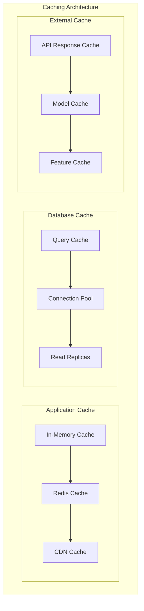
```mermaid
graph TB
    subgraph "Caching Architecture"
        subgraph "Application Cache"
            InMemoryCache[In-Memory Cache]
            RedisCache[Redis Cache]
            CDN[CDN Cache]
        end
        
        subgraph "Database Cache"
            QueryCache[Query Cache]
            ConnectionPool[Connection Pool]
            ReadReplicas[Read Replicas]
        end
        
        subgraph "External Cache"
            APICache[API Response Cache]
            ModelCache[Model Cache]
            FeatureCache[Feature Cache]
        end
    end
    
    InMemoryCache --> RedisCache
    RedisCache --> CDN
    
    QueryCache --> ConnectionPool
    ConnectionPool --> ReadReplicas
    
    APICache --> ModelCache
    ModelCache --> FeatureCache
```

### 2. Load Balancing Strategy

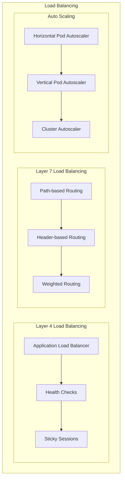
```mermaid
graph TB
    subgraph "Load Balancing"
        subgraph "Layer 4 Load Balancing"
            ALB[Application Load Balancer]
            HealthChecks[Health Checks]
            StickySessions[Sticky Sessions]
        end
        
        subgraph "Layer 7 Load Balancing"
            PathRouting[Path-based Routing]
            HeaderRouting[Header-based Routing]
            WeightedRouting[Weighted Routing]
        end
        
        subgraph "Auto Scaling"
            HPA[Horizontal Pod Autoscaler]
            VPA[Vertical Pod Autoscaler]
            ClusterAutoscaler[Cluster Autoscaler]
        end
    end
    
    ALB --> HealthChecks
    HealthChecks --> StickySessions
    
    PathRouting --> HeaderRouting
    HeaderRouting --> WeightedRouting
    
    HPA --> VPA
    VPA --> ClusterAutoscaler
```

## Disaster Recovery Architecture

### 1. Backup Strategy

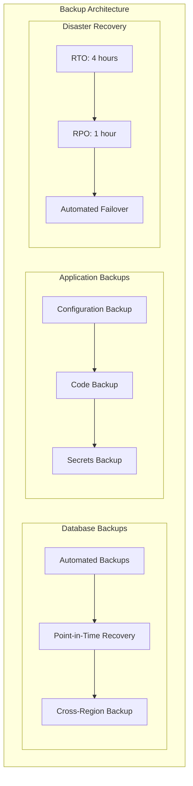
```mermaid
graph TB
    subgraph "Backup Architecture"
        subgraph "Database Backups"
            AutomatedBackups[Automated Backups]
            PointInTimeRecovery[Point-in-Time Recovery]
            CrossRegionBackup[Cross-Region Backup]
        end
        
        subgraph "Application Backups"
            ConfigurationBackup[Configuration Backup]
            CodeBackup[Code Backup]
            SecretsBackup[Secrets Backup]
        end
        
        subgraph "Disaster Recovery"
            RTO[RTO: 4 hours]
            RPO[RPO: 1 hour]
            Failover[Automated Failover]
        end
    end
    
    AutomatedBackups --> PointInTimeRecovery
    PointInTimeRecovery --> CrossRegionBackup
    
    ConfigurationBackup --> CodeBackup
    CodeBackup --> SecretsBackup
    
    RTO --> RPO
    RPO --> Failover
```

### 2. Multi-Region Architecture

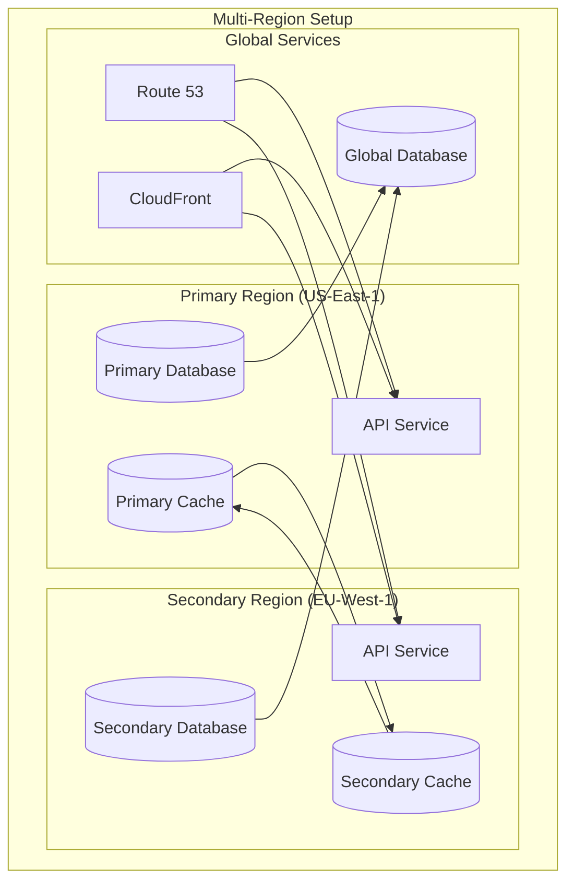
```mermaid
graph TB
    subgraph "Multi-Region Setup"
        subgraph "Primary Region (US-East-1)"
            PrimaryAPI[API Service]
            PrimaryDB[(Primary Database)]
            PrimaryCache[(Primary Cache)]
        end
        
        subgraph "Secondary Region (EU-West-1)"
            SecondaryAPI[API Service]
            SecondaryDB[(Secondary Database)]
            SecondaryCache[(Secondary Cache)]
        end
        
        subgraph "Global Services"
            Route53[Route 53]
            CloudFront[CloudFront]
            GlobalDB[(Global Database)]
        end
    end
    
    Route53 --> PrimaryAPI
    Route53 --> SecondaryAPI
    
    CloudFront --> PrimaryAPI
    CloudFront --> SecondaryAPI
    
    PrimaryDB --> GlobalDB
    SecondaryDB --> GlobalDB
    
    PrimaryCache --> SecondaryCache
    SecondaryCache --> PrimaryCache
```

## Technology Stack

### 1. Backend Technologies

- **Language**: Go 1.22+
- **Framework**: Gin HTTP framework
- **Database**: PostgreSQL 15+
- **Cache**: Redis 7+
- **Message Queue**: Redis Streams
- **Container**: Docker
- **Orchestration**: Kubernetes / AWS ECS

### 2. ML Technologies

- **Language**: Python 3.11+
- **ML Framework**: scikit-learn, XGBoost, TensorFlow
- **Model Serving**: TensorFlow Serving
- **Feature Store**: Feast
- **Model Registry**: MLflow
- **Monitoring**: Evidently AI

### 3. Infrastructure Technologies

- **Cloud Provider**: AWS
- **Infrastructure as Code**: Terraform
- **CI/CD**: GitHub Actions
- **Monitoring**: Prometheus, Grafana
- **Logging**: ELK Stack
- **Tracing**: Jaeger

### 4. Security Technologies

- **Authentication**: JWT, OAuth 2.0
- **Authorization**: RBAC
- **Encryption**: AES-256, TLS 1.3
- **Secrets Management**: AWS Secrets Manager
- **Network Security**: VPC, Security Groups
- **Compliance**: SOC 2, GDPR

## Scalability Considerations

### 1. Horizontal Scaling

- **Stateless Services**: All services are stateless for easy horizontal scaling
- **Database Sharding**: User-based sharding for database scalability
- **Cache Distribution**: Redis Cluster for cache scalability
- **Load Balancing**: Multiple load balancers for high availability

### 2. Vertical Scaling

- **Resource Monitoring**: Continuous monitoring of resource usage
- **Auto-scaling**: Automatic scaling based on metrics
- **Resource Optimization**: Regular optimization of resource allocation
- **Performance Tuning**: Continuous performance tuning

### 3. Performance Optimization

- **Caching Strategy**: Multi-layer caching for optimal performance
- **Database Optimization**: Query optimization and indexing
- **API Optimization**: Response compression and pagination
- **CDN Integration**: Global content delivery for static assets

## Future Architecture Considerations

### 1. Microservices Evolution

- **Service Mesh**: Istio for service-to-service communication
- **Event-Driven Architecture**: Event sourcing and CQRS
- **API Gateway**: Advanced API management and routing
- **Service Discovery**: Dynamic service discovery and registration

### 2. Advanced ML Architecture

- **ML Pipeline**: Automated ML pipeline with MLOps
- **Real-time Inference**: Real-time model inference with low latency
- **Model A/B Testing**: Advanced A/B testing for model comparison
- **Federated Learning**: Distributed model training

### 3. Cloud-Native Evolution

- **Serverless**: Migration to serverless architecture
- **Edge Computing**: Edge deployment for low latency
- **Multi-Cloud**: Multi-cloud deployment for vendor independence
- **GitOps**: GitOps for infrastructure and application management

---

**Last Updated**: January 15, 2024  
**Version**: 2.0.0  
**Next Review**: April 15, 2024
