# Architecture Diagrams

## Overview

This document contains detailed architecture diagrams for the Risk Assessment Service. All diagrams are created using Mermaid.js and can be rendered in any Markdown viewer that supports Mermaid.

## System Architecture Diagrams

### 1. High-Level System Architecture

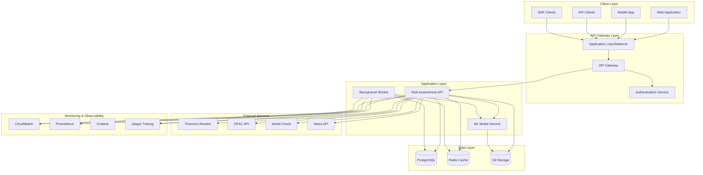
```mermaid
graph TB
    subgraph "Client Layer"
        WebApp[Web Application]
        MobileApp[Mobile App]
        API[API Clients]
        SDK[SDK Clients]
    end
    
    subgraph "API Gateway Layer"
        ALB[Application Load Balancer]
        API_GW[API Gateway]
        Auth[Authentication Service]
    end
    
    subgraph "Application Layer"
        API_Service[Risk Assessment API]
        Worker[Background Worker]
        ML_Service[ML Model Service]
    end
    
    subgraph "Data Layer"
        PostgreSQL[(PostgreSQL)]
        Redis[(Redis Cache)]
        S3[(S3 Storage)]
    end
    
    subgraph "External Services"
        ThomsonReuters[Thomson Reuters]
        OFAC[OFAC API]
        WorldCheck[World-Check]
        NewsAPI[News API]
    end
    
    subgraph "Monitoring & Observability"
        CloudWatch[CloudWatch]
        Prometheus[Prometheus]
        Grafana[Grafana]
        Jaeger[Jaeger Tracing]
    end
    
    WebApp --> ALB
    MobileApp --> ALB
    API --> ALB
    SDK --> ALB
    
    ALB --> API_GW
    API_GW --> Auth
    API_GW --> API_Service
    
    API_Service --> PostgreSQL
    API_Service --> Redis
    API_Service --> ML_Service
    API_Service --> S3
    
    Worker --> PostgreSQL
    Worker --> Redis
    Worker --> ML_Service
    
    ML_Service --> S3
    
    API_Service --> ThomsonReuters
    API_Service --> OFAC
    API_Service --> WorldCheck
    API_Service --> NewsAPI
    
    API_Service --> CloudWatch
    API_Service --> Prometheus
    API_Service --> Jaeger
    
    Worker --> CloudWatch
    Worker --> Prometheus
    Worker --> Jaeger
```

### 2. Component Architecture

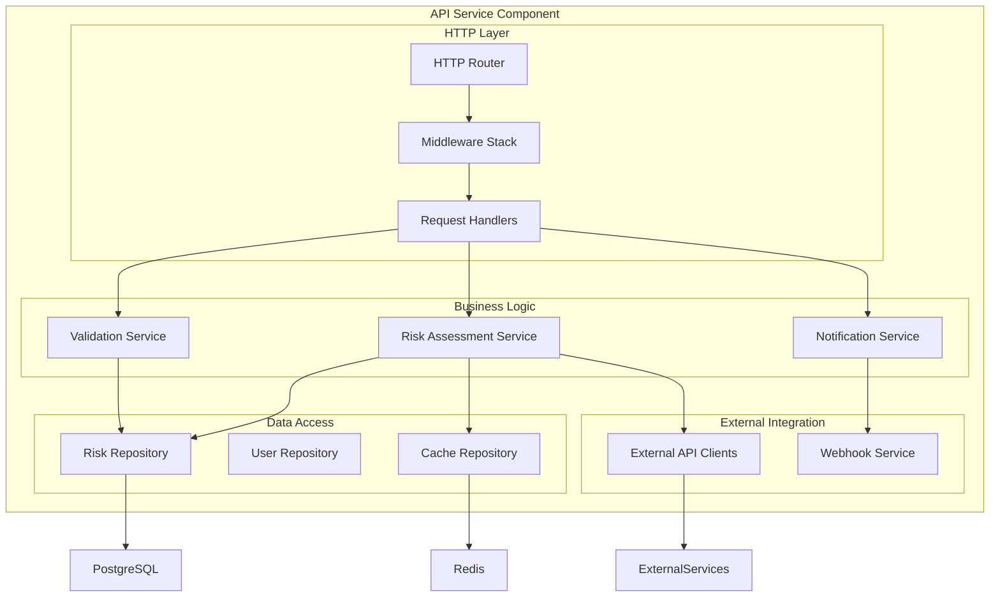
```mermaid
graph TB
    subgraph "API Service Component"
        subgraph "HTTP Layer"
            Router[HTTP Router]
            Middleware[Middleware Stack]
            Handlers[Request Handlers]
        end
        
        subgraph "Business Logic"
            RiskService[Risk Assessment Service]
            ValidationService[Validation Service]
            NotificationService[Notification Service]
        end
        
        subgraph "Data Access"
            RiskRepo[Risk Repository]
            UserRepo[User Repository]
            CacheRepo[Cache Repository]
        end
        
        subgraph "External Integration"
            ExternalAPIs[External API Clients]
            WebhookService[Webhook Service]
        end
    end
    
    Router --> Middleware
    Middleware --> Handlers
    Handlers --> RiskService
    Handlers --> ValidationService
    Handlers --> NotificationService
    
    RiskService --> RiskRepo
    RiskService --> CacheRepo
    RiskService --> ExternalAPIs
    
    ValidationService --> RiskRepo
    NotificationService --> WebhookService
    
    RiskRepo --> PostgreSQL
    CacheRepo --> Redis
    ExternalAPIs --> ExternalServices
```

### 3. ML Model Service Architecture

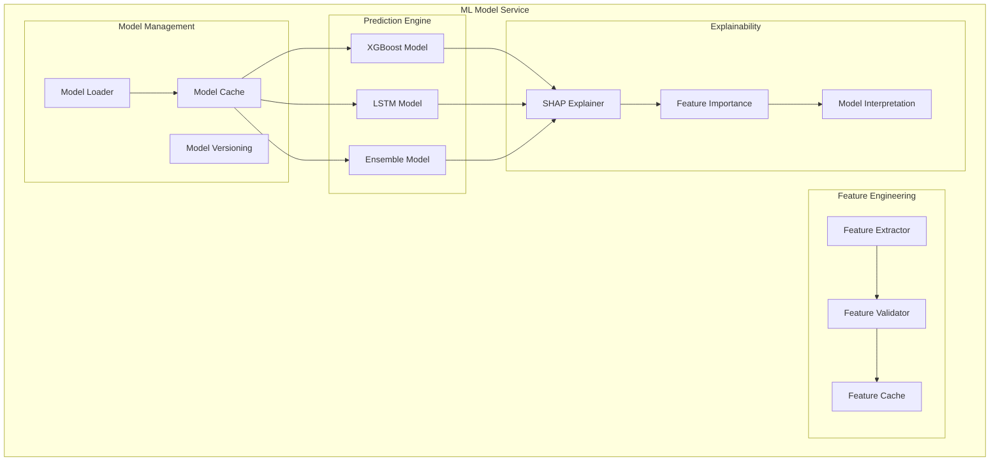
```mermaid
graph TB
    subgraph "ML Model Service"
        subgraph "Model Management"
            ModelLoader[Model Loader]
            ModelCache[Model Cache]
            ModelVersioning[Model Versioning]
        end
        
        subgraph "Prediction Engine"
            XGBoostModel[XGBoost Model]
            LSTMModel[LSTM Model]
            EnsembleModel[Ensemble Model]
        end
        
        subgraph "Feature Engineering"
            FeatureExtractor[Feature Extractor]
            FeatureValidator[Feature Validator]
            FeatureCache[Feature Cache]
        end
        
        subgraph "Explainability"
            SHAPExplainer[SHAP Explainer]
            FeatureImportance[Feature Importance]
            ModelInterpretation[Model Interpretation]
        end
    end
    
    ModelLoader --> ModelCache
    ModelCache --> XGBoostModel
    ModelCache --> LSTMModel
    ModelCache --> EnsembleModel
    
    FeatureExtractor --> FeatureValidator
    FeatureValidator --> FeatureCache
    
    XGBoostModel --> SHAPExplainer
    LSTMModel --> SHAPExplainer
    EnsembleModel --> SHAPExplainer
    
    SHAPExplainer --> FeatureImportance
    FeatureImportance --> ModelInterpretation
```

## Data Flow Diagrams

### 1. Risk Assessment Request Flow

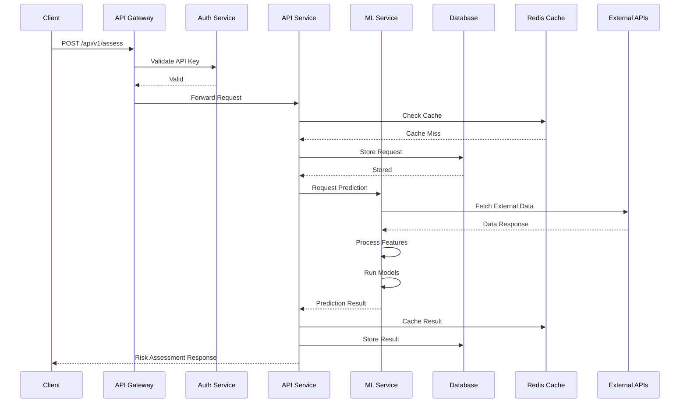
```mermaid
sequenceDiagram
    participant Client
    participant API_GW as API Gateway
    participant Auth as Auth Service
    participant API as API Service
    participant ML as ML Service
    participant DB as Database
    participant Cache as Redis Cache
    participant External as External APIs
    
    Client->>API_GW: POST /api/v1/assess
    API_GW->>Auth: Validate API Key
    Auth-->>API_GW: Valid
    API_GW->>API: Forward Request
    
    API->>Cache: Check Cache
    Cache-->>API: Cache Miss
    
    API->>DB: Store Request
    DB-->>API: Stored
    
    API->>ML: Request Prediction
    ML->>External: Fetch External Data
    External-->>ML: Data Response
    ML->>ML: Process Features
    ML->>ML: Run Models
    ML-->>API: Prediction Result
    
    API->>Cache: Cache Result
    API->>DB: Store Result
    API-->>Client: Risk Assessment Response
```

### 2. Batch Processing Flow

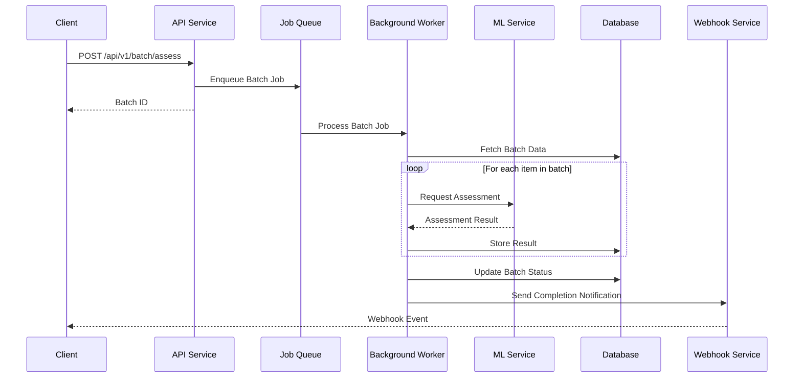
```mermaid
sequenceDiagram
    participant Client
    participant API as API Service
    participant Queue as Job Queue
    participant Worker as Background Worker
    participant ML as ML Service
    participant DB as Database
    participant Webhook as Webhook Service
    
    Client->>API: POST /api/v1/batch/assess
    API->>Queue: Enqueue Batch Job
    API-->>Client: Batch ID
    
    Queue->>Worker: Process Batch Job
    Worker->>DB: Fetch Batch Data
    
    loop For each item in batch
        Worker->>ML: Request Assessment
        ML-->>Worker: Assessment Result
        Worker->>DB: Store Result
    end
    
    Worker->>DB: Update Batch Status
    Worker->>Webhook: Send Completion Notification
    Webhook-->>Client: Webhook Event
```

### 3. Model Training Flow

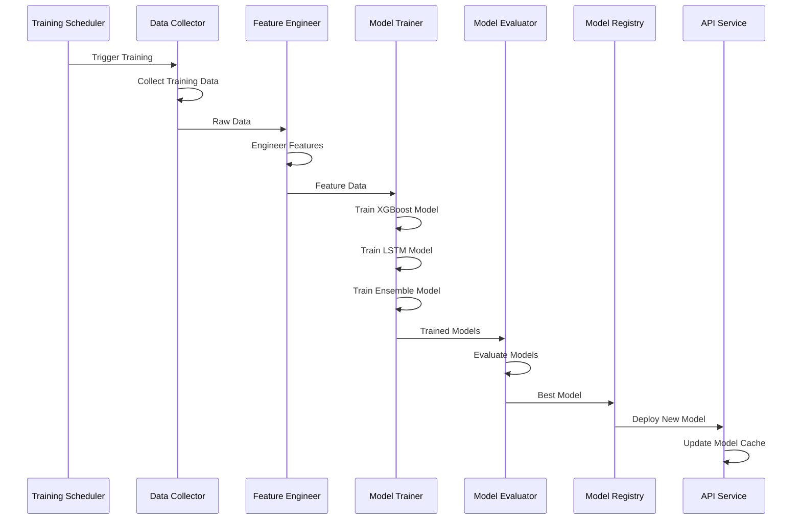
```mermaid
sequenceDiagram
    participant Scheduler as Training Scheduler
    participant DataCollector as Data Collector
    participant FeatureEngineer as Feature Engineer
    participant ModelTrainer as Model Trainer
    participant ModelEvaluator as Model Evaluator
    participant ModelRegistry as Model Registry
    participant API as API Service
    
    Scheduler->>DataCollector: Trigger Training
    DataCollector->>DataCollector: Collect Training Data
    DataCollector->>FeatureEngineer: Raw Data
    
    FeatureEngineer->>FeatureEngineer: Engineer Features
    FeatureEngineer->>ModelTrainer: Feature Data
    
    ModelTrainer->>ModelTrainer: Train XGBoost Model
    ModelTrainer->>ModelTrainer: Train LSTM Model
    ModelTrainer->>ModelTrainer: Train Ensemble Model
    
    ModelTrainer->>ModelEvaluator: Trained Models
    ModelEvaluator->>ModelEvaluator: Evaluate Models
    ModelEvaluator->>ModelRegistry: Best Model
    
    ModelRegistry->>API: Deploy New Model
    API->>API: Update Model Cache
```

## Database Architecture Diagrams

### 1. Database Schema

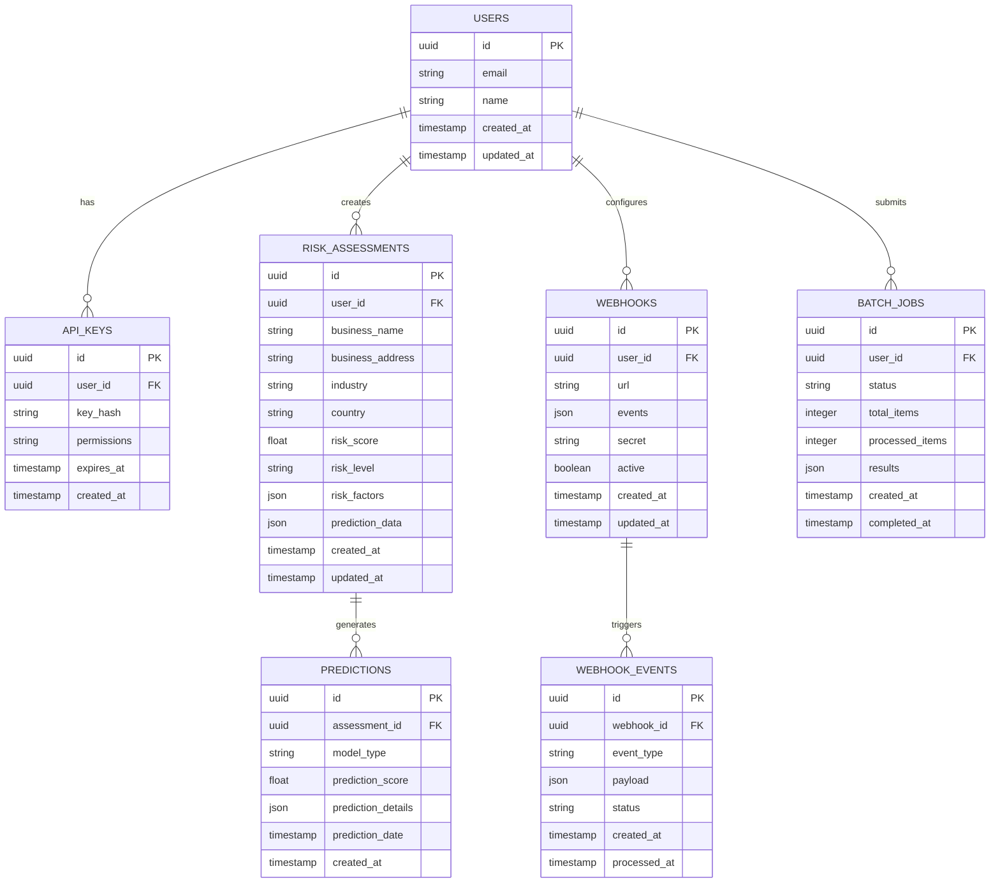
```mermaid
erDiagram
    USERS {
        uuid id PK
        string email
        string name
        timestamp created_at
        timestamp updated_at
    }
    
    API_KEYS {
        uuid id PK
        uuid user_id FK
        string key_hash
        string permissions
        timestamp expires_at
        timestamp created_at
    }
    
    RISK_ASSESSMENTS {
        uuid id PK
        uuid user_id FK
        string business_name
        string business_address
        string industry
        string country
        float risk_score
        string risk_level
        json risk_factors
        json prediction_data
        timestamp created_at
        timestamp updated_at
    }
    
    PREDICTIONS {
        uuid id PK
        uuid assessment_id FK
        string model_type
        float prediction_score
        json prediction_details
        timestamp prediction_date
        timestamp created_at
    }
    
    WEBHOOKS {
        uuid id PK
        uuid user_id FK
        string url
        json events
        string secret
        boolean active
        timestamp created_at
        timestamp updated_at
    }
    
    WEBHOOK_EVENTS {
        uuid id PK
        uuid webhook_id FK
        string event_type
        json payload
        string status
        timestamp created_at
        timestamp processed_at
    }
    
    BATCH_JOBS {
        uuid id PK
        uuid user_id FK
        string status
        integer total_items
        integer processed_items
        json results
        timestamp created_at
        timestamp completed_at
    }
    
    USERS ||--o{ API_KEYS : has
    USERS ||--o{ RISK_ASSESSMENTS : creates
    USERS ||--o{ WEBHOOKS : configures
    USERS ||--o{ BATCH_JOBS : submits
    
    RISK_ASSESSMENTS ||--o{ PREDICTIONS : generates
    WEBHOOKS ||--o{ WEBHOOK_EVENTS : triggers
```

### 2. Data Partitioning Strategy

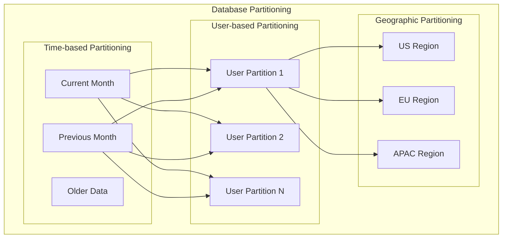
```mermaid
graph TB
    subgraph "Database Partitioning"
        subgraph "Time-based Partitioning"
            CurrentMonth[Current Month]
            PreviousMonth[Previous Month]
            OlderData[Older Data]
        end
        
        subgraph "User-based Partitioning"
            UserPartition1[User Partition 1]
            UserPartition2[User Partition 2]
            UserPartitionN[User Partition N]
        end
        
        subgraph "Geographic Partitioning"
            USRegion[US Region]
            EURegion[EU Region]
            APACRegion[APAC Region]
        end
    end
    
    CurrentMonth --> UserPartition1
    CurrentMonth --> UserPartition2
    CurrentMonth --> UserPartitionN
    
    PreviousMonth --> UserPartition1
    PreviousMonth --> UserPartition2
    PreviousMonth --> UserPartitionN
    
    UserPartition1 --> USRegion
    UserPartition1 --> EURegion
    UserPartition1 --> APACRegion
```

## Security Architecture Diagrams

### 1. Security Layers

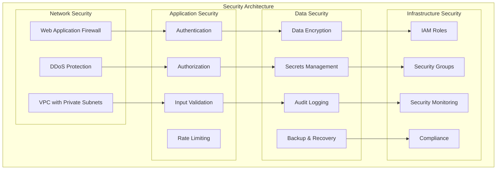
```mermaid
graph TB
    subgraph "Security Architecture"
        subgraph "Network Security"
            WAF[Web Application Firewall]
            DDoS[DDoS Protection]
            VPC[VPC with Private Subnets]
        end
        
        subgraph "Application Security"
            Auth[Authentication]
            Authz[Authorization]
            InputValidation[Input Validation]
            RateLimiting[Rate Limiting]
        end
        
        subgraph "Data Security"
            Encryption[Data Encryption]
            Secrets[Secrets Management]
            Audit[Audit Logging]
            Backup[Backup & Recovery]
        end
        
        subgraph "Infrastructure Security"
            IAM[IAM Roles]
            SecurityGroups[Security Groups]
            Monitoring[Security Monitoring]
            Compliance[Compliance]
        end
    end
    
    WAF --> Auth
    DDoS --> Authz
    VPC --> InputValidation
    
    Auth --> Encryption
    Authz --> Secrets
    InputValidation --> Audit
    
    Encryption --> IAM
    Secrets --> SecurityGroups
    Audit --> Monitoring
    Backup --> Compliance
```

### 2. Authentication Flow

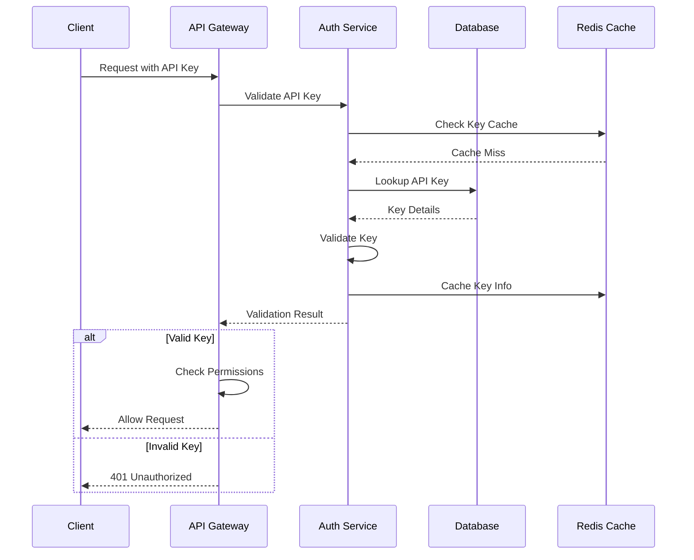
```mermaid
sequenceDiagram
    participant Client
    participant API_GW as API Gateway
    participant Auth as Auth Service
    participant DB as Database
    participant Cache as Redis Cache
    
    Client->>API_GW: Request with API Key
    API_GW->>Auth: Validate API Key
    
    Auth->>Cache: Check Key Cache
    Cache-->>Auth: Cache Miss
    
    Auth->>DB: Lookup API Key
    DB-->>Auth: Key Details
    
    Auth->>Auth: Validate Key
    Auth->>Cache: Cache Key Info
    Auth-->>API_GW: Validation Result
    
    alt Valid Key
        API_GW->>API_GW: Check Permissions
        API_GW-->>Client: Allow Request
    else Invalid Key
        API_GW-->>Client: 401 Unauthorized
    end
```

## Deployment Architecture Diagrams

### 1. AWS ECS Deployment

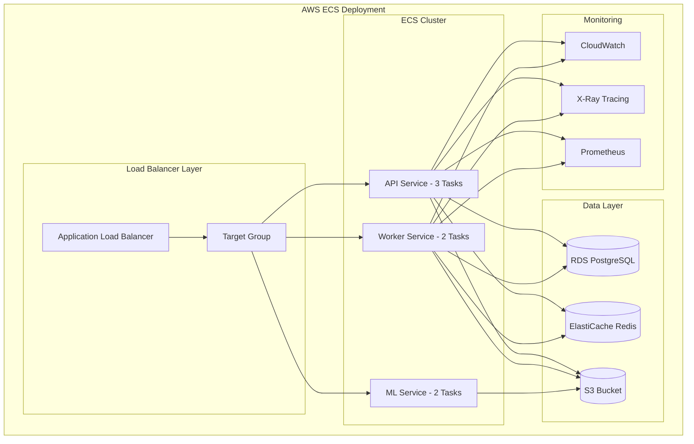
```mermaid
graph TB
    subgraph "AWS ECS Deployment"
        subgraph "Load Balancer Layer"
            ALB[Application Load Balancer]
            TargetGroup[Target Group]
        end
        
        subgraph "ECS Cluster"
            Service1[API Service - 3 Tasks]
            Service2[Worker Service - 2 Tasks]
            Service3[ML Service - 2 Tasks]
        end
        
        subgraph "Data Layer"
            RDS[(RDS PostgreSQL)]
            ElastiCache[(ElastiCache Redis)]
            S3[(S3 Bucket)]
        end
        
        subgraph "Monitoring"
            CloudWatch[CloudWatch]
            XRay[X-Ray Tracing]
            Prometheus[Prometheus]
        end
    end
    
    ALB --> TargetGroup
    TargetGroup --> Service1
    TargetGroup --> Service2
    TargetGroup --> Service3
    
    Service1 --> RDS
    Service1 --> ElastiCache
    Service1 --> S3
    
    Service2 --> RDS
    Service2 --> ElastiCache
    Service2 --> S3
    
    Service3 --> S3
    
    Service1 --> CloudWatch
    Service1 --> XRay
    Service1 --> Prometheus
    
    Service2 --> CloudWatch
    Service2 --> XRay
    Service2 --> Prometheus
```

### 2. Kubernetes Deployment

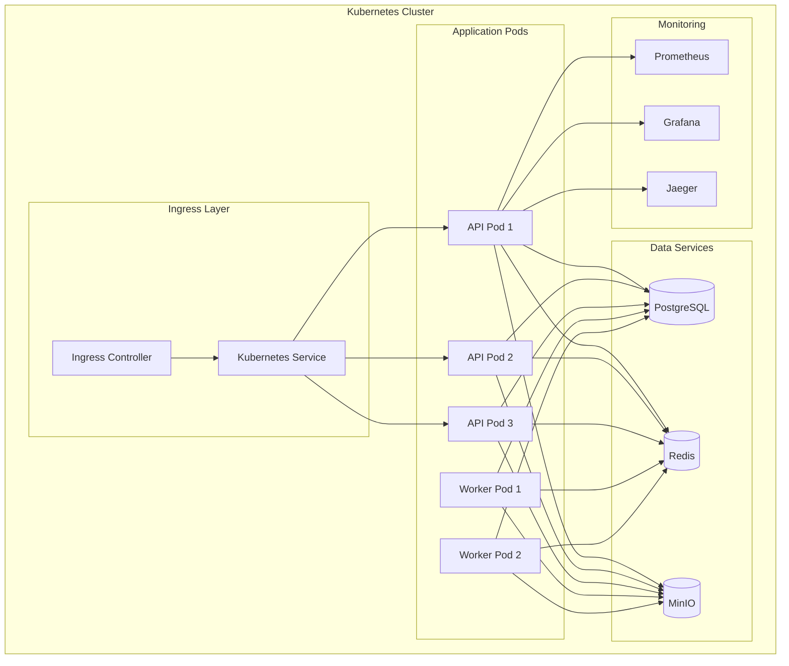
```mermaid
graph TB
    subgraph "Kubernetes Cluster"
        subgraph "Ingress Layer"
            Ingress[Ingress Controller]
            Service[Kubernetes Service]
        end
        
        subgraph "Application Pods"
            API_Pod1[API Pod 1]
            API_Pod2[API Pod 2]
            API_Pod3[API Pod 3]
            Worker_Pod1[Worker Pod 1]
            Worker_Pod2[Worker Pod 2]
        end
        
        subgraph "Data Services"
            PostgreSQL[(PostgreSQL)]
            Redis[(Redis)]
            MinIO[(MinIO)]
        end
        
        subgraph "Monitoring"
            Prometheus[Prometheus]
            Grafana[Grafana]
            Jaeger[Jaeger]
        end
    end
    
    Ingress --> Service
    Service --> API_Pod1
    Service --> API_Pod2
    Service --> API_Pod3
    
    API_Pod1 --> PostgreSQL
    API_Pod1 --> Redis
    API_Pod1 --> MinIO
    
    API_Pod2 --> PostgreSQL
    API_Pod2 --> Redis
    API_Pod2 --> MinIO
    
    API_Pod3 --> PostgreSQL
    API_Pod3 --> Redis
    API_Pod3 --> MinIO
    
    Worker_Pod1 --> PostgreSQL
    Worker_Pod1 --> Redis
    Worker_Pod1 --> MinIO
    
    Worker_Pod2 --> PostgreSQL
    Worker_Pod2 --> Redis
    Worker_Pod2 --> MinIO
    
    API_Pod1 --> Prometheus
    API_Pod1 --> Grafana
    API_Pod1 --> Jaeger
```

## Monitoring and Observability Diagrams

### 1. Monitoring Stack

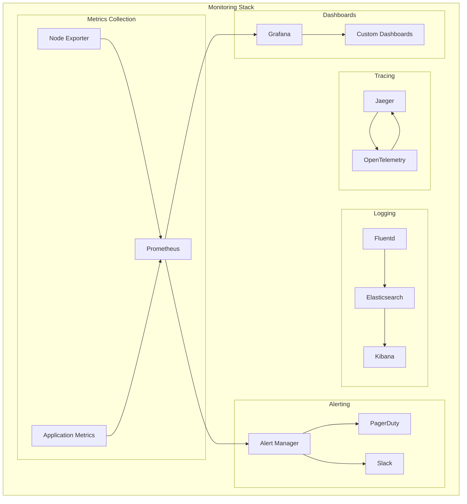
```mermaid
graph TB
    subgraph "Monitoring Stack"
        subgraph "Metrics Collection"
            Prometheus[Prometheus]
            NodeExporter[Node Exporter]
            AppMetrics[Application Metrics]
        end
        
        subgraph "Logging"
            Fluentd[Fluentd]
            Elasticsearch[Elasticsearch]
            Kibana[Kibana]
        end
        
        subgraph "Tracing"
            Jaeger[Jaeger]
            OpenTelemetry[OpenTelemetry]
        end
        
        subgraph "Alerting"
            AlertManager[Alert Manager]
            PagerDuty[PagerDuty]
            Slack[Slack]
        end
        
        subgraph "Dashboards"
            Grafana[Grafana]
            CustomDashboards[Custom Dashboards]
        end
    end
    
    Prometheus --> Grafana
    NodeExporter --> Prometheus
    AppMetrics --> Prometheus
    
    Fluentd --> Elasticsearch
    Elasticsearch --> Kibana
    
    Jaeger --> OpenTelemetry
    OpenTelemetry --> Jaeger
    
    Prometheus --> AlertManager
    AlertManager --> PagerDuty
    AlertManager --> Slack
    
    Grafana --> CustomDashboards
```

### 2. Health Check Architecture

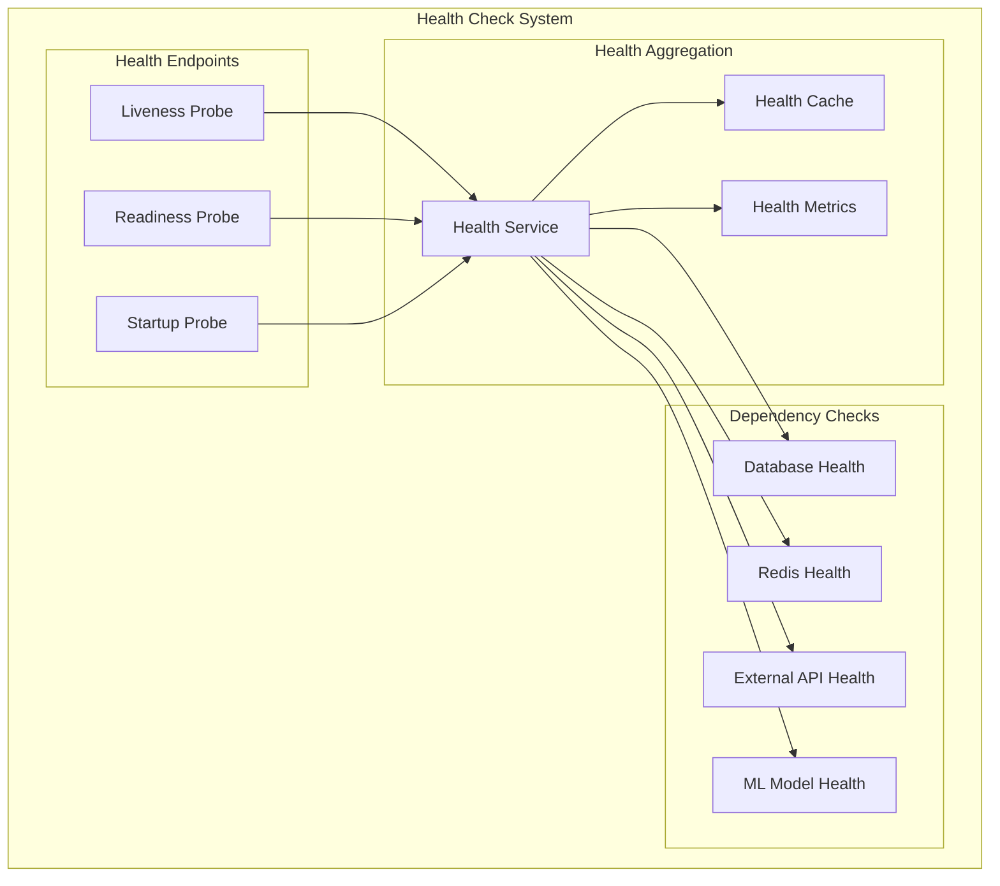
```mermaid
graph TB
    subgraph "Health Check System"
        subgraph "Health Endpoints"
            Liveness[Liveness Probe]
            Readiness[Readiness Probe]
            Startup[Startup Probe]
        end
        
        subgraph "Dependency Checks"
            Database[Database Health]
            Redis[Redis Health]
            ExternalAPIs[External API Health]
            MLModels[ML Model Health]
        end
        
        subgraph "Health Aggregation"
            HealthService[Health Service]
            HealthCache[Health Cache]
            HealthMetrics[Health Metrics]
        end
    end
    
    Liveness --> HealthService
    Readiness --> HealthService
    Startup --> HealthService
    
    HealthService --> Database
    HealthService --> Redis
    HealthService --> ExternalAPIs
    HealthService --> MLModels
    
    HealthService --> HealthCache
    HealthService --> HealthMetrics
```

## Performance Architecture Diagrams

### 1. Caching Strategy

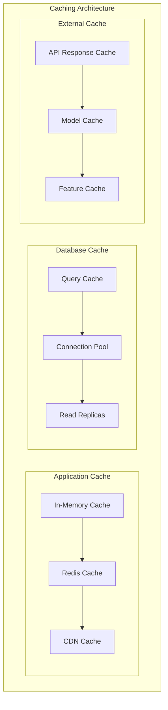
```mermaid
graph TB
    subgraph "Caching Architecture"
        subgraph "Application Cache"
            InMemoryCache[In-Memory Cache]
            RedisCache[Redis Cache]
            CDN[CDN Cache]
        end
        
        subgraph "Database Cache"
            QueryCache[Query Cache]
            ConnectionPool[Connection Pool]
            ReadReplicas[Read Replicas]
        end
        
        subgraph "External Cache"
            APICache[API Response Cache]
            ModelCache[Model Cache]
            FeatureCache[Feature Cache]
        end
    end
    
    InMemoryCache --> RedisCache
    RedisCache --> CDN
    
    QueryCache --> ConnectionPool
    ConnectionPool --> ReadReplicas
    
    APICache --> ModelCache
    ModelCache --> FeatureCache
```

### 2. Load Balancing Strategy

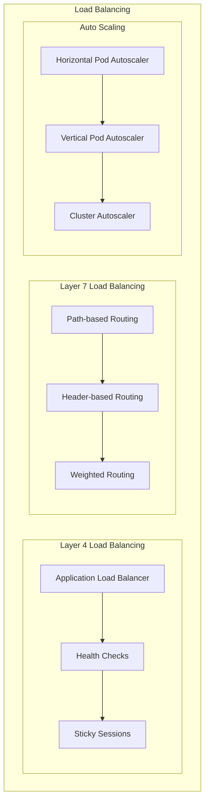
```mermaid
graph TB
    subgraph "Load Balancing"
        subgraph "Layer 4 Load Balancing"
            ALB[Application Load Balancer]
            HealthChecks[Health Checks]
            StickySessions[Sticky Sessions]
        end
        
        subgraph "Layer 7 Load Balancing"
            PathRouting[Path-based Routing]
            HeaderRouting[Header-based Routing]
            WeightedRouting[Weighted Routing]
        end
        
        subgraph "Auto Scaling"
            HPA[Horizontal Pod Autoscaler]
            VPA[Vertical Pod Autoscaler]
            ClusterAutoscaler[Cluster Autoscaler]
        end
    end
    
    ALB --> HealthChecks
    HealthChecks --> StickySessions
    
    PathRouting --> HeaderRouting
    HeaderRouting --> WeightedRouting
    
    HPA --> VPA
    VPA --> ClusterAutoscaler
```

## Disaster Recovery Architecture Diagrams

### 1. Backup Strategy

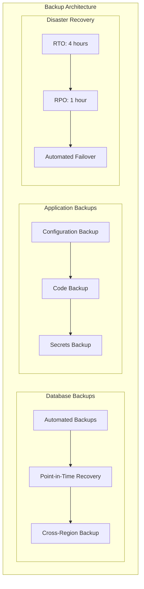
```mermaid
graph TB
    subgraph "Backup Architecture"
        subgraph "Database Backups"
            AutomatedBackups[Automated Backups]
            PointInTimeRecovery[Point-in-Time Recovery]
            CrossRegionBackup[Cross-Region Backup]
        end
        
        subgraph "Application Backups"
            ConfigurationBackup[Configuration Backup]
            CodeBackup[Code Backup]
            SecretsBackup[Secrets Backup]
        end
        
        subgraph "Disaster Recovery"
            RTO[RTO: 4 hours]
            RPO[RPO: 1 hour]
            Failover[Automated Failover]
        end
    end
    
    AutomatedBackups --> PointInTimeRecovery
    PointInTimeRecovery --> CrossRegionBackup
    
    ConfigurationBackup --> CodeBackup
    CodeBackup --> SecretsBackup
    
    RTO --> RPO
    RPO --> Failover
```

### 2. Multi-Region Architecture

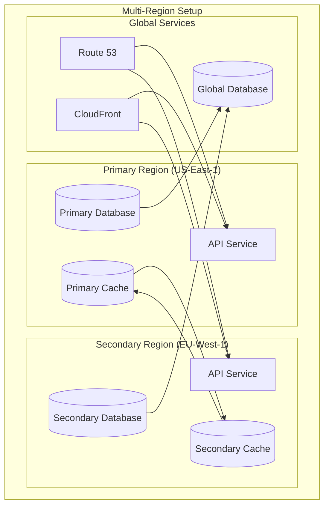
```mermaid
graph TB
    subgraph "Multi-Region Setup"
        subgraph "Primary Region (US-East-1)"
            PrimaryAPI[API Service]
            PrimaryDB[(Primary Database)]
            PrimaryCache[(Primary Cache)]
        end
        
        subgraph "Secondary Region (EU-West-1)"
            SecondaryAPI[API Service]
            SecondaryDB[(Secondary Database)]
            SecondaryCache[(Secondary Cache)]
        end
        
        subgraph "Global Services"
            Route53[Route 53]
            CloudFront[CloudFront]
            GlobalDB[(Global Database)]
        end
    end
    
    Route53 --> PrimaryAPI
    Route53 --> SecondaryAPI
    
    CloudFront --> PrimaryAPI
    CloudFront --> SecondaryAPI
    
    PrimaryDB --> GlobalDB
    SecondaryDB --> GlobalDB
    
    PrimaryCache --> SecondaryCache
    SecondaryCache --> PrimaryCache
```

## ML Pipeline Architecture Diagrams

### 1. ML Training Pipeline

```mermaid
graph TB
    subgraph "ML Training Pipeline"
        subgraph "Data Collection"
            DataSources[Data Sources]
            DataValidation[Data Validation]
            DataCleaning[Data Cleaning]
        end
        
        subgraph "Feature Engineering"
            FeatureExtraction[Feature Extraction]
            FeatureSelection[Feature Selection]
            FeatureTransformation[Feature Transformation]
        end
        
        subgraph "Model Training"
            ModelSelection[Model Selection]
            HyperparameterTuning[Hyperparameter Tuning]
            CrossValidation[Cross Validation]
        end
        
        subgraph "Model Evaluation"
            ModelEvaluation[Model Evaluation]
            ModelComparison[Model Comparison]
            ModelSelection[Model Selection]
        end
        
        subgraph "Model Deployment"
            ModelRegistry[Model Registry]
            ModelServing[Model Serving]
            ModelMonitoring[Model Monitoring]
        end
    end
    
    DataSources --> DataValidation
    DataValidation --> DataCleaning
    DataCleaning --> FeatureExtraction
    
    FeatureExtraction --> FeatureSelection
    FeatureSelection --> FeatureTransformation
    FeatureTransformation --> ModelSelection
    
    ModelSelection --> HyperparameterTuning
    HyperparameterTuning --> CrossValidation
    CrossValidation --> ModelEvaluation
    
    ModelEvaluation --> ModelComparison
    ModelComparison --> ModelSelection
    ModelSelection --> ModelRegistry
    
    ModelRegistry --> ModelServing
    ModelServing --> ModelMonitoring
```

### 2. Model Serving Architecture

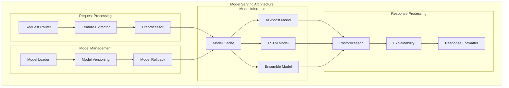
```mermaid
graph TB
    subgraph "Model Serving Architecture"
        subgraph "Request Processing"
            RequestRouter[Request Router]
            FeatureExtractor[Feature Extractor]
            Preprocessor[Preprocessor]
        end
        
        subgraph "Model Inference"
            ModelCache[Model Cache]
            XGBoostModel[XGBoost Model]
            LSTMModel[LSTM Model]
            EnsembleModel[Ensemble Model]
        end
        
        subgraph "Response Processing"
            Postprocessor[Postprocessor]
            Explainability[Explainability]
            ResponseFormatter[Response Formatter]
        end
        
        subgraph "Model Management"
            ModelLoader[Model Loader]
            ModelVersioning[Model Versioning]
            ModelRollback[Model Rollback]
        end
    end
    
    RequestRouter --> FeatureExtractor
    FeatureExtractor --> Preprocessor
    Preprocessor --> ModelCache
    
    ModelCache --> XGBoostModel
    ModelCache --> LSTMModel
    ModelCache --> EnsembleModel
    
    XGBoostModel --> Postprocessor
    LSTMModel --> Postprocessor
    EnsembleModel --> Postprocessor
    
    Postprocessor --> Explainability
    Explainability --> ResponseFormatter
    
    ModelLoader --> ModelVersioning
    ModelVersioning --> ModelRollback
    ModelRollback --> ModelCache
```

## API Architecture Diagrams

### 1. API Gateway Architecture

```mermaid
graph TB
    subgraph "API Gateway Architecture"
        subgraph "Request Processing"
            RateLimiter[Rate Limiter]
            Authentication[Authentication]
            Authorization[Authorization]
            RequestValidator[Request Validator]
        end
        
        subgraph "Routing"
            PathRouter[Path Router]
            MethodRouter[Method Router]
            HeaderRouter[Header Router]
        end
        
        subgraph "Response Processing"
            ResponseTransformer[Response Transformer]
            ErrorHandler[Error Handler]
            ResponseCache[Response Cache]
        end
        
        subgraph "Monitoring"
            RequestLogger[Request Logger]
            MetricsCollector[Metrics Collector]
            Tracing[Tracing]
        end
    end
    
    RateLimiter --> Authentication
    Authentication --> Authorization
    Authorization --> RequestValidator
    RequestValidator --> PathRouter
    
    PathRouter --> MethodRouter
    MethodRouter --> HeaderRouter
    HeaderRouter --> ResponseTransformer
    
    ResponseTransformer --> ErrorHandler
    ErrorHandler --> ResponseCache
    
    RequestLogger --> MetricsCollector
    MetricsCollector --> Tracing
```

### 2. Webhook Architecture

```mermaid
graph TB
    subgraph "Webhook Architecture"
        subgraph "Event Generation"
            EventDetector[Event Detector]
            EventFilter[Event Filter]
            EventFormatter[Event Formatter]
        end
        
        subgraph "Webhook Processing"
            WebhookQueue[Webhook Queue]
            WebhookProcessor[Webhook Processor]
            RetryLogic[Retry Logic]
        end
        
        subgraph "Delivery"
            HTTPClient[HTTP Client]
            SignatureGenerator[Signature Generator]
            DeliveryTracker[Delivery Tracker]
        end
        
        subgraph "Monitoring"
            DeliveryMetrics[Delivery Metrics]
            ErrorTracking[Error Tracking]
            DeadLetterQueue[Dead Letter Queue]
        end
    end
    
    EventDetector --> EventFilter
    EventFilter --> EventFormatter
    EventFormatter --> WebhookQueue
    
    WebhookQueue --> WebhookProcessor
    WebhookProcessor --> RetryLogic
    RetryLogic --> HTTPClient
    
    HTTPClient --> SignatureGenerator
    SignatureGenerator --> DeliveryTracker
    
    DeliveryTracker --> DeliveryMetrics
    DeliveryMetrics --> ErrorTracking
    ErrorTracking --> DeadLetterQueue
```

## Integration Architecture Diagrams

### 1. External API Integration

```mermaid
graph TB
    subgraph "External API Integration"
        subgraph "API Clients"
            ThomsonReutersClient[Thomson Reuters Client]
            OFACClient[OFAC Client]
            WorldCheckClient[World-Check Client]
            NewsAPIClient[News API Client]
        end
        
        subgraph "Rate Limiting"
            RateLimiter[Rate Limiter]
            CircuitBreaker[Circuit Breaker]
            RetryLogic[Retry Logic]
        end
        
        subgraph "Caching"
            ResponseCache[Response Cache]
            CacheInvalidation[Cache Invalidation]
            CacheMetrics[Cache Metrics]
        end
        
        subgraph "Error Handling"
            ErrorHandler[Error Handler]
            FallbackLogic[Fallback Logic]
            ErrorMetrics[Error Metrics]
        end
    end
    
    ThomsonReutersClient --> RateLimiter
    OFACClient --> RateLimiter
    WorldCheckClient --> RateLimiter
    NewsAPIClient --> RateLimiter
    
    RateLimiter --> CircuitBreaker
    CircuitBreaker --> RetryLogic
    RetryLogic --> ResponseCache
    
    ResponseCache --> CacheInvalidation
    CacheInvalidation --> CacheMetrics
    
    ErrorHandler --> FallbackLogic
    FallbackLogic --> ErrorMetrics
```

### 2. Data Integration Pipeline

```mermaid
graph TB
    subgraph "Data Integration Pipeline"
        subgraph "Data Sources"
            ExternalAPIs[External APIs]
            Database[Database]
            Files[File Systems]
            Streams[Data Streams]
        end
        
        subgraph "Data Processing"
            DataIngestion[Data Ingestion]
            DataTransformation[Data Transformation]
            DataValidation[Data Validation]
        end
        
        subgraph "Data Storage"
            DataWarehouse[Data Warehouse]
            DataLake[Data Lake]
            FeatureStore[Feature Store]
        end
        
        subgraph "Data Serving"
            APIServing[API Serving]
            BatchServing[Batch Serving]
            RealTimeServing[Real-time Serving]
        end
    end
    
    ExternalAPIs --> DataIngestion
    Database --> DataIngestion
    Files --> DataIngestion
    Streams --> DataIngestion
    
    DataIngestion --> DataTransformation
    DataTransformation --> DataValidation
    DataValidation --> DataWarehouse
    
    DataWarehouse --> DataLake
    DataLake --> FeatureStore
    FeatureStore --> APIServing
    
    APIServing --> BatchServing
    BatchServing --> RealTimeServing
```

## How to Use These Diagrams

### 1. Rendering in Markdown

These diagrams use Mermaid.js syntax and can be rendered in:
- GitHub (native support)
- GitLab (native support)
- VS Code (with Mermaid extension)
- Notion (with Mermaid blocks)
- Most modern Markdown viewers

### 2. Exporting Diagrams

You can export these diagrams to various formats:
- PNG/SVG using Mermaid CLI
- PDF using Mermaid Live Editor
- Interactive diagrams using Mermaid Live Editor

### 3. Customizing Diagrams

To customize these diagrams:
1. Copy the Mermaid code
2. Edit the diagram structure
3. Update colors, shapes, and connections
4. Test in Mermaid Live Editor
5. Update the documentation

### 4. Adding New Diagrams

To add new diagrams:
1. Create the Mermaid code
2. Test in Mermaid Live Editor
3. Add to this document
4. Update the table of contents
5. Reference in other documentation

## Diagram Maintenance

### 1. Regular Updates

- Update diagrams when architecture changes
- Review diagrams during architecture reviews
- Keep diagrams in sync with code changes
- Validate diagrams with stakeholders

### 2. Version Control

- Track diagram changes in version control
- Tag diagram versions with releases
- Maintain diagram history
- Document diagram changes

### 3. Quality Assurance

- Validate diagram syntax
- Test diagram rendering
- Review diagram accuracy
- Ensure diagram clarity

---

**Last Updated**: January 15, 2024  
**Version**: 2.0.0  
**Next Review**: April 15, 2024
