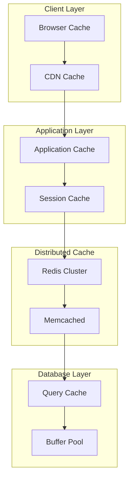

# Caching Strategies Guide

## Overview

This guide provides comprehensive caching strategies for the Risk Assessment Service. It covers multi-layer caching architectures, cache invalidation patterns, performance optimization techniques, and monitoring approaches to ensure optimal cache performance.

## Table of Contents

1. [Caching Architecture](#caching-architecture)
2. [Cache Types and Use Cases](#cache-types-and-use-cases)
3. [Cache Implementation Patterns](#cache-implementation-patterns)
4. [Cache Invalidation Strategies](#cache-invalidation-strategies)
5. [Performance Optimization](#performance-optimization)
6. [Monitoring and Debugging](#monitoring-and-debugging)
7. [Best Practices](#best-practices)

## Caching Architecture

### Multi-Layer Caching Strategy



### Cache Hierarchy

```go
type CacheHierarchy struct {
    L1Cache *sync.Map          // In-memory cache (fastest)
    L2Cache *redis.Client      // Redis cache (fast)
    L3Cache *sql.DB           // Database cache (slower)
}

func (ch *CacheHierarchy) Get(key string) (interface{}, error) {
    // L1 Cache (In-memory)
    if value, ok := ch.L1Cache.Load(key); ok {
        return value, nil
    }
    
    // L2 Cache (Redis)
    if value, err := ch.L2Cache.Get(context.Background(), key).Result(); err == nil {
        ch.L1Cache.Store(key, value)
        return value, nil
    }
    
    // L3 Cache (Database)
    // This would typically trigger a database query
    return nil, cache.ErrCacheMiss
}
```

## Cache Types and Use Cases

### 1. Response Caching

#### API Response Cache
```go
type ResponseCache struct {
    redis  *redis.Client
    ttl    time.Duration
    prefix string
}

func (rc *ResponseCache) GetResponse(endpoint string, params map[string]interface{}) ([]byte, error) {
    key := rc.generateKey(endpoint, params)
    
    cached, err := rc.redis.Get(context.Background(), key).Bytes()
    if err == nil {
        return cached, nil
    }
    
    return nil, cache.ErrCacheMiss
}

func (rc *ResponseCache) SetResponse(endpoint string, params map[string]interface{}, response []byte) error {
    key := rc.generateKey(endpoint, params)
    return rc.redis.Set(context.Background(), key, response, rc.ttl).Err()
}

func (rc *ResponseCache) generateKey(endpoint string, params map[string]interface{}) string {
    hash := sha256.Sum256([]byte(fmt.Sprintf("%s:%v", endpoint, params)))
    return fmt.Sprintf("%s:response:%x", rc.prefix, hash)
}
```

#### HTTP Response Cache Middleware
```go
func ResponseCacheMiddleware(cache *ResponseCache, ttl time.Duration) gin.HandlerFunc {
    return gin.HandlerFunc(func(c *gin.Context) {
        // Only cache GET requests
        if c.Request.Method != "GET" {
            c.Next()
            return
        }
        
        // Generate cache key
        key := generateCacheKey(c.Request)
        
        // Try to get from cache
        if cached, err := cache.GetResponse(key, nil); err == nil {
            c.Header("X-Cache", "HIT")
            c.Header("Content-Type", "application/json")
            c.Data(200, "application/json", cached)
            return
        }
        
        // Cache miss - capture response
        writer := &responseWriter{
            ResponseWriter: c.Writer,
            body:          &bytes.Buffer{},
        }
        c.Writer = writer
        
        c.Next()
        
        // Cache successful responses
        if writer.statusCode == 200 {
            cache.SetResponse(key, nil, writer.body.Bytes())
        }
        
        c.Header("X-Cache", "MISS")
    })
}
```

### 2. Model Caching

#### ML Model Cache
```go
type ModelCache struct {
    models    map[string]*Model
    mutex     sync.RWMutex
    ttl       time.Duration
    maxSize   int
    eviction  *LRUEviction
}

func NewModelCache(maxSize int, ttl time.Duration) *ModelCache {
    return &ModelCache{
        models:   make(map[string]*Model),
        ttl:      ttl,
        maxSize:  maxSize,
        eviction: NewLRUEviction(),
    }
}

func (mc *ModelCache) GetModel(modelType string) (*Model, error) {
    mc.mutex.RLock()
    defer mc.mutex.RUnlock()
    
    if model, exists := mc.models[modelType]; exists {
        mc.eviction.Access(modelType)
        return model, nil
    }
    
    return nil, errors.New("model not found")
}

func (mc *ModelCache) SetModel(modelType string, model *Model) error {
    mc.mutex.Lock()
    defer mc.mutex.Unlock()
    
    // Check if we need to evict
    if len(mc.models) >= mc.maxSize {
        evicted := mc.eviction.Evict()
        delete(mc.models, evicted)
    }
    
    mc.models[modelType] = model
    mc.eviction.Access(modelType)
    
    return nil
}
```

#### Feature Cache
```go
type FeatureCache struct {
    redis     *redis.Client
    ttl       time.Duration
    prefix    string
    compressor *GzipCompressor
}

func (fc *FeatureCache) GetFeatures(businessID string) (*Features, error) {
    key := fmt.Sprintf("%s:features:%s", fc.prefix, businessID)
    
    compressed, err := fc.redis.Get(context.Background(), key).Bytes()
    if err != nil {
        return nil, cache.ErrCacheMiss
    }
    
    decompressed, err := fc.compressor.Decompress(compressed)
    if err != nil {
        return nil, err
    }
    
    var features Features
    if err := json.Unmarshal(decompressed, &features); err != nil {
        return nil, err
    }
    
    return &features, nil
}

func (fc *FeatureCache) SetFeatures(businessID string, features *Features) error {
    key := fmt.Sprintf("%s:features:%s", fc.prefix, businessID)
    
    data, err := json.Marshal(features)
    if err != nil {
        return err
    }
    
    compressed, err := fc.compressor.Compress(data)
    if err != nil {
        return err
    }
    
    return fc.redis.Set(context.Background(), key, compressed, fc.ttl).Err()
}
```

### 3. Session Caching

#### User Session Cache
```go
type SessionCache struct {
    redis    *redis.Client
    ttl      time.Duration
    prefix   string
    serializer *JSONSerializer
}

func (sc *SessionCache) GetSession(sessionID string) (*UserSession, error) {
    key := fmt.Sprintf("%s:session:%s", sc.prefix, sessionID)
    
    data, err := sc.redis.Get(context.Background(), key).Result()
    if err != nil {
        return nil, cache.ErrCacheMiss
    }
    
    var session UserSession
    if err := sc.serializer.Deserialize([]byte(data), &session); err != nil {
        return nil, err
    }
    
    return &session, nil
}

func (sc *SessionCache) SetSession(sessionID string, session *UserSession) error {
    key := fmt.Sprintf("%s:session:%s", sc.prefix, sessionID)
    
    data, err := sc.serializer.Serialize(session)
    if err != nil {
        return err
    }
    
    return sc.redis.Set(context.Background(), key, data, sc.ttl).Err()
}

func (sc *SessionCache) RefreshSession(sessionID string) error {
    key := fmt.Sprintf("%s:session:%s", sc.prefix, sessionID)
    return sc.redis.Expire(context.Background(), key, sc.ttl).Err()
}
```

## Cache Implementation Patterns

### 1. Cache-Aside Pattern

```go
type CacheAsideService struct {
    cache      Cache
    repository Repository
}

func (cas *CacheAsideService) GetAssessment(id string) (*Assessment, error) {
    // Try cache first
    if cached, err := cas.cache.Get(id); err == nil {
        return cached.(*Assessment), nil
    }
    
    // Cache miss - fetch from repository
    assessment, err := cas.repository.GetByID(id)
    if err != nil {
        return nil, err
    }
    
    // Store in cache
    cas.cache.Set(id, assessment, 15*time.Minute)
    
    return assessment, nil
}

func (cas *CacheAsideService) UpdateAssessment(id string, updates map[string]interface{}) error {
    // Update repository
    err := cas.repository.Update(id, updates)
    if err != nil {
        return err
    }
    
    // Invalidate cache
    cas.cache.Delete(id)
    
    return nil
}
```

### 2. Write-Through Pattern

```go
type WriteThroughService struct {
    cache      Cache
    repository Repository
}

func (wts *WriteThroughService) CreateAssessment(assessment *Assessment) error {
    // Write to repository first
    err := wts.repository.Create(assessment)
    if err != nil {
        return err
    }
    
    // Write to cache
    wts.cache.Set(assessment.ID, assessment, 15*time.Minute)
    
    return nil
}

func (wts *WriteThroughService) UpdateAssessment(id string, updates map[string]interface{}) error {
    // Update repository
    err := wts.repository.Update(id, updates)
    if err != nil {
        return err
    }
    
    // Update cache
    if cached, err := wts.cache.Get(id); err == nil {
        assessment := cached.(*Assessment)
        // Apply updates to cached object
        wts.applyUpdates(assessment, updates)
        wts.cache.Set(id, assessment, 15*time.Minute)
    }
    
    return nil
}
```

### 3. Write-Behind Pattern

```go
type WriteBehindService struct {
    cache      Cache
    repository Repository
    queue      chan WriteOperation
    workers    int
}

type WriteOperation struct {
    Type string
    Key  string
    Data interface{}
}

func (wbs *WriteBehindService) Start() {
    for i := 0; i < wbs.workers; i++ {
        go wbs.worker()
    }
}

func (wbs *WriteBehindService) worker() {
    for op := range wbs.queue {
        switch op.Type {
        case "create":
            wbs.repository.Create(op.Data.(*Assessment))
        case "update":
            wbs.repository.Update(op.Key, op.Data.(map[string]interface{}))
        case "delete":
            wbs.repository.Delete(op.Key)
        }
    }
}

func (wbs *WriteBehindService) CreateAssessment(assessment *Assessment) error {
    // Write to cache immediately
    wbs.cache.Set(assessment.ID, assessment, 15*time.Minute)
    
    // Queue write to repository
    wbs.queue <- WriteOperation{
        Type: "create",
        Key:  assessment.ID,
        Data: assessment,
    }
    
    return nil
}
```

### 4. Refresh-Ahead Pattern

```go
type RefreshAheadService struct {
    cache      Cache
    repository Repository
    ttl        time.Duration
    refreshTTL time.Duration
}

func (ras *RefreshAheadService) GetAssessment(id string) (*Assessment, error) {
    // Try cache first
    if cached, err := ras.cache.Get(id); err == nil {
        assessment := cached.(*Assessment)
        
        // Check if we need to refresh
        if ras.shouldRefresh(assessment) {
            go ras.refreshAssessment(id)
        }
        
        return assessment, nil
    }
    
    // Cache miss - fetch from repository
    assessment, err := ras.repository.GetByID(id)
    if err != nil {
        return nil, err
    }
    
    // Store in cache
    ras.cache.Set(id, assessment, ras.ttl)
    
    return assessment, nil
}

func (ras *RefreshAheadService) shouldRefresh(assessment *Assessment) bool {
    // Refresh if cache expires within refreshTTL
    return time.Until(assessment.CacheExpiry) < ras.refreshTTL
}

func (ras *RefreshAheadService) refreshAssessment(id string) {
    assessment, err := ras.repository.GetByID(id)
    if err != nil {
        return
    }
    
    ras.cache.Set(id, assessment, ras.ttl)
}
```

## Cache Invalidation Strategies

### 1. Time-Based Expiration

```go
type TimeBasedCache struct {
    redis *redis.Client
    ttl   time.Duration
}

func (tbc *TimeBasedCache) Set(key string, value interface{}) error {
    data, err := json.Marshal(value)
    if err != nil {
        return err
    }
    
    return tbc.redis.Set(context.Background(), key, data, tbc.ttl).Err()
}

func (tbc *TimeBasedCache) Get(key string) (interface{}, error) {
    data, err := tbc.redis.Get(context.Background(), key).Result()
    if err != nil {
        return nil, cache.ErrCacheMiss
    }
    
    var value interface{}
    if err := json.Unmarshal([]byte(data), &value); err != nil {
        return nil, err
    }
    
    return value, nil
}
```

### 2. Event-Based Invalidation

```go
type EventBasedCache struct {
    cache     Cache
    eventBus  EventBus
    listeners map[string][]InvalidationListener
}

type InvalidationListener func(key string, event Event)

func (ebc *EventBasedCache) RegisterListener(eventType string, listener InvalidationListener) {
    ebc.listeners[eventType] = append(ebc.listeners[eventType], listener)
}

func (ebc *EventBasedCache) HandleEvent(event Event) {
    listeners := ebc.listeners[event.Type]
    for _, listener := range listeners {
        listener(event.Key, event)
    }
}

func (ebc *EventBasedCache) InvalidateByPattern(pattern string) error {
    keys, err := ebc.cache.Keys(pattern)
    if err != nil {
        return err
    }
    
    for _, key := range keys {
        ebc.cache.Delete(key)
    }
    
    return nil
}
```

### 3. Version-Based Invalidation

```go
type VersionedCache struct {
    cache   Cache
    version int64
}

func (vc *VersionedCache) Get(key string) (interface{}, error) {
    versionedKey := fmt.Sprintf("%s:v%d", key, vc.version)
    return vc.cache.Get(versionedKey)
}

func (vc *VersionedCache) Set(key string, value interface{}) error {
    versionedKey := fmt.Sprintf("%s:v%d", key, vc.version)
    return vc.cache.Set(versionedKey, value, 15*time.Minute)
}

func (vc *VersionedCache) InvalidateAll() {
    vc.version++
}
```

### 4. Dependency-Based Invalidation

```go
type DependencyCache struct {
    cache        Cache
    dependencies map[string][]string
    mutex        sync.RWMutex
}

func (dc *DependencyCache) SetWithDependencies(key string, value interface{}, deps []string) error {
    dc.mutex.Lock()
    dc.dependencies[key] = deps
    dc.mutex.Unlock()
    
    return dc.cache.Set(key, value, 15*time.Minute)
}

func (dc *DependencyCache) InvalidateDependency(dep string) error {
    dc.mutex.RLock()
    defer dc.mutex.RUnlock()
    
    for key, deps := range dc.dependencies {
        for _, dependency := range deps {
            if dependency == dep {
                dc.cache.Delete(key)
                break
            }
        }
    }
    
    return nil
}
```

## Performance Optimization

### 1. Cache Warming

#### Proactive Cache Warming
```go
type CacheWarmer struct {
    cache      Cache
    repository Repository
    scheduler  *cron.Cron
}

func (cw *CacheWarmer) Start() {
    // Warm cache every hour
    cw.scheduler.AddFunc("@hourly", cw.warmFrequentlyAccessedData)
    
    // Warm cache on startup
    cw.warmFrequentlyAccessedData()
    
    cw.scheduler.Start()
}

func (cw *CacheWarmer) warmFrequentlyAccessedData() {
    // Warm recent assessments
    assessments, err := cw.repository.GetRecentAssessments(1000)
    if err != nil {
        log.Printf("Failed to warm assessments: %v", err)
        return
    }
    
    for _, assessment := range assessments {
        cw.cache.Set(assessment.ID, assessment, 15*time.Minute)
    }
    
    // Warm user sessions
    users, err := cw.repository.GetActiveUsers(500)
    if err != nil {
        log.Printf("Failed to warm user sessions: %v", err)
        return
    }
    
    for _, user := range users {
        session := &UserSession{UserID: user.ID, LastAccess: time.Now()}
        cw.cache.Set(fmt.Sprintf("session:%s", user.ID), session, 30*time.Minute)
    }
}
```

#### Predictive Cache Warming
```go
func (cw *CacheWarmer) warmPredictiveData() {
    // Analyze access patterns
    patterns := cw.analyzeAccessPatterns()
    
    for _, pattern := range patterns {
        if pattern.Probability > 0.8 {
            // Warm data that's likely to be accessed
            cw.warmData(pattern.DataType, pattern.Key)
        }
    }
}

func (cw *CacheWarmer) analyzeAccessPatterns() []AccessPattern {
    // Implement machine learning-based prediction
    // This would analyze historical access patterns
    // and predict what data is likely to be accessed next
    return []AccessPattern{}
}
```

### 2. Cache Compression

#### Gzip Compression
```go
type CompressedCache struct {
    cache       Cache
    compressor  *GzipCompressor
    threshold   int // Only compress if data is larger than threshold
}

func (cc *CompressedCache) Set(key string, value interface{}) error {
    data, err := json.Marshal(value)
    if err != nil {
        return err
    }
    
    if len(data) > cc.threshold {
        compressed, err := cc.compressor.Compress(data)
        if err != nil {
            return err
        }
        
        // Store with compression flag
        compressedData := append([]byte{1}, compressed...)
        return cc.cache.Set(key, compressedData, 15*time.Minute)
    }
    
    // Store uncompressed
    uncompressedData := append([]byte{0}, data...)
    return cc.cache.Set(key, uncompressedData, 15*time.Minute)
}

func (cc *CompressedCache) Get(key string) (interface{}, error) {
    data, err := cc.cache.Get(key)
    if err != nil {
        return nil, err
    }
    
    dataBytes := data.([]byte)
    
    // Check compression flag
    if dataBytes[0] == 1 {
        // Decompress
        decompressed, err := cc.compressor.Decompress(dataBytes[1:])
        if err != nil {
            return nil, err
        }
        dataBytes = decompressed
    } else {
        dataBytes = dataBytes[1:]
    }
    
    var value interface{}
    if err := json.Unmarshal(dataBytes, &value); err != nil {
        return nil, err
    }
    
    return value, nil
}
```

### 3. Cache Sharding

#### Consistent Hashing
```go
type ShardedCache struct {
    shards    []Cache
    hasher    *ConsistentHasher
    replicas  int
}

func NewShardedCache(shards []Cache, replicas int) *ShardedCache {
    return &ShardedCache{
        shards:   shards,
        hasher:   NewConsistentHasher(replicas),
        replicas: replicas,
    }
}

func (sc *ShardedCache) Get(key string) (interface{}, error) {
    shard := sc.getShard(key)
    return shard.Get(key)
}

func (sc *ShardedCache) Set(key string, value interface{}, ttl time.Duration) error {
    shard := sc.getShard(key)
    return shard.Set(key, value, ttl)
}

func (sc *ShardedCache) getShard(key string) Cache {
    hash := sc.hasher.Hash(key)
    shardIndex := hash % uint32(len(sc.shards))
    return sc.shards[shardIndex]
}
```

## Monitoring and Debugging

### 1. Cache Metrics

#### Cache Performance Metrics
```go
type CacheMetrics struct {
    hits        prometheus.Counter
    misses      prometheus.Counter
    sets        prometheus.Counter
    deletes     prometheus.Counter
    hitRate     prometheus.Gauge
    size        prometheus.Gauge
    latency     prometheus.HistogramVec
}

func NewCacheMetrics() *CacheMetrics {
    return &CacheMetrics{
        hits: prometheus.NewCounter(prometheus.CounterOpts{
            Name: "cache_hits_total",
            Help: "Total number of cache hits",
        }),
        misses: prometheus.NewCounter(prometheus.CounterOpts{
            Name: "cache_misses_total",
            Help: "Total number of cache misses",
        }),
        sets: prometheus.NewCounter(prometheus.CounterOpts{
            Name: "cache_sets_total",
            Help: "Total number of cache sets",
        }),
        deletes: prometheus.NewCounter(prometheus.CounterOpts{
            Name: "cache_deletes_total",
            Help: "Total number of cache deletes",
        }),
        hitRate: prometheus.NewGauge(prometheus.GaugeOpts{
            Name: "cache_hit_rate",
            Help: "Cache hit rate",
        }),
        size: prometheus.NewGauge(prometheus.GaugeOpts{
            Name: "cache_size",
            Help: "Cache size in bytes",
        }),
        latency: prometheus.NewHistogramVec(prometheus.HistogramOpts{
            Name: "cache_operation_duration_seconds",
            Help: "Cache operation duration",
        }, []string{"operation", "result"}),
    }
}

func (cm *CacheMetrics) RecordHit(operation string, duration time.Duration) {
    cm.hits.Inc()
    cm.latency.WithLabelValues(operation, "hit").Observe(duration.Seconds())
    cm.updateHitRate()
}

func (cm *CacheMetrics) RecordMiss(operation string, duration time.Duration) {
    cm.misses.Inc()
    cm.latency.WithLabelValues(operation, "miss").Observe(duration.Seconds())
    cm.updateHitRate()
}

func (cm *CacheMetrics) updateHitRate() {
    total := cm.hits.Get() + cm.misses.Get()
    if total > 0 {
        rate := cm.hits.Get() / total
        cm.hitRate.Set(rate)
    }
}
```

### 2. Cache Health Monitoring

#### Cache Health Check
```go
type CacheHealthChecker struct {
    cache   Cache
    metrics *CacheMetrics
}

func (chc *CacheHealthChecker) CheckHealth() *HealthStatus {
    status := &HealthStatus{
        Status:    "healthy",
        Timestamp: time.Now(),
        Checks:    make(map[string]CheckResult),
    }
    
    // Check cache connectivity
    start := time.Now()
    err := chc.cache.Ping()
    status.Checks["connectivity"] = CheckResult{
        Status:    getStatus(err == nil),
        Duration:  time.Since(start),
        Error:     err,
    }
    
    // Check cache performance
    start = time.Now()
    testKey := "health_check"
    testValue := "test_value"
    
    err = chc.cache.Set(testKey, testValue, time.Minute)
    if err == nil {
        _, err = chc.cache.Get(testKey)
    }
    
    status.Checks["performance"] = CheckResult{
        Status:    getStatus(err == nil),
        Duration:  time.Since(start),
        Error:     err,
    }
    
    // Check hit rate
    hitRate := chc.metrics.hitRate.Get()
    status.Checks["hit_rate"] = CheckResult{
        Status:    getStatus(hitRate > 0.8),
        Duration:  0,
        Error:     nil,
        Details:   fmt.Sprintf("Hit rate: %.2f", hitRate),
    }
    
    // Overall status
    for _, check := range status.Checks {
        if check.Status != "healthy" {
            status.Status = "unhealthy"
            break
        }
    }
    
    return status
}
```

### 3. Cache Debugging

#### Cache Debug Information
```go
type CacheDebugger struct {
    cache Cache
}

func (cd *CacheDebugger) GetDebugInfo(key string) *DebugInfo {
    info := &DebugInfo{
        Key:       key,
        Timestamp: time.Now(),
    }
    
    // Check if key exists
    exists, err := cd.cache.Exists(key)
    if err != nil {
        info.Error = err.Error()
        return info
    }
    
    info.Exists = exists
    
    if exists {
        // Get TTL
        ttl, err := cd.cache.TTL(key)
        if err == nil {
            info.TTL = ttl
        }
        
        // Get size
        size, err := cd.cache.Size(key)
        if err == nil {
            info.Size = size
        }
        
        // Get value (first 100 chars)
        value, err := cd.cache.Get(key)
        if err == nil {
            valueStr := fmt.Sprintf("%v", value)
            if len(valueStr) > 100 {
                valueStr = valueStr[:100] + "..."
            }
            info.Value = valueStr
        }
    }
    
    return info
}
```

## Best Practices

### 1. Cache Design Principles

#### Key Design
- Use descriptive, hierarchical keys
- Include version information in keys
- Use consistent key formats
- Avoid special characters in keys

```go
// Good key design
func generateCacheKey(userID, assessmentID string) string {
    return fmt.Sprintf("user:%s:assessment:%s", userID, assessmentID)
}

// Bad key design
func generateCacheKey(userID, assessmentID string) string {
    return fmt.Sprintf("%s_%s", userID, assessmentID)
}
```

#### TTL Strategy
- Set appropriate TTLs based on data volatility
- Use shorter TTLs for frequently changing data
- Use longer TTLs for stable data
- Implement TTL extension for frequently accessed data

```go
type TTLStrategy struct {
    StaticData    time.Duration // 1 hour
    DynamicData   time.Duration // 15 minutes
    SessionData   time.Duration // 30 minutes
    ModelData     time.Duration // 1 hour
}

func (ts *TTLStrategy) GetTTL(dataType string) time.Duration {
    switch dataType {
    case "static":
        return ts.StaticData
    case "dynamic":
        return ts.DynamicData
    case "session":
        return ts.SessionData
    case "model":
        return ts.ModelData
    default:
        return 15 * time.Minute
    }
}
```

### 2. Cache Invalidation Best Practices

#### Invalidation Patterns
- Invalidate related data when updating
- Use event-driven invalidation
- Implement cascading invalidation
- Use version-based invalidation for complex data

```go
func (s *RiskAssessmentService) UpdateAssessment(id string, updates map[string]interface{}) error {
    // Update database
    err := s.repository.Update(id, updates)
    if err != nil {
        return err
    }
    
    // Invalidate related caches
    s.cache.Delete(fmt.Sprintf("assessment:%s", id))
    s.cache.Delete(fmt.Sprintf("user:%s:assessments", updates["user_id"]))
    s.cache.Delete(fmt.Sprintf("user:%s:recent", updates["user_id"]))
    
    // Invalidate by pattern
    s.cache.DeletePattern(fmt.Sprintf("assessment:%s:*", id))
    
    return nil
}
```

### 3. Performance Optimization

#### Cache Warming
- Warm frequently accessed data
- Use predictive warming based on patterns
- Implement background warming
- Monitor warming effectiveness

#### Compression
- Compress large data objects
- Use appropriate compression algorithms
- Balance compression ratio vs. CPU usage
- Cache compressed data when possible

#### Sharding
- Distribute cache across multiple nodes
- Use consistent hashing for sharding
- Implement replica nodes for high availability
- Monitor shard distribution and rebalance when needed

### 4. Monitoring and Alerting

#### Key Metrics to Monitor
- Cache hit rate
- Cache latency
- Cache size and memory usage
- Error rates
- Eviction rates

#### Alerting Thresholds
- Hit rate below 80%
- Latency above 10ms
- Memory usage above 90%
- Error rate above 1%

```go
func (cm *CacheMetrics) CheckAlerts() []Alert {
    var alerts []Alert
    
    hitRate := cm.hitRate.Get()
    if hitRate < 0.8 {
        alerts = append(alerts, Alert{
            Type:    "low_hit_rate",
            Message: fmt.Sprintf("Cache hit rate is low: %.2f", hitRate),
            Severity: "warning",
        })
    }
    
    size := cm.size.Get()
    if size > 0.9*cm.maxSize {
        alerts = append(alerts, Alert{
            Type:    "high_memory_usage",
            Message: fmt.Sprintf("Cache memory usage is high: %.2f", size),
            Severity: "critical",
        })
    }
    
    return alerts
}
```

## Tools and Resources

### Caching Tools
- **Redis**: In-memory data structure store
- **Memcached**: Distributed memory caching system
- **Hazelcast**: In-memory data grid
- **Apache Ignite**: Distributed caching platform

### Monitoring Tools
- **Prometheus**: Metrics collection and alerting
- **Grafana**: Metrics visualization
- **Redis CLI**: Redis monitoring and debugging
- **Cachegrind**: Cache profiling tool

### Testing Tools
- **Redis-benchmark**: Redis performance testing
- **Memtier**: Memcached performance testing
- **JMeter**: Load testing with caching scenarios
- **K6**: Modern load testing tool

---

**Last Updated**: January 15, 2024  
**Version**: 2.0.0  
**Next Review**: April 15, 2024
