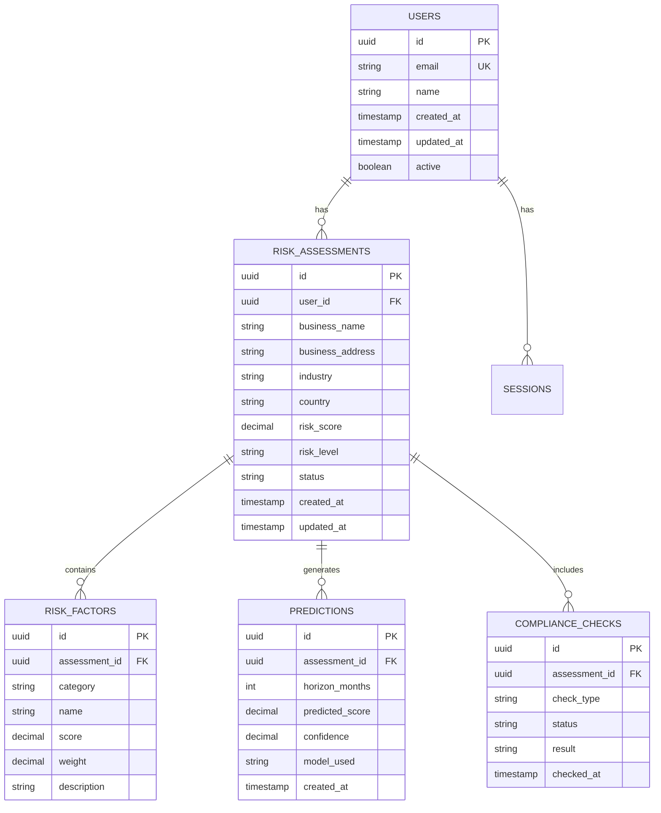

# Database Optimization Guide

## Overview

This guide provides comprehensive database optimization strategies for the Risk Assessment Service. It covers query optimization, indexing strategies, connection pooling, partitioning, and performance monitoring to ensure optimal database performance at scale.

## Table of Contents

1. [Database Architecture](#database-architecture)
2. [Query Optimization](#query-optimization)
3. [Indexing Strategies](#indexing-strategies)
4. [Connection Pooling](#connection-pooling)
5. [Partitioning and Sharding](#partitioning-and-sharding)
6. [Performance Monitoring](#performance-monitoring)
7. [Backup and Recovery](#backup-and-recovery)
8. [Best Practices](#best-practices)

## Database Architecture

### Database Schema Design



### Database Configuration

#### PostgreSQL Configuration
```sql
-- postgresql.conf optimizations
shared_buffers = 256MB                    -- 25% of RAM
effective_cache_size = 1GB                -- 75% of RAM
work_mem = 4MB                            -- Per operation memory
maintenance_work_mem = 64MB               -- Maintenance operations
checkpoint_completion_target = 0.9        -- Checkpoint spread
wal_buffers = 16MB                        -- WAL buffer size
default_statistics_target = 100           -- Statistics accuracy
random_page_cost = 1.1                    -- SSD optimization
effective_io_concurrency = 200            -- SSD optimization
max_connections = 100                     -- Connection limit
shared_preload_libraries = 'pg_stat_statements' -- Query statistics
```

#### Connection Pool Configuration
```go
type DatabaseConfig struct {
    Host            string
    Port            int
    Database        string
    Username        string
    Password        string
    SSLMode         string
    MaxConnections  int
    MinConnections  int
    MaxLifetime     time.Duration
    MaxIdleTime     time.Duration
    ConnectTimeout  time.Duration
    QueryTimeout    time.Duration
}

func NewDatabaseConfig() *DatabaseConfig {
    return &DatabaseConfig{
        Host:            getEnv("DB_HOST", "localhost"),
        Port:            getEnvInt("DB_PORT", 5432),
        Database:        getEnv("DB_NAME", "risk_assessment"),
        Username:        getEnv("DB_USER", "postgres"),
        Password:        getEnv("DB_PASSWORD", ""),
        SSLMode:         getEnv("DB_SSL_MODE", "require"),
        MaxConnections:  getEnvInt("DB_MAX_CONNECTIONS", 25),
        MinConnections:  getEnvInt("DB_MIN_CONNECTIONS", 5),
        MaxLifetime:     getEnvDuration("DB_MAX_LIFETIME", 5*time.Minute),
        MaxIdleTime:     getEnvDuration("DB_MAX_IDLE_TIME", 1*time.Minute),
        ConnectTimeout:  getEnvDuration("DB_CONNECT_TIMEOUT", 30*time.Second),
        QueryTimeout:    getEnvDuration("DB_QUERY_TIMEOUT", 30*time.Second),
    }
}
```

## Query Optimization

### 1. Query Analysis and Profiling

#### Query Performance Analysis
```sql
-- Enable query statistics
CREATE EXTENSION IF NOT EXISTS pg_stat_statements;

-- View slow queries
SELECT 
    query,
    calls,
    total_time,
    mean_time,
    rows,
    100.0 * shared_blks_hit / nullif(shared_blks_hit + shared_blks_read, 0) AS hit_percent
FROM pg_stat_statements 
WHERE mean_time > 100  -- Queries taking more than 100ms
ORDER BY mean_time DESC
LIMIT 10;

-- View query execution plans
EXPLAIN (ANALYZE, BUFFERS, FORMAT JSON) 
SELECT * FROM risk_assessments 
WHERE user_id = $1 AND status = 'completed'
ORDER BY created_at DESC;
```

#### Query Optimization Techniques
```go
// Bad: N+1 query problem
func GetUserAssessmentsWithFactors(userID string) ([]AssessmentWithFactors, error) {
    assessments, err := db.GetAssessmentsByUser(userID)
    if err != nil {
        return nil, err
    }
    
    var results []AssessmentWithFactors
    for _, assessment := range assessments {
        factors, err := db.GetRiskFactors(assessment.ID)
        if err != nil {
            return nil, err
        }
        
        results = append(results, AssessmentWithFactors{
            Assessment: assessment,
            Factors:    factors,
        })
    }
    
    return results, nil
}

// Good: Single query with JOIN
func GetUserAssessmentsWithFactors(userID string) ([]AssessmentWithFactors, error) {
    query := `
        SELECT 
            a.id, a.business_name, a.risk_score, a.risk_level, a.created_at,
            rf.id as factor_id, rf.category, rf.name, rf.score, rf.weight
        FROM risk_assessments a
        LEFT JOIN risk_factors rf ON a.id = rf.assessment_id
        WHERE a.user_id = $1
        ORDER BY a.created_at DESC, rf.category, rf.name
    `
    
    rows, err := db.Query(query, userID)
    if err != nil {
        return nil, err
    }
    defer rows.Close()
    
    return scanAssessmentsWithFactors(rows)
}
```

### 2. Prepared Statements

#### Prepared Statement Usage
```go
type PreparedStatements struct {
    GetAssessmentByID    *sql.Stmt
    GetUserAssessments   *sql.Stmt
    CreateAssessment     *sql.Stmt
    UpdateAssessment     *sql.Stmt
    DeleteAssessment     *sql.Stmt
}

func PrepareStatements(db *sql.DB) (*PreparedStatements, error) {
    stmts := &PreparedStatements{}
    
    var err error
    
    stmts.GetAssessmentByID, err = db.Prepare(`
        SELECT id, user_id, business_name, risk_score, risk_level, created_at
        FROM risk_assessments 
        WHERE id = $1
    `)
    if err != nil {
        return nil, err
    }
    
    stmts.GetUserAssessments, err = db.Prepare(`
        SELECT id, business_name, risk_score, risk_level, created_at
        FROM risk_assessments 
        WHERE user_id = $1 
        ORDER BY created_at DESC
        LIMIT $2 OFFSET $3
    `)
    if err != nil {
        return nil, err
    }
    
    stmts.CreateAssessment, err = db.Prepare(`
        INSERT INTO risk_assessments (id, user_id, business_name, business_address, industry, country, risk_score, risk_level, status)
        VALUES ($1, $2, $3, $4, $5, $6, $7, $8, $9)
        RETURNING id, created_at
    `)
    if err != nil {
        return nil, err
    }
    
    return stmts, nil
}
```

### 3. Query Batching

#### Batch Operations
```go
func BatchCreateAssessments(assessments []Assessment) error {
    if len(assessments) == 0 {
        return nil
    }
    
    // Prepare batch insert
    query := `
        INSERT INTO risk_assessments (id, user_id, business_name, business_address, industry, country, risk_score, risk_level, status)
        VALUES ($1, $2, $3, $4, $5, $6, $7, $8, $9)
    `
    
    stmt, err := db.Prepare(query)
    if err != nil {
        return err
    }
    defer stmt.Close()
    
    // Execute batch
    for _, assessment := range assessments {
        _, err := stmt.Exec(
            assessment.ID,
            assessment.UserID,
            assessment.BusinessName,
            assessment.BusinessAddress,
            assessment.Industry,
            assessment.Country,
            assessment.RiskScore,
            assessment.RiskLevel,
            assessment.Status,
        )
        if err != nil {
            return err
        }
    }
    
    return nil
}
```

## Indexing Strategies

### 1. Primary Indexes

#### Essential Indexes
```sql
-- Primary key indexes (automatically created)
CREATE INDEX CONCURRENTLY idx_risk_assessments_pkey ON risk_assessments(id);
CREATE INDEX CONCURRENTLY idx_users_pkey ON users(id);

-- Foreign key indexes
CREATE INDEX CONCURRENTLY idx_risk_assessments_user_id ON risk_assessments(user_id);
CREATE INDEX CONCURRENTLY idx_risk_factors_assessment_id ON risk_factors(assessment_id);
CREATE INDEX CONCURRENTLY idx_predictions_assessment_id ON predictions(assessment_id);
CREATE INDEX CONCURRENTLY idx_compliance_checks_assessment_id ON compliance_checks(assessment_id);

-- Timestamp indexes for time-based queries
CREATE INDEX CONCURRENTLY idx_risk_assessments_created_at ON risk_assessments(created_at);
CREATE INDEX CONCURRENTLY idx_risk_assessments_updated_at ON risk_assessments(updated_at);
CREATE INDEX CONCURRENTLY idx_users_created_at ON users(created_at);
```

### 2. Composite Indexes

#### Multi-Column Indexes
```sql
-- Composite indexes for common query patterns
CREATE INDEX CONCURRENTLY idx_risk_assessments_user_status 
ON risk_assessments(user_id, status);

CREATE INDEX CONCURRENTLY idx_risk_assessments_user_created 
ON risk_assessments(user_id, created_at DESC);

CREATE INDEX CONCURRENTLY idx_risk_assessments_status_created 
ON risk_assessments(status, created_at DESC);

CREATE INDEX CONCURRENTLY idx_risk_assessments_industry_country 
ON risk_assessments(industry, country);

-- Covering index for read-heavy queries
CREATE INDEX CONCURRENTLY idx_risk_assessments_covering 
ON risk_assessments(user_id, status, created_at DESC) 
INCLUDE (business_name, risk_score, risk_level);
```

### 3. Partial Indexes

#### Conditional Indexes
```sql
-- Partial indexes for specific conditions
CREATE INDEX CONCURRENTLY idx_risk_assessments_active 
ON risk_assessments(user_id, created_at DESC) 
WHERE status IN ('pending', 'completed');

CREATE INDEX CONCURRENTLY idx_risk_assessments_high_risk 
ON risk_assessments(user_id, created_at DESC) 
WHERE risk_level = 'high';

CREATE INDEX CONCURRENTLY idx_users_active 
ON users(email, created_at) 
WHERE active = true;

-- Partial index for recent data
CREATE INDEX CONCURRENTLY idx_risk_assessments_recent 
ON risk_assessments(user_id, created_at DESC) 
WHERE created_at > NOW() - INTERVAL '30 days';
```

### 4. Expression Indexes

#### Functional Indexes
```sql
-- Expression indexes for computed values
CREATE INDEX CONCURRENTLY idx_risk_assessments_business_name_lower 
ON risk_assessments(LOWER(business_name));

CREATE INDEX CONCURRENTLY idx_risk_assessments_created_date 
ON risk_assessments(DATE(created_at));

CREATE INDEX CONCURRENTLY idx_users_email_domain 
ON users(SUBSTRING(email FROM '@(.*)$'));

-- Index for full-text search
CREATE INDEX CONCURRENTLY idx_risk_assessments_business_search 
ON risk_assessments USING gin(to_tsvector('english', business_name || ' ' || business_address));
```

### 5. Index Maintenance

#### Index Monitoring and Maintenance
```sql
-- Monitor index usage
SELECT 
    schemaname,
    tablename,
    indexname,
    idx_tup_read,
    idx_tup_fetch,
    idx_scan,
    CASE 
        WHEN idx_scan = 0 THEN 'UNUSED'
        WHEN idx_scan < 100 THEN 'LOW_USAGE'
        ELSE 'ACTIVE'
    END as usage_status
FROM pg_stat_user_indexes 
ORDER BY idx_scan DESC;

-- Find unused indexes
SELECT 
    schemaname,
    tablename,
    indexname,
    idx_scan
FROM pg_stat_user_indexes 
WHERE idx_scan = 0 
AND indexname NOT LIKE '%_pkey';

-- Monitor index bloat
SELECT 
    schemaname,
    tablename,
    indexname,
    pg_size_pretty(pg_relation_size(indexrelid)) as index_size,
    pg_size_pretty(pg_relation_size(relid)) as table_size
FROM pg_stat_user_indexes 
ORDER BY pg_relation_size(indexrelid) DESC;
```

## Connection Pooling

### 1. Connection Pool Configuration

#### PgBouncer Configuration
```ini
# pgbouncer.ini
[databases]
risk_assessment = host=localhost port=5432 dbname=risk_assessment user=postgres

[pgbouncer]
listen_addr = 127.0.0.1
listen_port = 6432
auth_type = md5
auth_file = /etc/pgbouncer/userlist.txt
pool_mode = transaction
max_client_conn = 1000
default_pool_size = 25
reserve_pool_size = 5
reserve_pool_timeout = 3
max_db_connections = 100
max_user_connections = 50
server_round_robin = 1
ignore_startup_parameters = extra_float_digits
application_name_add_host = 1

# Logging
log_connections = 1
log_disconnections = 1
log_pooler_errors = 1
```

#### Go Connection Pool
```go
type DatabasePool struct {
    db     *sql.DB
    config *DatabaseConfig
    stats  *PoolStats
}

func NewDatabasePool(config *DatabaseConfig) (*DatabasePool, error) {
    dsn := fmt.Sprintf(
        "host=%s port=%d dbname=%s user=%s password=%s sslmode=%s",
        config.Host, config.Port, config.Database, config.Username, config.Password, config.SSLMode,
    )
    
    db, err := sql.Open("postgres", dsn)
    if err != nil {
        return nil, err
    }
    
    // Configure connection pool
    db.SetMaxOpenConns(config.MaxConnections)
    db.SetMaxIdleConns(config.MinConnections)
    db.SetConnMaxLifetime(config.MaxLifetime)
    db.SetConnMaxIdleTime(config.MaxIdleTime)
    
    // Test connection
    ctx, cancel := context.WithTimeout(context.Background(), config.ConnectTimeout)
    defer cancel()
    
    if err := db.PingContext(ctx); err != nil {
        return nil, err
    }
    
    pool := &DatabasePool{
        db:     db,
        config: config,
        stats:  NewPoolStats(),
    }
    
    // Start monitoring
    go pool.monitor()
    
    return pool, nil
}
```

### 2. Connection Pool Monitoring

#### Pool Statistics
```go
type PoolStats struct {
    OpenConnections     int
    InUse              int
    Idle               int
    WaitCount          int64
    WaitDuration       time.Duration
    MaxIdleClosed      int64
    MaxIdleTimeClosed  int64
    MaxLifetimeClosed  int64
}

func (dp *DatabasePool) GetStats() *PoolStats {
    stats := dp.db.Stats()
    
    return &PoolStats{
        OpenConnections:    stats.OpenConnections,
        InUse:             stats.InUse,
        Idle:              stats.Idle,
        WaitCount:         stats.WaitCount,
        WaitDuration:      stats.WaitDuration,
        MaxIdleClosed:     stats.MaxIdleClosed,
        MaxIdleTimeClosed: stats.MaxIdleTimeClosed,
        MaxLifetimeClosed: stats.MaxLifetimeClosed,
    }
}

func (dp *DatabasePool) monitor() {
    ticker := time.NewTicker(30 * time.Second)
    defer ticker.Stop()
    
    for range ticker.C {
        stats := dp.GetStats()
        
        // Log pool statistics
        log.Printf("DB Pool Stats: Open=%d, InUse=%d, Idle=%d, WaitCount=%d",
            stats.OpenConnections, stats.InUse, stats.Idle, stats.WaitCount)
        
        // Alert on high wait count
        if stats.WaitCount > 100 {
            log.Printf("WARNING: High database wait count: %d", stats.WaitCount)
        }
        
        // Alert on high connection usage
        if stats.OpenConnections > int(float64(dp.config.MaxConnections)*0.8) {
            log.Printf("WARNING: High database connection usage: %d/%d",
                stats.OpenConnections, dp.config.MaxConnections)
        }
    }
}
```

## Partitioning and Sharding

### 1. Table Partitioning

#### Time-Based Partitioning
```sql
-- Create partitioned table
CREATE TABLE risk_assessments (
    id UUID NOT NULL,
    user_id UUID NOT NULL,
    business_name VARCHAR(255) NOT NULL,
    business_address TEXT,
    industry VARCHAR(100),
    country VARCHAR(2),
    risk_score DECIMAL(3,2) NOT NULL,
    risk_level VARCHAR(20) NOT NULL,
    status VARCHAR(20) NOT NULL,
    created_at TIMESTAMP NOT NULL,
    updated_at TIMESTAMP NOT NULL,
    PRIMARY KEY (id, created_at)
) PARTITION BY RANGE (created_at);

-- Create monthly partitions
CREATE TABLE risk_assessments_2024_01 PARTITION OF risk_assessments
    FOR VALUES FROM ('2024-01-01') TO ('2024-02-01');

CREATE TABLE risk_assessments_2024_02 PARTITION OF risk_assessments
    FOR VALUES FROM ('2024-02-01') TO ('2024-03-01');

CREATE TABLE risk_assessments_2024_03 PARTITION OF risk_assessments
    FOR VALUES FROM ('2024-03-01') TO ('2024-04-01');

-- Create indexes on partitions
CREATE INDEX idx_risk_assessments_2024_01_user_id 
    ON risk_assessments_2024_01(user_id);

CREATE INDEX idx_risk_assessments_2024_01_status 
    ON risk_assessments_2024_01(status);

-- Create default partition for future data
CREATE TABLE risk_assessments_default PARTITION OF risk_assessments DEFAULT;
```

#### Hash Partitioning
```sql
-- Create hash partitioned table for users
CREATE TABLE users (
    id UUID NOT NULL,
    email VARCHAR(255) NOT NULL,
    name VARCHAR(255) NOT NULL,
    created_at TIMESTAMP NOT NULL,
    updated_at TIMESTAMP NOT NULL,
    active BOOLEAN NOT NULL DEFAULT true,
    PRIMARY KEY (id)
) PARTITION BY HASH (id);

-- Create hash partitions
CREATE TABLE users_0 PARTITION OF users FOR VALUES WITH (modulus 4, remainder 0);
CREATE TABLE users_1 PARTITION OF users FOR VALUES WITH (modulus 4, remainder 1);
CREATE TABLE users_2 PARTITION OF users FOR VALUES WITH (modulus 4, remainder 2);
CREATE TABLE users_3 PARTITION OF users FOR VALUES WITH (modulus 4, remainder 3);
```

### 2. Automatic Partition Management

#### Partition Creation Script
```go
func CreateMonthlyPartition(db *sql.DB, tableName string, year int, month int) error {
    partitionName := fmt.Sprintf("%s_%d_%02d", tableName, year, month)
    startDate := fmt.Sprintf("%d-%02d-01", year, month)
    
    var endDate string
    if month == 12 {
        endDate = fmt.Sprintf("%d-01-01", year+1)
    } else {
        endDate = fmt.Sprintf("%d-%02d-01", year, month+1)
    }
    
    query := fmt.Sprintf(`
        CREATE TABLE IF NOT EXISTS %s PARTITION OF %s
        FOR VALUES FROM ('%s') TO ('%s')
    `, partitionName, tableName, startDate, endDate)
    
    _, err := db.Exec(query)
    return err
}

func CreatePartitionIndexes(db *sql.DB, partitionName string) error {
    indexes := []string{
        fmt.Sprintf("CREATE INDEX IF NOT EXISTS idx_%s_user_id ON %s(user_id)", partitionName, partitionName),
        fmt.Sprintf("CREATE INDEX IF NOT EXISTS idx_%s_status ON %s(status)", partitionName, partitionName),
        fmt.Sprintf("CREATE INDEX IF NOT EXISTS idx_%s_created_at ON %s(created_at)", partitionName, partitionName),
    }
    
    for _, index := range indexes {
        if _, err := db.Exec(index); err != nil {
            return err
        }
    }
    
    return nil
}
```

### 3. Data Archiving

#### Archive Old Data
```go
func ArchiveOldData(db *sql.DB, tableName string, retentionDays int) error {
    cutoffDate := time.Now().AddDate(0, 0, -retentionDays)
    
    // Create archive table if it doesn't exist
    archiveTable := fmt.Sprintf("%s_archive", tableName)
    createArchiveTable := fmt.Sprintf(`
        CREATE TABLE IF NOT EXISTS %s (LIKE %s INCLUDING ALL)
    `, archiveTable, tableName)
    
    if _, err := db.Exec(createArchiveTable); err != nil {
        return err
    }
    
    // Move old data to archive
    moveQuery := fmt.Sprintf(`
        INSERT INTO %s 
        SELECT * FROM %s 
        WHERE created_at < $1
    `, archiveTable, tableName)
    
    if _, err := db.Exec(moveQuery, cutoffDate); err != nil {
        return err
    }
    
    // Delete old data from main table
    deleteQuery := fmt.Sprintf(`
        DELETE FROM %s 
        WHERE created_at < $1
    `, tableName)
    
    result, err := db.Exec(deleteQuery, cutoffDate)
    if err != nil {
        return err
    }
    
    rowsAffected, _ := result.RowsAffected()
    log.Printf("Archived %d rows from %s", rowsAffected, tableName)
    
    return nil
}
```

## Performance Monitoring

### 1. Query Performance Monitoring

#### Query Statistics
```sql
-- Enable query statistics
CREATE EXTENSION IF NOT EXISTS pg_stat_statements;

-- View top slow queries
SELECT 
    query,
    calls,
    total_time,
    mean_time,
    stddev_time,
    rows,
    100.0 * shared_blks_hit / nullif(shared_blks_hit + shared_blks_read, 0) AS hit_percent
FROM pg_stat_statements 
WHERE mean_time > 100
ORDER BY mean_time DESC
LIMIT 20;

-- View query execution plans
EXPLAIN (ANALYZE, BUFFERS, FORMAT JSON) 
SELECT * FROM risk_assessments 
WHERE user_id = $1 AND status = 'completed'
ORDER BY created_at DESC
LIMIT 10;
```

#### Database Metrics Collection
```go
type DatabaseMetrics struct {
    queryDuration    prometheus.HistogramVec
    queryCount       prometheus.CounterVec
    connectionCount  prometheus.Gauge
    transactionCount prometheus.Counter
    deadlockCount    prometheus.Counter
}

func NewDatabaseMetrics() *DatabaseMetrics {
    return &DatabaseMetrics{
        queryDuration: prometheus.NewHistogramVec(
            prometheus.HistogramOpts{
                Name: "database_query_duration_seconds",
                Help: "Database query duration in seconds",
                Buckets: prometheus.DefBuckets,
            },
            []string{"query_type", "table"},
        ),
        queryCount: prometheus.NewCounterVec(
            prometheus.CounterOpts{
                Name: "database_queries_total",
                Help: "Total number of database queries",
            },
            []string{"query_type", "table", "status"},
        ),
        connectionCount: prometheus.NewGauge(
            prometheus.GaugeOpts{
                Name: "database_connections",
                Help: "Number of database connections",
            },
        ),
        transactionCount: prometheus.NewCounter(
            prometheus.CounterOpts{
                Name: "database_transactions_total",
                Help: "Total number of database transactions",
            },
        ),
        deadlockCount: prometheus.NewCounter(
            prometheus.CounterOpts{
                Name: "database_deadlocks_total",
                Help: "Total number of database deadlocks",
            },
        ),
    }
}

func (dm *DatabaseMetrics) RecordQuery(queryType, table string, duration time.Duration, err error) {
    status := "success"
    if err != nil {
        status = "error"
    }
    
    dm.queryDuration.WithLabelValues(queryType, table).Observe(duration.Seconds())
    dm.queryCount.WithLabelValues(queryType, table, status).Inc()
}
```

### 2. Database Health Monitoring

#### Health Check
```go
type DatabaseHealthChecker struct {
    db     *sql.DB
    config *DatabaseConfig
}

func (dhc *DatabaseHealthChecker) CheckHealth() *HealthStatus {
    status := &HealthStatus{
        Status:    "healthy",
        Timestamp: time.Now(),
        Checks:    make(map[string]CheckResult),
    }
    
    // Check connectivity
    start := time.Now()
    err := dhc.db.Ping()
    status.Checks["connectivity"] = CheckResult{
        Status:    getStatus(err == nil),
        Duration:  time.Since(start),
        Error:     err,
    }
    
    // Check connection pool
    poolStats := dhc.db.Stats()
    status.Checks["connection_pool"] = CheckResult{
        Status:    getStatus(poolStats.OpenConnections < dhc.config.MaxConnections),
        Duration:  0,
        Error:     nil,
        Details:   fmt.Sprintf("Connections: %d/%d", poolStats.OpenConnections, dhc.config.MaxConnections),
    }
    
    // Check database size
    var dbSize int64
    err = dhc.db.QueryRow("SELECT pg_database_size(current_database())").Scan(&dbSize)
    status.Checks["database_size"] = CheckResult{
        Status:    getStatus(err == nil),
        Duration:  0,
        Error:     err,
        Details:   fmt.Sprintf("Size: %s", formatBytes(dbSize)),
    }
    
    // Check for long-running queries
    var longQueries int
    err = dhc.db.QueryRow(`
        SELECT COUNT(*) 
        FROM pg_stat_activity 
        WHERE state = 'active' 
        AND query_start < NOW() - INTERVAL '30 seconds'
    `).Scan(&longQueries)
    
    status.Checks["long_queries"] = CheckResult{
        Status:    getStatus(longQueries == 0),
        Duration:  0,
        Error:     err,
        Details:   fmt.Sprintf("Long queries: %d", longQueries),
    }
    
    // Overall status
    for _, check := range status.Checks {
        if check.Status != "healthy" {
            status.Status = "unhealthy"
            break
        }
    }
    
    return status
}
```

## Backup and Recovery

### 1. Backup Strategies

#### Automated Backup Script
```bash
#!/bin/bash
# backup_database.sh

DB_NAME="risk_assessment"
DB_USER="postgres"
BACKUP_DIR="/var/backups/postgresql"
RETENTION_DAYS=30

# Create backup directory
mkdir -p $BACKUP_DIR

# Generate backup filename
BACKUP_FILE="$BACKUP_DIR/${DB_NAME}_$(date +%Y%m%d_%H%M%S).sql"

# Create backup
pg_dump -h localhost -U $DB_USER -d $DB_NAME \
    --verbose \
    --clean \
    --if-exists \
    --create \
    --format=plain \
    --file=$BACKUP_FILE

# Compress backup
gzip $BACKUP_FILE

# Remove old backups
find $BACKUP_DIR -name "${DB_NAME}_*.sql.gz" -mtime +$RETENTION_DAYS -delete

echo "Backup completed: ${BACKUP_FILE}.gz"
```

#### Point-in-Time Recovery
```bash
#!/bin/bash
# restore_database.sh

DB_NAME="risk_assessment"
DB_USER="postgres"
BACKUP_FILE="$1"
TARGET_TIME="$2"

if [ -z "$BACKUP_FILE" ]; then
    echo "Usage: $0 <backup_file> [target_time]"
    exit 1
fi

# Stop application
systemctl stop risk-assessment-api

# Drop and recreate database
dropdb -h localhost -U $DB_USER $DB_NAME
createdb -h localhost -U $DB_USER $DB_NAME

# Restore from backup
if [ -n "$TARGET_TIME" ]; then
    # Point-in-time recovery
    gunzip -c $BACKUP_FILE | psql -h localhost -U $DB_USER -d $DB_NAME
    pg_recovery -h localhost -U $DB_USER -d $DB_NAME -t "$TARGET_TIME"
else
    # Full restore
    gunzip -c $BACKUP_FILE | psql -h localhost -U $DB_USER -d $DB_NAME
fi

# Start application
systemctl start risk-assessment-api

echo "Database restored successfully"
```

### 2. Replication Setup

#### Streaming Replication
```sql
-- On master server
-- Create replication user
CREATE USER replicator REPLICATION LOGIN CONNECTION LIMIT 3 ENCRYPTED PASSWORD 'replication_password';

-- Configure replication
ALTER SYSTEM SET wal_level = replica;
ALTER SYSTEM SET max_wal_senders = 3;
ALTER SYSTEM SET wal_keep_segments = 64;
ALTER SYSTEM SET hot_standby = on;

-- Restart PostgreSQL
SELECT pg_reload_conf();
```

```bash
# On replica server
# Create base backup
pg_basebackup -h master_host -U replicator -D /var/lib/postgresql/data -W -P -R

# Configure replica
echo "standby_mode = 'on'" >> /var/lib/postgresql/data/recovery.conf
echo "primary_conninfo = 'host=master_host port=5432 user=replicator'" >> /var/lib/postgresql/data/recovery.conf

# Start replica
systemctl start postgresql
```

## Best Practices

### 1. Query Optimization

#### Best Practices
- Use EXPLAIN ANALYZE to understand query plans
- Avoid SELECT * in production queries
- Use appropriate WHERE clauses to limit result sets
- Use LIMIT for pagination
- Use prepared statements for repeated queries
- Avoid N+1 query problems
- Use appropriate JOIN types
- Consider query batching for bulk operations

#### Anti-Patterns to Avoid
```sql
-- Bad: SELECT * without WHERE
SELECT * FROM risk_assessments;

-- Good: Specific columns with WHERE
SELECT id, business_name, risk_score, created_at 
FROM risk_assessments 
WHERE user_id = $1 
ORDER BY created_at DESC 
LIMIT 10;

-- Bad: N+1 queries
SELECT * FROM risk_assessments WHERE user_id = $1;
-- Then for each assessment:
SELECT * FROM risk_factors WHERE assessment_id = $1;

-- Good: Single query with JOIN
SELECT 
    a.id, a.business_name, a.risk_score,
    rf.category, rf.name, rf.score
FROM risk_assessments a
LEFT JOIN risk_factors rf ON a.id = rf.assessment_id
WHERE a.user_id = $1
ORDER BY a.created_at DESC;
```

### 2. Index Management

#### Index Best Practices
- Create indexes based on query patterns
- Use composite indexes for multi-column queries
- Use partial indexes for conditional queries
- Monitor index usage and remove unused indexes
- Use CONCURRENTLY for index creation on large tables
- Consider covering indexes for read-heavy workloads
- Use expression indexes for computed values

#### Index Maintenance
```sql
-- Reindex tables periodically
REINDEX TABLE risk_assessments;

-- Update table statistics
ANALYZE risk_assessments;

-- Vacuum tables
VACUUM ANALYZE risk_assessments;
```

### 3. Connection Management

#### Connection Best Practices
- Use connection pooling
- Set appropriate connection limits
- Monitor connection usage
- Use prepared statements
- Implement connection timeouts
- Use read replicas for read-heavy workloads
- Implement circuit breakers for database failures

### 4. Monitoring and Alerting

#### Key Metrics to Monitor
- Query performance (duration, throughput)
- Connection pool usage
- Database size and growth
- Index usage and effectiveness
- Lock contention
- Replication lag
- Backup success/failure

#### Alerting Thresholds
- Query duration > 1 second
- Connection pool usage > 80%
- Database size growth > 10% per day
- Replication lag > 1 minute
- Failed backups

---

**Last Updated**: January 15, 2024  
**Version**: 2.0.0  
**Next Review**: April 15, 2024
