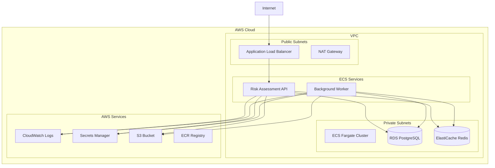

# AWS Deployment Guide

## Overview

This guide covers deploying the Risk Assessment Service on Amazon Web Services (AWS) using modern cloud-native services. We'll use AWS ECS with Fargate for container orchestration, RDS for PostgreSQL, ElastiCache for Redis, and other AWS services for a production-ready deployment.

## Architecture Overview



## Prerequisites

### Required Tools

- **AWS CLI**: Version 2.0 or later
- **Terraform**: Version 1.0 or later
- **Docker**: Version 20.10 or later
- **kubectl**: For Kubernetes deployments (optional)
- **Git**: Version 2.30 or later

### AWS Account Setup

1. **Create AWS Account**: Sign up at [aws.amazon.com](https://aws.amazon.com)
2. **Configure AWS CLI**:
   ```bash
   aws configure
   # Enter your Access Key ID, Secret Access Key, Region, and Output format
   ```
3. **Create IAM User**: Create a dedicated IAM user with appropriate permissions
4. **Set up Billing Alerts**: Configure CloudWatch billing alerts

### Required AWS Services

- **ECS (Elastic Container Service)**: Container orchestration
- **Fargate**: Serverless container platform
- **RDS (Relational Database Service)**: PostgreSQL database
- **ElastiCache**: Redis cache
- **Application Load Balancer**: Load balancing
- **VPC**: Virtual Private Cloud
- **ECR (Elastic Container Registry)**: Container registry
- **CloudWatch**: Monitoring and logging
- **Secrets Manager**: Secrets management
- **S3**: Object storage
- **IAM**: Identity and Access Management

## Infrastructure Setup

### 1. VPC and Networking

```hcl
# terraform/vpc.tf
resource "aws_vpc" "main" {
  cidr_block           = "10.0.0.0/16"
  enable_dns_hostnames = true
  enable_dns_support   = true

  tags = {
    Name = "risk-assessment-vpc"
  }
}

resource "aws_internet_gateway" "main" {
  vpc_id = aws_vpc.main.id

  tags = {
    Name = "risk-assessment-igw"
  }
}

resource "aws_subnet" "public" {
  count = 2

  vpc_id                  = aws_vpc.main.id
  cidr_block              = "10.0.${count.index + 1}.0/24"
  availability_zone       = data.aws_availability_zones.available.names[count.index]
  map_public_ip_on_launch = true

  tags = {
    Name = "risk-assessment-public-${count.index + 1}"
  }
}

resource "aws_subnet" "private" {
  count = 2

  vpc_id            = aws_vpc.main.id
  cidr_block        = "10.0.${count.index + 10}.0/24"
  availability_zone = data.aws_availability_zones.available.names[count.index]

  tags = {
    Name = "risk-assessment-private-${count.index + 1}"
  }
}

resource "aws_route_table" "public" {
  vpc_id = aws_vpc.main.id

  route {
    cidr_block = "0.0.0.0/0"
    gateway_id = aws_internet_gateway.main.id
  }

  tags = {
    Name = "risk-assessment-public-rt"
  }
}

resource "aws_route_table_association" "public" {
  count = 2

  subnet_id      = aws_subnet.public[count.index].id
  route_table_id = aws_route_table.public.id
}

resource "aws_nat_gateway" "main" {
  count = 2

  allocation_id = aws_eip.nat[count.index].id
  subnet_id     = aws_subnet.public[count.index].id

  tags = {
    Name = "risk-assessment-nat-${count.index + 1}"
  }

  depends_on = [aws_internet_gateway.main]
}

resource "aws_eip" "nat" {
  count = 2

  domain = "vpc"

  tags = {
    Name = "risk-assessment-nat-eip-${count.index + 1}"
  }
}

resource "aws_route_table" "private" {
  count = 2

  vpc_id = aws_vpc.main.id

  route {
    cidr_block     = "0.0.0.0/0"
    nat_gateway_id = aws_nat_gateway.main[count.index].id
  }

  tags = {
    Name = "risk-assessment-private-rt-${count.index + 1}"
  }
}

resource "aws_route_table_association" "private" {
  count = 2

  subnet_id      = aws_subnet.private[count.index].id
  route_table_id = aws_route_table.private[count.index].id
}
```

### 2. Security Groups

```hcl
# terraform/security-groups.tf
resource "aws_security_group" "alb" {
  name_prefix = "risk-assessment-alb-"
  vpc_id      = aws_vpc.main.id

  ingress {
    from_port   = 80
    to_port     = 80
    protocol    = "tcp"
    cidr_blocks = ["0.0.0.0/0"]
  }

  ingress {
    from_port   = 443
    to_port     = 443
    protocol    = "tcp"
    cidr_blocks = ["0.0.0.0/0"]
  }

  egress {
    from_port   = 0
    to_port     = 0
    protocol    = "-1"
    cidr_blocks = ["0.0.0.0/0"]
  }

  tags = {
    Name = "risk-assessment-alb-sg"
  }
}

resource "aws_security_group" "ecs" {
  name_prefix = "risk-assessment-ecs-"
  vpc_id      = aws_vpc.main.id

  ingress {
    from_port       = 8080
    to_port         = 8080
    protocol        = "tcp"
    security_groups = [aws_security_group.alb.id]
  }

  ingress {
    from_port       = 9090
    to_port         = 9090
    protocol        = "tcp"
    security_groups = [aws_security_group.alb.id]
  }

  egress {
    from_port   = 0
    to_port     = 0
    protocol    = "-1"
    cidr_blocks = ["0.0.0.0/0"]
  }

  tags = {
    Name = "risk-assessment-ecs-sg"
  }
}

resource "aws_security_group" "rds" {
  name_prefix = "risk-assessment-rds-"
  vpc_id      = aws_vpc.main.id

  ingress {
    from_port       = 5432
    to_port         = 5432
    protocol        = "tcp"
    security_groups = [aws_security_group.ecs.id]
  }

  tags = {
    Name = "risk-assessment-rds-sg"
  }
}

resource "aws_security_group" "redis" {
  name_prefix = "risk-assessment-redis-"
  vpc_id      = aws_vpc.main.id

  ingress {
    from_port       = 6379
    to_port         = 6379
    protocol        = "tcp"
    security_groups = [aws_security_group.ecs.id]
  }

  tags = {
    Name = "risk-assessment-redis-sg"
  }
}
```

### 3. RDS PostgreSQL

```hcl
# terraform/rds.tf
resource "aws_db_subnet_group" "main" {
  name       = "risk-assessment-db-subnet-group"
  subnet_ids = aws_subnet.private[*].id

  tags = {
    Name = "risk-assessment-db-subnet-group"
  }
}

resource "aws_db_parameter_group" "main" {
  family = "postgres15"
  name   = "risk-assessment-db-params"

  parameter {
    name  = "log_statement"
    value = "all"
  }

  parameter {
    name  = "log_min_duration_statement"
    value = "1000"
  }

  tags = {
    Name = "risk-assessment-db-params"
  }
}

resource "aws_db_instance" "main" {
  identifier = "risk-assessment-db"

  engine         = "postgres"
  engine_version = "15.4"
  instance_class = "db.t3.medium"

  allocated_storage     = 100
  max_allocated_storage = 1000
  storage_type          = "gp3"
  storage_encrypted     = true

  db_name  = "risk_assessment_db"
  username = "kyb_user"
  password = var.db_password

  vpc_security_group_ids = [aws_security_group.rds.id]
  db_subnet_group_name   = aws_db_subnet_group.main.name
  parameter_group_name   = aws_db_parameter_group.main.name

  backup_retention_period = 7
  backup_window          = "03:00-04:00"
  maintenance_window     = "sun:04:00-sun:05:00"

  skip_final_snapshot = false
  final_snapshot_identifier = "risk-assessment-db-final-snapshot-${formatdate("YYYY-MM-DD-hhmm", timestamp())}"

  performance_insights_enabled = true
  monitoring_interval         = 60
  monitoring_role_arn        = aws_iam_role.rds_enhanced_monitoring.arn

  tags = {
    Name = "risk-assessment-db"
  }
}

resource "aws_iam_role" "rds_enhanced_monitoring" {
  name = "risk-assessment-rds-enhanced-monitoring"

  assume_role_policy = jsonencode({
    Version = "2012-10-17"
    Statement = [
      {
        Action = "sts:AssumeRole"
        Effect = "Allow"
        Principal = {
          Service = "monitoring.rds.amazonaws.com"
        }
      }
    ]
  })

  tags = {
    Name = "risk-assessment-rds-enhanced-monitoring"
  }
}

resource "aws_iam_role_policy_attachment" "rds_enhanced_monitoring" {
  role       = aws_iam_role.rds_enhanced_monitoring.name
  policy_arn = "arn:aws:iam::aws:policy/service-role/AmazonRDSEnhancedMonitoringRole"
}
```

### 4. ElastiCache Redis

```hcl
# terraform/redis.tf
resource "aws_elasticache_subnet_group" "main" {
  name       = "risk-assessment-redis-subnet-group"
  subnet_ids = aws_subnet.private[*].id

  tags = {
    Name = "risk-assessment-redis-subnet-group"
  }
}

resource "aws_elasticache_parameter_group" "main" {
  family = "redis7.x"
  name   = "risk-assessment-redis-params"

  parameter {
    name  = "maxmemory-policy"
    value = "allkeys-lru"
  }

  tags = {
    Name = "risk-assessment-redis-params"
  }
}

resource "aws_elasticache_replication_group" "main" {
  replication_group_id         = "risk-assessment-redis"
  description                  = "Risk Assessment Service Redis"

  node_type            = "cache.t3.micro"
  port                 = 6379
  parameter_group_name = aws_elasticache_parameter_group.main.name

  num_cache_clusters = 2

  subnet_group_name  = aws_elasticache_subnet_group.main.name
  security_group_ids = [aws_security_group.redis.id]

  at_rest_encryption_enabled = true
  transit_encryption_enabled = true

  automatic_failover_enabled = true
  multi_az_enabled          = true

  snapshot_retention_limit = 5
  snapshot_window         = "03:00-05:00"

  tags = {
    Name = "risk-assessment-redis"
  }
}
```

### 5. ECS Cluster and Services

```hcl
# terraform/ecs.tf
resource "aws_ecs_cluster" "main" {
  name = "risk-assessment-cluster"

  setting {
    name  = "containerInsights"
    value = "enabled"
  }

  tags = {
    Name = "risk-assessment-cluster"
  }
}

resource "aws_ecs_cluster_capacity_providers" "main" {
  cluster_name = aws_ecs_cluster.main.name

  capacity_providers = ["FARGATE", "FARGATE_SPOT"]

  default_capacity_provider_strategy {
    base              = 1
    weight            = 100
    capacity_provider = "FARGATE"
  }
}

resource "aws_ecs_task_definition" "api" {
  family                   = "risk-assessment-api"
  network_mode             = "awsvpc"
  requires_compatibilities = ["FARGATE"]
  cpu                      = 1024
  memory                   = 2048
  execution_role_arn       = aws_iam_role.ecs_execution_role.arn
  task_role_arn           = aws_iam_role.ecs_task_role.arn

  container_definitions = jsonencode([
    {
      name  = "risk-assessment-api"
      image = "${aws_ecr_repository.main.repository_url}:latest"

      portMappings = [
        {
          containerPort = 8080
          protocol      = "tcp"
        },
        {
          containerPort = 9090
          protocol      = "tcp"
        }
      ]

      environment = [
        {
          name  = "ENVIRONMENT"
          value = "production"
        },
        {
          name  = "LOG_LEVEL"
          value = "info"
        },
        {
          name  = "PORT"
          value = "8080"
        }
      ]

      secrets = [
        {
          name      = "DATABASE_URL"
          valueFrom = aws_secretsmanager_secret.database_url.arn
        },
        {
          name      = "REDIS_URL"
          valueFrom = aws_secretsmanager_secret.redis_url.arn
        },
        {
          name      = "JWT_SECRET"
          valueFrom = aws_secretsmanager_secret.jwt_secret.arn
        }
      ]

      logConfiguration = {
        logDriver = "awslogs"
        options = {
          awslogs-group         = aws_cloudwatch_log_group.api.name
          awslogs-region        = var.aws_region
          awslogs-stream-prefix = "ecs"
        }
      }

      healthCheck = {
        command     = ["CMD-SHELL", "curl -f http://localhost:8080/health || exit 1"]
        interval    = 30
        timeout     = 5
        retries     = 3
        startPeriod = 60
      }
    }
  ])

  tags = {
    Name = "risk-assessment-api-task"
  }
}

resource "aws_ecs_service" "api" {
  name            = "risk-assessment-api"
  cluster         = aws_ecs_cluster.main.id
  task_definition = aws_ecs_task_definition.api.arn
  desired_count   = 2
  launch_type     = "FARGATE"

  network_configuration {
    security_groups  = [aws_security_group.ecs.id]
    subnets          = aws_subnet.private[*].id
    assign_public_ip = false
  }

  load_balancer {
    target_group_arn = aws_lb_target_group.api.arn
    container_name   = "risk-assessment-api"
    container_port   = 8080
  }

  depends_on = [aws_lb_listener.api]

  tags = {
    Name = "risk-assessment-api-service"
  }
}

resource "aws_ecs_task_definition" "worker" {
  family                   = "risk-assessment-worker"
  network_mode             = "awsvpc"
  requires_compatibilities = ["FARGATE"]
  cpu                      = 512
  memory                   = 1024
  execution_role_arn       = aws_iam_role.ecs_execution_role.arn
  task_role_arn           = aws_iam_role.ecs_task_role.arn

  container_definitions = jsonencode([
    {
      name  = "risk-assessment-worker"
      image = "${aws_ecr_repository.main.repository_url}:latest"

      environment = [
        {
          name  = "ENVIRONMENT"
          value = "production"
        },
        {
          name  = "LOG_LEVEL"
          value = "info"
        },
        {
          name  = "WORKER_MODE"
          value = "true"
        }
      ]

      secrets = [
        {
          name      = "DATABASE_URL"
          valueFrom = aws_secretsmanager_secret.database_url.arn
        },
        {
          name      = "REDIS_URL"
          valueFrom = aws_secretsmanager_secret.redis_url.arn
        }
      ]

      logConfiguration = {
        logDriver = "awslogs"
        options = {
          awslogs-group         = aws_cloudwatch_log_group.worker.name
          awslogs-region        = var.aws_region
          awslogs-stream-prefix = "ecs"
        }
      }
    }
  ])

  tags = {
    Name = "risk-assessment-worker-task"
  }
}

resource "aws_ecs_service" "worker" {
  name            = "risk-assessment-worker"
  cluster         = aws_ecs_cluster.main.id
  task_definition = aws_ecs_task_definition.worker.arn
  desired_count   = 1
  launch_type     = "FARGATE"

  network_configuration {
    security_groups  = [aws_security_group.ecs.id]
    subnets          = aws_subnet.private[*].id
    assign_public_ip = false
  }

  tags = {
    Name = "risk-assessment-worker-service"
  }
}
```

### 6. Application Load Balancer

```hcl
# terraform/alb.tf
resource "aws_lb" "main" {
  name               = "risk-assessment-alb"
  internal           = false
  load_balancer_type = "application"
  security_groups    = [aws_security_group.alb.id]
  subnets            = aws_subnet.public[*].id

  enable_deletion_protection = false

  tags = {
    Name = "risk-assessment-alb"
  }
}

resource "aws_lb_target_group" "api" {
  name     = "risk-assessment-api-tg"
  port     = 8080
  protocol = "HTTP"
  vpc_id   = aws_vpc.main.id

  health_check {
    enabled             = true
    healthy_threshold   = 2
    unhealthy_threshold = 2
    timeout             = 5
    interval            = 30
    path                = "/health"
    matcher             = "200"
    port                = "traffic-port"
    protocol            = "HTTP"
  }

  tags = {
    Name = "risk-assessment-api-tg"
  }
}

resource "aws_lb_listener" "api" {
  load_balancer_arn = aws_lb.main.arn
  port              = "80"
  protocol          = "HTTP"

  default_action {
    type             = "forward"
    target_group_arn = aws_lb_target_group.api.arn
  }
}

resource "aws_lb_listener" "api_https" {
  count = var.certificate_arn != "" ? 1 : 0

  load_balancer_arn = aws_lb.main.arn
  port              = "443"
  protocol          = "HTTPS"
  ssl_policy        = "ELBSecurityPolicy-TLS-1-2-2017-01"
  certificate_arn   = var.certificate_arn

  default_action {
    type             = "forward"
    target_group_arn = aws_lb_target_group.api.arn
  }
}
```

### 7. ECR Repository

```hcl
# terraform/ecr.tf
resource "aws_ecr_repository" "main" {
  name                 = "risk-assessment-service"
  image_tag_mutability = "MUTABLE"

  image_scanning_configuration {
    scan_on_push = true
  }

  tags = {
    Name = "risk-assessment-service"
  }
}

resource "aws_ecr_lifecycle_policy" "main" {
  repository = aws_ecr_repository.main.name

  policy = jsonencode({
    rules = [
      {
        rulePriority = 1
        description  = "Keep last 10 images"
        selection = {
          tagStatus     = "tagged"
          tagPrefixList = ["v"]
          countType     = "imageCountMoreThan"
          countNumber   = 10
        }
        action = {
          type = "expire"
        }
      }
    ]
  })
}
```

### 8. Secrets Manager

```hcl
# terraform/secrets.tf
resource "aws_secretsmanager_secret" "database_url" {
  name                    = "risk-assessment/database-url"
  description             = "Database connection URL for Risk Assessment Service"
  recovery_window_in_days = 7

  tags = {
    Name = "risk-assessment-database-url"
  }
}

resource "aws_secretsmanager_secret_version" "database_url" {
  secret_id = aws_secretsmanager_secret.database_url.id
  secret_string = jsonencode({
    url = "postgres://kyb_user:${var.db_password}@${aws_db_instance.main.endpoint}/risk_assessment_db"
  })
}

resource "aws_secretsmanager_secret" "redis_url" {
  name                    = "risk-assessment/redis-url"
  description             = "Redis connection URL for Risk Assessment Service"
  recovery_window_in_days = 7

  tags = {
    Name = "risk-assessment-redis-url"
  }
}

resource "aws_secretsmanager_secret_version" "redis_url" {
  secret_id = aws_secretsmanager_secret.redis_url.id
  secret_string = jsonencode({
    url = "redis://${aws_elasticache_replication_group.main.primary_endpoint_address}:6379"
  })
}

resource "aws_secretsmanager_secret" "jwt_secret" {
  name                    = "risk-assessment/jwt-secret"
  description             = "JWT secret for Risk Assessment Service"
  recovery_window_in_days = 7

  tags = {
    Name = "risk-assessment-jwt-secret"
  }
}

resource "aws_secretsmanager_secret_version" "jwt_secret" {
  secret_id = aws_secretsmanager_secret.jwt_secret.id
  secret_string = jsonencode({
    secret = var.jwt_secret
  })
}
```

### 9. CloudWatch Logs

```hcl
# terraform/cloudwatch.tf
resource "aws_cloudwatch_log_group" "api" {
  name              = "/ecs/risk-assessment-api"
  retention_in_days = 30

  tags = {
    Name = "risk-assessment-api-logs"
  }
}

resource "aws_cloudwatch_log_group" "worker" {
  name              = "/ecs/risk-assessment-worker"
  retention_in_days = 30

  tags = {
    Name = "risk-assessment-worker-logs"
  }
}

resource "aws_cloudwatch_log_group" "alb" {
  name              = "/aws/applicationloadbalancer/risk-assessment"
  retention_in_days = 30

  tags = {
    Name = "risk-assessment-alb-logs"
  }
}
```

### 10. IAM Roles

```hcl
# terraform/iam.tf
resource "aws_iam_role" "ecs_execution_role" {
  name = "risk-assessment-ecs-execution-role"

  assume_role_policy = jsonencode({
    Version = "2012-10-17"
    Statement = [
      {
        Action = "sts:AssumeRole"
        Effect = "Allow"
        Principal = {
          Service = "ecs-tasks.amazonaws.com"
        }
      }
    ]
  })

  tags = {
    Name = "risk-assessment-ecs-execution-role"
  }
}

resource "aws_iam_role_policy_attachment" "ecs_execution_role" {
  role       = aws_iam_role.ecs_execution_role.name
  policy_arn = "arn:aws:iam::aws:policy/service-role/AmazonECSTaskExecutionRolePolicy"
}

resource "aws_iam_role_policy" "ecs_execution_role" {
  name = "risk-assessment-ecs-execution-policy"
  role = aws_iam_role.ecs_execution_role.id

  policy = jsonencode({
    Version = "2012-10-17"
    Statement = [
      {
        Effect = "Allow"
        Action = [
          "secretsmanager:GetSecretValue"
        ]
        Resource = [
          aws_secretsmanager_secret.database_url.arn,
          aws_secretsmanager_secret.redis_url.arn,
          aws_secretsmanager_secret.jwt_secret.arn
        ]
      }
    ]
  })
}

resource "aws_iam_role" "ecs_task_role" {
  name = "risk-assessment-ecs-task-role"

  assume_role_policy = jsonencode({
    Version = "2012-10-17"
    Statement = [
      {
        Action = "sts:AssumeRole"
        Effect = "Allow"
        Principal = {
          Service = "ecs-tasks.amazonaws.com"
        }
      }
    ]
  })

  tags = {
    Name = "risk-assessment-ecs-task-role"
  }
}

resource "aws_iam_role_policy" "ecs_task_role" {
  name = "risk-assessment-ecs-task-policy"
  role = aws_iam_role.ecs_task_role.id

  policy = jsonencode({
    Version = "2012-10-17"
    Statement = [
      {
        Effect = "Allow"
        Action = [
          "s3:GetObject",
          "s3:PutObject",
          "s3:DeleteObject"
        ]
        Resource = [
          "${aws_s3_bucket.models.arn}/*"
        ]
      },
      {
        Effect = "Allow"
        Action = [
          "cloudwatch:PutMetricData"
        ]
        Resource = "*"
      }
    ]
  })
}
```

## Deployment Process

### 1. Build and Push Docker Image

```bash
# Build Docker image
docker build -t risk-assessment-service .

# Tag for ECR
docker tag risk-assessment-service:latest \
  ${AWS_ACCOUNT_ID}.dkr.ecr.${AWS_REGION}.amazonaws.com/risk-assessment-service:latest

# Login to ECR
aws ecr get-login-password --region ${AWS_REGION} | \
  docker login --username AWS --password-stdin \
  ${AWS_ACCOUNT_ID}.dkr.ecr.${AWS_REGION}.amazonaws.com

# Push to ECR
docker push ${AWS_ACCOUNT_ID}.dkr.ecr.${AWS_REGION}.amazonaws.com/risk-assessment-service:latest
```

### 2. Deploy Infrastructure

```bash
# Initialize Terraform
terraform init

# Plan deployment
terraform plan -var="db_password=${DB_PASSWORD}" -var="jwt_secret=${JWT_SECRET}"

# Apply infrastructure
terraform apply -var="db_password=${DB_PASSWORD}" -var="jwt_secret=${JWT_SECRET}"
```

### 3. Run Database Migrations

```bash
# Get ECS task definition
TASK_DEFINITION=$(aws ecs describe-task-definition \
  --task-definition risk-assessment-api \
  --query 'taskDefinition.taskDefinitionArn' \
  --output text)

# Run migration task
aws ecs run-task \
  --cluster risk-assessment-cluster \
  --task-definition $TASK_DEFINITION \
  --launch-type FARGATE \
  --network-configuration "awsvpcConfiguration={subnets=[${SUBNET_IDS}],securityGroups=[${SECURITY_GROUP_ID}],assignPublicIp=DISABLED}" \
  --overrides '{
    "containerOverrides": [
      {
        "name": "risk-assessment-api",
        "command": ["./main", "migrate", "up"]
      }
    ]
  }'
```

### 4. Update ECS Service

```bash
# Update service with new task definition
aws ecs update-service \
  --cluster risk-assessment-cluster \
  --service risk-assessment-api \
  --task-definition risk-assessment-api:${NEW_REVISION}
```

## Monitoring and Logging

### 1. CloudWatch Dashboards

```hcl
# terraform/cloudwatch-dashboard.tf
resource "aws_cloudwatch_dashboard" "main" {
  dashboard_name = "risk-assessment-dashboard"

  dashboard_body = jsonencode({
    widgets = [
      {
        type   = "metric"
        x      = 0
        y      = 0
        width  = 12
        height = 6

        properties = {
          metrics = [
            ["AWS/ECS", "CPUUtilization", "ServiceName", "risk-assessment-api", "ClusterName", "risk-assessment-cluster"],
            [".", "MemoryUtilization", ".", ".", ".", "."]
          ]
          view    = "timeSeries"
          stacked = false
          region  = var.aws_region
          title   = "ECS Service Metrics"
          period  = 300
        }
      },
      {
        type   = "metric"
        x      = 0
        y      = 6
        width  = 12
        height = 6

        properties = {
          metrics = [
            ["AWS/RDS", "CPUUtilization", "DBInstanceIdentifier", "risk-assessment-db"],
            [".", "DatabaseConnections", ".", "."],
            [".", "FreeableMemory", ".", "."]
          ]
          view    = "timeSeries"
          stacked = false
          region  = var.aws_region
          title   = "RDS Metrics"
          period  = 300
        }
      }
    ]
  })
}
```

### 2. CloudWatch Alarms

```hcl
# terraform/cloudwatch-alarms.tf
resource "aws_cloudwatch_metric_alarm" "high_cpu" {
  alarm_name          = "risk-assessment-high-cpu"
  comparison_operator = "GreaterThanThreshold"
  evaluation_periods  = "2"
  metric_name         = "CPUUtilization"
  namespace           = "AWS/ECS"
  period              = "300"
  statistic           = "Average"
  threshold           = "80"
  alarm_description   = "This metric monitors ECS CPU utilization"
  alarm_actions       = [aws_sns_topic.alerts.arn]

  dimensions = {
    ServiceName = "risk-assessment-api"
    ClusterName = "risk-assessment-cluster"
  }
}

resource "aws_cloudwatch_metric_alarm" "high_memory" {
  alarm_name          = "risk-assessment-high-memory"
  comparison_operator = "GreaterThanThreshold"
  evaluation_periods  = "2"
  metric_name         = "MemoryUtilization"
  namespace           = "AWS/ECS"
  period              = "300"
  statistic           = "Average"
  threshold           = "80"
  alarm_description   = "This metric monitors ECS memory utilization"
  alarm_actions       = [aws_sns_topic.alerts.arn]

  dimensions = {
    ServiceName = "risk-assessment-api"
    ClusterName = "risk-assessment-cluster"
  }
}
```

## Security Best Practices

### 1. Network Security

- Use private subnets for application and database tiers
- Implement security groups with least privilege access
- Use NAT Gateway for outbound internet access
- Enable VPC Flow Logs for network monitoring

### 2. Data Encryption

- Enable encryption at rest for RDS and ElastiCache
- Use SSL/TLS for data in transit
- Store secrets in AWS Secrets Manager
- Use AWS KMS for key management

### 3. Access Control

- Use IAM roles for service-to-service communication
- Implement least privilege access policies
- Enable MFA for administrative access
- Use AWS Organizations for multi-account management

### 4. Monitoring and Compliance

- Enable CloudTrail for API logging
- Use AWS Config for compliance monitoring
- Implement CloudWatch alarms for security events
- Regular security assessments and penetration testing

## Cost Optimization

### 1. Resource Sizing

- Use AWS Cost Explorer to analyze usage patterns
- Implement auto-scaling based on demand
- Use Fargate Spot for non-critical workloads
- Right-size RDS instances based on actual usage

### 2. Storage Optimization

- Use S3 Intelligent Tiering for long-term storage
- Implement lifecycle policies for log retention
- Use EBS GP3 volumes for better price/performance
- Enable RDS automated backups with appropriate retention

### 3. Network Optimization

- Use CloudFront for static content delivery
- Implement VPC endpoints for AWS services
- Use NAT Gateway with appropriate sizing
- Monitor data transfer costs

## Troubleshooting

### 1. Common Issues

**ECS Service Won't Start**
```bash
# Check service events
aws ecs describe-services \
  --cluster risk-assessment-cluster \
  --services risk-assessment-api

# Check task definition
aws ecs describe-task-definition \
  --task-definition risk-assessment-api
```

**Database Connection Issues**
```bash
# Check RDS status
aws rds describe-db-instances \
  --db-instance-identifier risk-assessment-db

# Test connection from ECS task
aws ecs run-task \
  --cluster risk-assessment-cluster \
  --task-definition risk-assessment-api \
  --overrides '{
    "containerOverrides": [
      {
        "name": "risk-assessment-api",
        "command": ["psql", "$DATABASE_URL", "-c", "SELECT 1;"]
      }
    ]
  }'
```

**High Memory Usage**
```bash
# Check CloudWatch metrics
aws cloudwatch get-metric-statistics \
  --namespace AWS/ECS \
  --metric-name MemoryUtilization \
  --dimensions Name=ServiceName,Value=risk-assessment-api \
  --start-time 2024-01-15T00:00:00Z \
  --end-time 2024-01-15T23:59:59Z \
  --period 300 \
  --statistics Average
```

### 2. Log Analysis

```bash
# View ECS logs
aws logs tail /ecs/risk-assessment-api --follow

# Search for errors
aws logs filter-log-events \
  --log-group-name /ecs/risk-assessment-api \
  --filter-pattern "ERROR"
```

## Next Steps

1. **Set up CI/CD Pipeline**: Configure GitHub Actions for automated deployment
2. **Implement Monitoring**: Set up comprehensive monitoring and alerting
3. **Security Hardening**: Implement additional security measures
4. **Performance Tuning**: Optimize based on production metrics
5. **Disaster Recovery**: Implement backup and recovery procedures

## Support

- **AWS Documentation**: [https://docs.aws.amazon.com](https://docs.aws.amazon.com)
- **Terraform Documentation**: [https://registry.terraform.io/providers/hashicorp/aws](https://registry.terraform.io/providers/hashicorp/aws)
- **GitHub Issues**: [https://github.com/kyb-platform/risk-assessment-service/issues](https://github.com/kyb-platform/risk-assessment-service/issues)
- **Email Support**: [dev-support@kyb-platform.com](mailto:dev-support@kyb-platform.com)

---

**Last Updated**: January 15, 2024  
**Version**: 2.0.0  
**Next Review**: April 15, 2024
