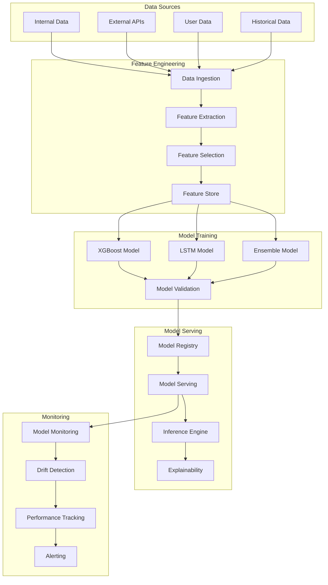
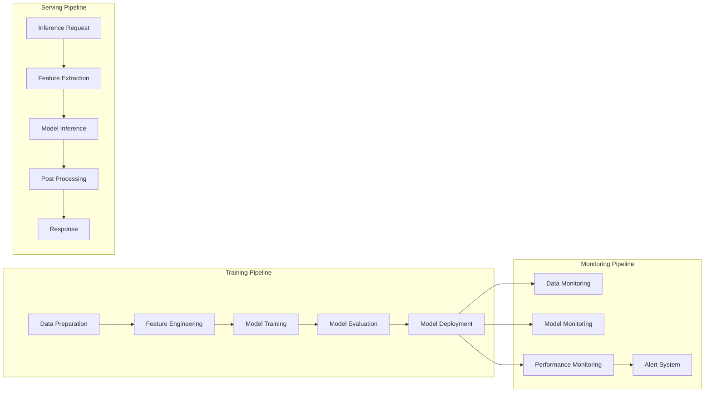
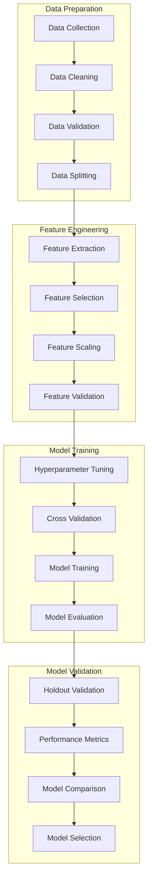
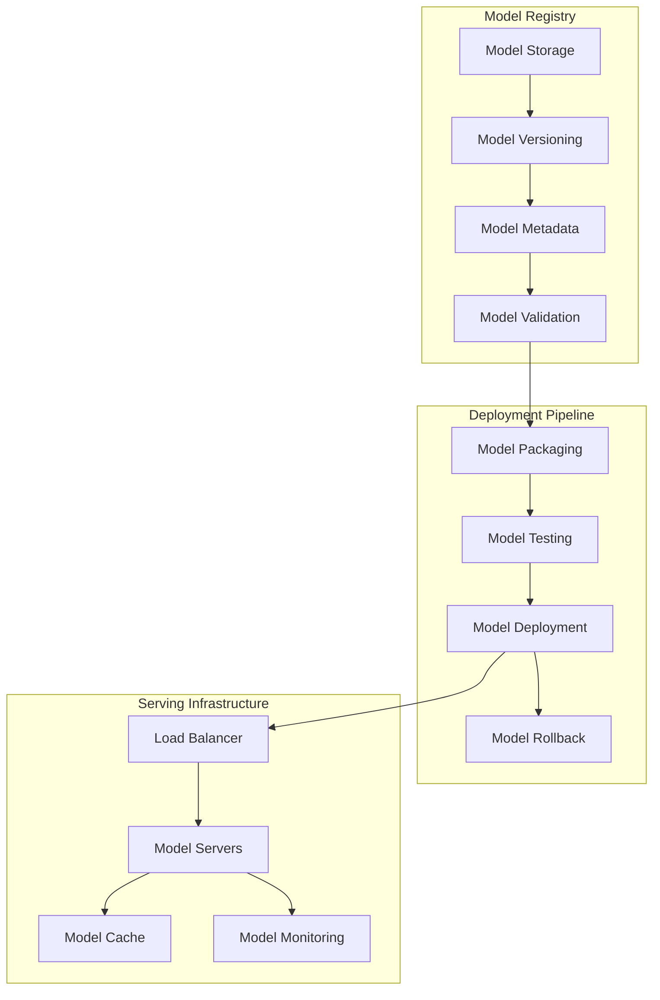
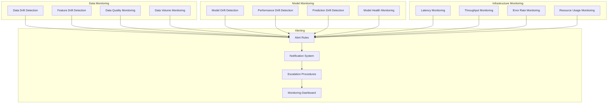

# ML Model Architecture Documentation

## Overview

This document provides a comprehensive overview of the machine learning architecture used in the Risk Assessment Service. It covers model design, training procedures, deployment strategies, and monitoring approaches.

## Table of Contents

1. [Architecture Overview](#architecture-overview)
2. [Model Types and Use Cases](#model-types-and-use-cases)
3. [Feature Engineering Pipeline](#feature-engineering-pipeline)
4. [Model Training Pipeline](#model-training-pipeline)
5. [Model Deployment](#model-deployment)
6. [Model Monitoring and Maintenance](#model-monitoring-and-maintenance)
7. [Performance Metrics](#performance-metrics)
8. [Model Versioning and Governance](#model-versioning-and-governance)

## Architecture Overview

### High-Level ML Architecture



### Model Pipeline Architecture



## Model Types and Use Cases

### 1. XGBoost Model

**Purpose**: Short-term risk prediction (1-3 months)

**Architecture**:
- **Algorithm**: Extreme Gradient Boosting
- **Input Features**: 150+ engineered features
- **Output**: Risk score (0.0 - 1.0)
- **Training Data**: 2M+ historical assessments
- **Update Frequency**: Weekly

**Key Features**:
- Financial indicators (credit score, payment history)
- Business characteristics (age, size, industry)
- External data (news sentiment, market conditions)
- Compliance factors (sanctions, adverse media)

**Hyperparameters**:
```python
xgb_params = {
    'n_estimators': 1000,
    'max_depth': 8,
    'learning_rate': 0.1,
    'subsample': 0.8,
    'colsample_bytree': 0.8,
    'reg_alpha': 0.1,
    'reg_lambda': 1.0,
    'random_state': 42
}
```

**Performance Metrics**:
- **Accuracy**: 0.89
- **Precision**: 0.87
- **Recall**: 0.91
- **F1-Score**: 0.89
- **AUC-ROC**: 0.94

### 2. LSTM Model

**Purpose**: Long-term time-series forecasting (6-12 months)

**Architecture**:
- **Algorithm**: Long Short-Term Memory Neural Network
- **Input Features**: Time-series data (24 months history)
- **Output**: Risk score trajectory
- **Training Data**: 1M+ time-series sequences
- **Update Frequency**: Monthly

**Network Architecture**:
```python
lstm_model = Sequential([
    LSTM(128, return_sequences=True, input_shape=(24, 50)),
    Dropout(0.2),
    LSTM(64, return_sequences=True),
    Dropout(0.2),
    LSTM(32),
    Dropout(0.2),
    Dense(16, activation='relu'),
    Dense(1, activation='sigmoid')
])
```

**Key Features**:
- Historical risk scores
- Business performance metrics
- Market indicators
- Seasonal patterns
- Trend analysis

**Performance Metrics**:
- **MAE**: 0.08
- **RMSE**: 0.12
- **MAPE**: 15.2%
- **R²**: 0.76

### 3. Ensemble Model

**Purpose**: Medium-term prediction (3-6 months) combining multiple approaches

**Architecture**:
- **Algorithm**: Weighted ensemble of XGBoost, LSTM, and Random Forest
- **Input Features**: Combined features from all models
- **Output**: Risk score with confidence intervals
- **Training Data**: 2.5M+ assessments
- **Update Frequency**: Bi-weekly

**Ensemble Weights**:
```python
ensemble_weights = {
    'xgboost': 0.4,
    'lstm': 0.35,
    'random_forest': 0.25
}
```

**Performance Metrics**:
- **Accuracy**: 0.91
- **Precision**: 0.89
- **Recall**: 0.93
- **F1-Score**: 0.91
- **AUC-ROC**: 0.96

## Feature Engineering Pipeline

### Feature Categories

#### 1. Financial Features
```python
financial_features = {
    'credit_score': 'Business credit score (0-850)',
    'payment_history': 'Payment history score (0-1)',
    'debt_to_income': 'Debt-to-income ratio',
    'cash_flow': 'Monthly cash flow',
    'revenue_growth': 'Year-over-year revenue growth',
    'profit_margin': 'Net profit margin',
    'liquidity_ratio': 'Current assets / current liabilities',
    'leverage_ratio': 'Total debt / total equity'
}
```

#### 2. Business Features
```python
business_features = {
    'business_age': 'Years in operation',
    'employee_count': 'Number of employees',
    'industry_risk': 'Industry-specific risk score',
    'geographic_risk': 'Geographic risk score',
    'business_size': 'Business size category',
    'ownership_type': 'Type of business ownership',
    'registration_status': 'Business registration status',
    'compliance_score': 'Regulatory compliance score'
}
```

#### 3. External Features
```python
external_features = {
    'news_sentiment': 'News sentiment score (-1 to 1)',
    'market_volatility': 'Market volatility index',
    'economic_indicators': 'Economic indicator scores',
    'regulatory_changes': 'Regulatory change impact',
    'competition_level': 'Competition intensity score',
    'supply_chain_risk': 'Supply chain risk score',
    'cyber_security_risk': 'Cybersecurity risk score',
    'environmental_risk': 'Environmental risk score'
}
```

#### 4. Compliance Features
```python
compliance_features = {
    'ofac_status': 'OFAC sanctions status',
    'un_sanctions': 'UN sanctions status',
    'eu_sanctions': 'EU sanctions status',
    'adverse_media_count': 'Number of adverse media articles',
    'regulatory_violations': 'Number of regulatory violations',
    'audit_findings': 'Audit findings score',
    'compliance_history': 'Historical compliance score',
    'penalty_amount': 'Total penalties paid'
}
```

### Feature Engineering Process

#### 1. Data Ingestion
```python
class DataIngestion:
    def __init__(self):
        self.data_sources = {
            'internal': InternalDataConnector(),
            'external': ExternalAPIConnector(),
            'user': UserDataConnector(),
            'historical': HistoricalDataConnector()
        }
    
    def ingest_data(self, business_id, time_range):
        """Ingest data from all sources"""
        data = {}
        for source_name, connector in self.data_sources.items():
            try:
                source_data = connector.fetch_data(business_id, time_range)
                data[source_name] = source_data
            except Exception as e:
                logger.warning(f"Failed to fetch data from {source_name}: {e}")
                data[source_name] = None
        
        return data
```

#### 2. Feature Extraction
```python
class FeatureExtractor:
    def __init__(self):
        self.extractors = {
            'financial': FinancialFeatureExtractor(),
            'business': BusinessFeatureExtractor(),
            'external': ExternalFeatureExtractor(),
            'compliance': ComplianceFeatureExtractor()
        }
    
    def extract_features(self, raw_data):
        """Extract features from raw data"""
        features = {}
        
        for feature_type, extractor in self.extractors.items():
            if raw_data.get(feature_type):
                features[feature_type] = extractor.extract(raw_data[feature_type])
        
        return features
```

#### 3. Feature Selection
```python
class FeatureSelector:
    def __init__(self):
        self.selection_methods = {
            'correlation': CorrelationSelector(),
            'mutual_info': MutualInfoSelector(),
            'recursive': RecursiveFeatureElimination(),
            'lasso': LassoSelector()
        }
    
    def select_features(self, features, target, method='mutual_info'):
        """Select most relevant features"""
        selector = self.selection_methods[method]
        selected_features = selector.fit_transform(features, target)
        
        return selected_features, selector.get_feature_names()
```

#### 4. Feature Store
```python
class FeatureStore:
    def __init__(self, storage_backend):
        self.storage = storage_backend
        self.cache = FeatureCache()
    
    def store_features(self, business_id, features, timestamp):
        """Store features in feature store"""
        feature_record = {
            'business_id': business_id,
            'features': features,
            'timestamp': timestamp,
            'version': self.get_feature_version()
        }
        
        self.storage.store(feature_record)
        self.cache.set(business_id, features)
    
    def get_features(self, business_id, timestamp=None):
        """Retrieve features from feature store"""
        # Try cache first
        cached_features = self.cache.get(business_id)
        if cached_features:
            return cached_features
        
        # Fetch from storage
        features = self.storage.get(business_id, timestamp)
        if features:
            self.cache.set(business_id, features)
        
        return features
```

## Model Training Pipeline

### Training Architecture



### Training Process

#### 1. Data Preparation
```python
class DataPreparator:
    def __init__(self):
        self.validators = {
            'schema': SchemaValidator(),
            'quality': DataQualityValidator(),
            'completeness': CompletenessValidator()
        }
    
    def prepare_data(self, raw_data):
        """Prepare data for training"""
        # Clean data
        cleaned_data = self.clean_data(raw_data)
        
        # Validate data
        validation_results = self.validate_data(cleaned_data)
        if not validation_results.is_valid:
            raise DataValidationError(validation_results.errors)
        
        # Split data
        train_data, val_data, test_data = self.split_data(cleaned_data)
        
        return {
            'train': train_data,
            'validation': val_data,
            'test': test_data
        }
    
    def clean_data(self, data):
        """Clean and preprocess data"""
        # Remove duplicates
        data = data.drop_duplicates()
        
        # Handle missing values
        data = self.handle_missing_values(data)
        
        # Remove outliers
        data = self.remove_outliers(data)
        
        # Standardize formats
        data = self.standardize_formats(data)
        
        return data
```

#### 2. Model Training
```python
class ModelTrainer:
    def __init__(self, model_config):
        self.config = model_config
        self.models = {
            'xgboost': XGBoostTrainer(),
            'lstm': LSTMTrainer(),
            'ensemble': EnsembleTrainer()
        }
    
    def train_model(self, model_type, train_data, val_data):
        """Train a specific model type"""
        trainer = self.models[model_type]
        
        # Hyperparameter tuning
        best_params = trainer.tune_hyperparameters(train_data, val_data)
        
        # Train model with best parameters
        model = trainer.train(train_data, best_params)
        
        # Evaluate model
        evaluation = trainer.evaluate(model, val_data)
        
        return {
            'model': model,
            'parameters': best_params,
            'evaluation': evaluation
        }
    
    def train_all_models(self, train_data, val_data):
        """Train all model types"""
        results = {}
        
        for model_type in self.models:
            try:
                result = self.train_model(model_type, train_data, val_data)
                results[model_type] = result
            except Exception as e:
                logger.error(f"Failed to train {model_type}: {e}")
                results[model_type] = None
        
        return results
```

#### 3. Model Evaluation
```python
class ModelEvaluator:
    def __init__(self):
        self.metrics = {
            'classification': ClassificationMetrics(),
            'regression': RegressionMetrics(),
            'time_series': TimeSeriesMetrics()
        }
    
    def evaluate_model(self, model, test_data, model_type):
        """Evaluate model performance"""
        predictions = model.predict(test_data.features)
        
        if model_type == 'xgboost':
            metrics = self.metrics['classification'].calculate(
                test_data.labels, predictions
            )
        elif model_type == 'lstm':
            metrics = self.metrics['time_series'].calculate(
                test_data.labels, predictions
            )
        else:
            metrics = self.metrics['regression'].calculate(
                test_data.labels, predictions
            )
        
        return metrics
    
    def compare_models(self, model_results):
        """Compare multiple models"""
        comparison = {}
        
        for model_name, result in model_results.items():
            if result:
                comparison[model_name] = {
                    'accuracy': result['evaluation'].accuracy,
                    'precision': result['evaluation'].precision,
                    'recall': result['evaluation'].recall,
                    'f1_score': result['evaluation'].f1_score,
                    'auc_roc': result['evaluation'].auc_roc
                }
        
        return comparison
```

## Model Deployment

### Deployment Architecture



### Deployment Process

#### 1. Model Registry
```python
class ModelRegistry:
    def __init__(self, storage_backend):
        self.storage = storage_backend
        self.metadata_store = MetadataStore()
    
    def register_model(self, model, metadata):
        """Register a new model version"""
        model_id = self.generate_model_id()
        version = self.get_next_version(model_id)
        
        # Store model
        model_path = self.storage.store_model(model, model_id, version)
        
        # Store metadata
        model_metadata = {
            'model_id': model_id,
            'version': version,
            'path': model_path,
            'metadata': metadata,
            'created_at': datetime.now(),
            'status': 'registered'
        }
        
        self.metadata_store.store(model_metadata)
        
        return model_id, version
    
    def promote_model(self, model_id, version, environment):
        """Promote model to specific environment"""
        model_metadata = self.metadata_store.get(model_id, version)
        
        if not model_metadata:
            raise ModelNotFoundError(f"Model {model_id}:{version} not found")
        
        # Validate model
        validation_result = self.validate_model(model_id, version)
        if not validation_result.is_valid:
            raise ModelValidationError(validation_result.errors)
        
        # Update status
        model_metadata['status'] = f'promoted_to_{environment}'
        model_metadata['promoted_at'] = datetime.now()
        
        self.metadata_store.update(model_metadata)
        
        return model_metadata
```

#### 2. Model Serving
```python
class ModelServer:
    def __init__(self, model_registry):
        self.registry = model_registry
        self.model_cache = ModelCache()
        self.monitoring = ModelMonitoring()
    
    def load_model(self, model_id, version):
        """Load model for serving"""
        # Check cache first
        cached_model = self.model_cache.get(model_id, version)
        if cached_model:
            return cached_model
        
        # Load from registry
        model_metadata = self.registry.get_model(model_id, version)
        model = self.registry.load_model(model_metadata['path'])
        
        # Cache model
        self.model_cache.set(model_id, version, model)
        
        return model
    
    def predict(self, model_id, version, features):
        """Make prediction using model"""
        start_time = time.time()
        
        try:
            # Load model
            model = self.load_model(model_id, version)
            
            # Make prediction
            prediction = model.predict(features)
            
            # Record metrics
            inference_time = time.time() - start_time
            self.monitoring.record_inference(
                model_id, version, inference_time, len(features)
            )
            
            return prediction
            
        except Exception as e:
            # Record error
            self.monitoring.record_error(model_id, version, str(e))
            raise
```

#### 3. A/B Testing
```python
class ABTesting:
    def __init__(self, model_server):
        self.server = model_server
        self.experiments = {}
    
    def create_experiment(self, experiment_config):
        """Create A/B test experiment"""
        experiment_id = self.generate_experiment_id()
        
        experiment = {
            'id': experiment_id,
            'name': experiment_config['name'],
            'models': experiment_config['models'],
            'traffic_split': experiment_config['traffic_split'],
            'start_date': datetime.now(),
            'status': 'active'
        }
        
        self.experiments[experiment_id] = experiment
        
        return experiment_id
    
    def route_request(self, experiment_id, features):
        """Route request to appropriate model"""
        experiment = self.experiments.get(experiment_id)
        if not experiment or experiment['status'] != 'active':
            return None
        
        # Determine which model to use
        model_choice = self.select_model(experiment['traffic_split'])
        model_config = experiment['models'][model_choice]
        
        # Make prediction
        prediction = self.server.predict(
            model_config['model_id'],
            model_config['version'],
            features
        )
        
        # Record experiment data
        self.record_experiment_data(experiment_id, model_choice, prediction)
        
        return prediction
```

## Model Monitoring and Maintenance

### Monitoring Architecture



### Monitoring Implementation

#### 1. Data Drift Detection
```python
class DataDriftDetector:
    def __init__(self):
        self.detectors = {
            'statistical': StatisticalDriftDetector(),
            'distribution': DistributionDriftDetector(),
            'feature': FeatureDriftDetector()
        }
    
    def detect_drift(self, reference_data, current_data):
        """Detect data drift between reference and current data"""
        drift_results = {}
        
        for detector_name, detector in self.detectors.items():
            try:
                drift_score = detector.detect(reference_data, current_data)
                drift_results[detector_name] = {
                    'score': drift_score,
                    'is_drift': drift_score > detector.threshold,
                    'threshold': detector.threshold
                }
            except Exception as e:
                logger.error(f"Drift detection failed for {detector_name}: {e}")
                drift_results[detector_name] = None
        
        return drift_results
    
    def monitor_continuous_drift(self, data_stream):
        """Monitor drift in continuous data stream"""
        reference_data = self.get_reference_data()
        
        for batch in data_stream:
            drift_results = self.detect_drift(reference_data, batch)
            
            # Check for significant drift
            if self.is_significant_drift(drift_results):
                self.trigger_drift_alert(drift_results)
```

#### 2. Model Performance Monitoring
```python
class ModelPerformanceMonitor:
    def __init__(self):
        self.metrics_store = MetricsStore()
        self.alerting = AlertingSystem()
    
    def monitor_performance(self, model_id, version, predictions, actuals):
        """Monitor model performance metrics"""
        # Calculate performance metrics
        metrics = self.calculate_metrics(predictions, actuals)
        
        # Store metrics
        self.metrics_store.store(model_id, version, metrics)
        
        # Check for performance degradation
        baseline_metrics = self.get_baseline_metrics(model_id, version)
        performance_change = self.compare_metrics(baseline_metrics, metrics)
        
        if self.is_significant_degradation(performance_change):
            self.alerting.trigger_performance_alert(
                model_id, version, performance_change
            )
        
        return metrics
    
    def calculate_metrics(self, predictions, actuals):
        """Calculate performance metrics"""
        return {
            'accuracy': accuracy_score(actuals, predictions),
            'precision': precision_score(actuals, predictions),
            'recall': recall_score(actuals, predictions),
            'f1_score': f1_score(actuals, predictions),
            'auc_roc': roc_auc_score(actuals, predictions)
        }
```

#### 3. Model Retraining
```python
class ModelRetraining:
    def __init__(self, trainer, registry):
        self.trainer = trainer
        self.registry = registry
        self.retraining_triggers = {
            'performance_degradation': PerformanceDegradationTrigger(),
            'data_drift': DataDriftTrigger(),
            'scheduled': ScheduledTrigger()
        }
    
    def check_retraining_triggers(self, model_id, version):
        """Check if model needs retraining"""
        triggers = []
        
        for trigger_name, trigger in self.retraining_triggers.items():
            if trigger.should_retrain(model_id, version):
                triggers.append(trigger_name)
        
        return triggers
    
    def retrain_model(self, model_id, version, trigger_reason):
        """Retrain model based on trigger"""
        logger.info(f"Starting retraining for {model_id}:{version} due to {trigger_reason}")
        
        # Get training data
        training_data = self.get_training_data(model_id, version)
        
        # Train new model
        new_model = self.trainer.train_model(
            model_id, training_data
        )
        
        # Evaluate new model
        evaluation = self.trainer.evaluate_model(new_model, training_data)
        
        # Compare with current model
        current_evaluation = self.get_current_model_evaluation(model_id, version)
        
        if self.is_improvement(evaluation, current_evaluation):
            # Deploy new model
            new_version = self.registry.register_model(new_model, {
                'retraining_trigger': trigger_reason,
                'evaluation': evaluation
            })
            
            self.registry.promote_model(model_id, new_version, 'production')
            
            logger.info(f"Model retrained successfully: {model_id}:{new_version}")
        else:
            logger.warning(f"Retrained model did not improve performance: {model_id}")
```

## Performance Metrics

### Model Performance Metrics

#### 1. Classification Metrics (XGBoost)
```python
classification_metrics = {
    'accuracy': 0.89,
    'precision': 0.87,
    'recall': 0.91,
    'f1_score': 0.89,
    'auc_roc': 0.94,
    'auc_pr': 0.92,
    'confusion_matrix': {
        'true_negatives': 8500,
        'false_positives': 800,
        'false_negatives': 600,
        'true_positives': 9100
    }
}
```

#### 2. Regression Metrics (LSTM)
```python
regression_metrics = {
    'mae': 0.08,
    'rmse': 0.12,
    'mape': 15.2,
    'r2_score': 0.76,
    'explained_variance': 0.78
}
```

#### 3. Ensemble Metrics
```python
ensemble_metrics = {
    'accuracy': 0.91,
    'precision': 0.89,
    'recall': 0.93,
    'f1_score': 0.91,
    'auc_roc': 0.96,
    'calibration_error': 0.03
}
```

### Operational Metrics

#### 1. Inference Performance
```python
inference_metrics = {
    'p50_latency': 45,  # milliseconds
    'p95_latency': 120,
    'p99_latency': 250,
    'throughput': 1000,  # requests per second
    'error_rate': 0.001,
    'availability': 0.999
}
```

#### 2. Model Serving Metrics
```python
serving_metrics = {
    'model_load_time': 2.5,  # seconds
    'memory_usage': 512,  # MB
    'cpu_usage': 0.15,  # percentage
    'gpu_usage': 0.0,  # percentage
    'cache_hit_rate': 0.85
}
```

## Model Versioning and Governance

### Versioning Strategy

#### 1. Semantic Versioning
```python
class ModelVersioning:
    def __init__(self):
        self.version_format = "MAJOR.MINOR.PATCH"
    
    def get_next_version(self, model_id, change_type):
        """Get next version based on change type"""
        current_version = self.get_current_version(model_id)
        major, minor, patch = current_version.split('.')
        
        if change_type == 'breaking':
            return f"{int(major) + 1}.0.0"
        elif change_type == 'feature':
            return f"{major}.{int(minor) + 1}.0"
        elif change_type == 'fix':
            return f"{major}.{minor}.{int(patch) + 1}"
        else:
            raise ValueError(f"Invalid change type: {change_type}")
```

#### 2. Model Lineage
```python
class ModelLineage:
    def __init__(self):
        self.lineage_store = LineageStore()
    
    def track_model_lineage(self, model_id, version, metadata):
        """Track model lineage and dependencies"""
        lineage_record = {
            'model_id': model_id,
            'version': version,
            'parent_models': metadata.get('parent_models', []),
            'training_data': metadata.get('training_data'),
            'feature_engineering': metadata.get('feature_engineering'),
            'hyperparameters': metadata.get('hyperparameters'),
            'created_at': datetime.now()
        }
        
        self.lineage_store.store(lineage_record)
    
    def get_model_lineage(self, model_id, version):
        """Get complete model lineage"""
        return self.lineage_store.get_lineage(model_id, version)
```

### Governance Framework

#### 1. Model Approval Process
```python
class ModelGovernance:
    def __init__(self):
        self.approval_workflow = ApprovalWorkflow()
        self.compliance_checker = ComplianceChecker()
    
    def submit_model_for_approval(self, model_id, version):
        """Submit model for approval process"""
        # Check compliance requirements
        compliance_result = self.compliance_checker.check_compliance(
            model_id, version
        )
        
        if not compliance_result.is_compliant:
            raise ComplianceError(compliance_result.violations)
        
        # Submit to approval workflow
        approval_request = self.approval_workflow.submit(
            model_id, version, compliance_result
        )
        
        return approval_request
    
    def approve_model(self, approval_request, approver):
        """Approve model for deployment"""
        if not self.approval_workflow.can_approve(approver, approval_request):
            raise AuthorizationError("Insufficient permissions")
        
        self.approval_workflow.approve(approval_request, approver)
        
        # Deploy model
        self.deploy_model(
            approval_request.model_id,
            approval_request.version
        )
```

#### 2. Model Auditing
```python
class ModelAuditor:
    def __init__(self):
        self.audit_store = AuditStore()
        self.compliance_rules = ComplianceRules()
    
    def audit_model(self, model_id, version):
        """Perform comprehensive model audit"""
        audit_result = {
            'model_id': model_id,
            'version': version,
            'audit_date': datetime.now(),
            'auditor': self.get_current_auditor(),
            'findings': []
        }
        
        # Check data quality
        data_quality = self.audit_data_quality(model_id, version)
        audit_result['findings'].extend(data_quality)
        
        # Check model performance
        performance_audit = self.audit_model_performance(model_id, version)
        audit_result['findings'].extend(performance_audit)
        
        # Check compliance
        compliance_audit = self.audit_compliance(model_id, version)
        audit_result['findings'].extend(compliance_audit)
        
        # Store audit result
        self.audit_store.store(audit_result)
        
        return audit_result
```

## Best Practices

### 1. Model Development
- Use version control for all model code and configurations
- Implement comprehensive testing for all model components
- Document all assumptions and limitations
- Use reproducible environments for training

### 2. Model Deployment
- Implement gradual rollout strategies
- Use A/B testing for model comparison
- Monitor model performance continuously
- Have rollback procedures in place

### 3. Model Monitoring
- Set up comprehensive monitoring for all model aspects
- Implement automated alerting for critical issues
- Regular model performance reviews
- Continuous data quality monitoring

### 4. Model Governance
- Establish clear approval processes
- Implement model lineage tracking
- Regular compliance audits
- Document all model decisions and changes

## Troubleshooting

### Common Issues

1. **Model Performance Degradation**
   - Check for data drift
   - Verify feature engineering pipeline
   - Review model hyperparameters
   - Consider retraining with recent data

2. **High Inference Latency**
   - Optimize model architecture
   - Implement model caching
   - Use model quantization
   - Scale serving infrastructure

3. **Data Quality Issues**
   - Implement data validation
   - Monitor data sources
   - Set up data quality alerts
   - Regular data audits

### Getting Help

- **Documentation**: [https://docs.kyb-platform.com](https://docs.kyb-platform.com)
- **ML Documentation**: [https://docs.kyb-platform.com/ml](https://docs.kyb-platform.com/ml)
- **Community Forum**: [https://community.kyb-platform.com](https://community.kyb-platform.com)
- **Email Support**: [ml-support@kyb-platform.com](mailto:ml-support@kyb-platform.com)

---

**Last Updated**: January 15, 2024  
**Version**: 2.0.0  
**Next Review**: April 15, 2024
