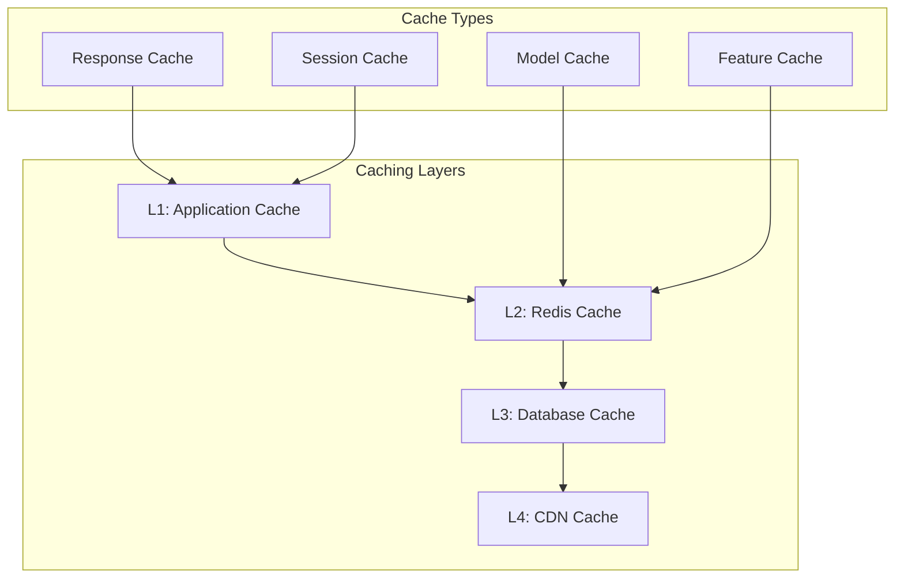

# Performance Best Practices Guide

## Overview

This guide provides comprehensive performance optimization strategies for the Risk Assessment Service. It covers database optimization, caching strategies, API performance, scaling techniques, and monitoring approaches to ensure optimal performance at scale.

## Table of Contents

1. [Performance Fundamentals](#performance-fundamentals)
2. [Database Optimization](#database-optimization)
3. [Caching Strategies](#caching-strategies)
4. [API Performance Optimization](#api-performance-optimization)
5. [Scaling Strategies](#scaling-strategies)
6. [Monitoring and Profiling](#monitoring-and-profiling)
7. [Performance Testing](#performance-testing)
8. [Troubleshooting Performance Issues](#troubleshooting-performance-issues)

## Performance Fundamentals

### Key Performance Metrics

#### 1. Response Time Metrics
```yaml
Target Response Times:
  - API Endpoints: < 200ms (95th percentile)
  - Risk Assessment: < 500ms (95th percentile)
  - Batch Processing: < 2s per item
  - Database Queries: < 50ms (95th percentile)
  - External API Calls: < 1s (95th percentile)
```

#### 2. Throughput Metrics
```yaml
Target Throughput:
  - API Requests: 10,000+ requests/minute
  - Risk Assessments: 5,000+ assessments/minute
  - Database Operations: 50,000+ operations/minute
  - Concurrent Users: 1,000+ simultaneous users
```

#### 3. Resource Utilization
```yaml
Target Resource Usage:
  - CPU Usage: < 70% average
  - Memory Usage: < 80% average
  - Database Connections: < 80% of pool
  - Network Bandwidth: < 80% of capacity
```

### Performance Optimization Principles

#### 1. Measure First, Optimize Second
- Establish baseline performance metrics
- Identify bottlenecks through profiling
- Set measurable performance goals
- Monitor continuously

#### 2. Optimize for the Common Case
- Focus on the 80/20 rule
- Optimize frequently used code paths
- Cache frequently accessed data
- Use appropriate data structures

#### 3. Scale Horizontally When Possible
- Design stateless services
- Use load balancing
- Implement auto-scaling
- Distribute load across instances

## Database Optimization

### 1. Query Optimization

#### Indexing Strategy
```sql
-- Primary indexes for risk assessments
CREATE INDEX idx_risk_assessments_user_id ON risk_assessments(user_id);
CREATE INDEX idx_risk_assessments_created_at ON risk_assessments(created_at);
CREATE INDEX idx_risk_assessments_status ON risk_assessments(status);

-- Composite indexes for common queries
CREATE INDEX idx_risk_assessments_user_status ON risk_assessments(user_id, status);
CREATE INDEX idx_risk_assessments_created_status ON risk_assessments(created_at, status);

-- Partial indexes for active records
CREATE INDEX idx_risk_assessments_active ON risk_assessments(user_id) 
WHERE status IN ('pending', 'completed');

-- Covering indexes for read-heavy queries
CREATE INDEX idx_risk_assessments_covering ON risk_assessments(
    user_id, status, risk_score, created_at
) INCLUDE (business_name, risk_level);
```

#### Query Optimization Techniques
```go
// Bad: N+1 query problem
func GetUserAssessments(userID string) ([]Assessment, error) {
    assessments, err := db.GetAssessmentsByUser(userID)
    if err != nil {
        return nil, err
    }
    
    for i := range assessments {
        // This creates N+1 queries
        assessments[i].RiskFactors, err = db.GetRiskFactors(assessments[i].ID)
        if err != nil {
            return nil, err
        }
    }
    
    return assessments, nil
}

// Good: Single query with JOIN
func GetUserAssessments(userID string) ([]Assessment, error) {
    query := `
        SELECT 
            a.id, a.business_name, a.risk_score, a.risk_level,
            rf.category, rf.name, rf.score, rf.weight
        FROM risk_assessments a
        LEFT JOIN risk_factors rf ON a.id = rf.assessment_id
        WHERE a.user_id = $1
        ORDER BY a.created_at DESC
    `
    
    rows, err := db.Query(query, userID)
    if err != nil {
        return nil, err
    }
    defer rows.Close()
    
    return scanAssessmentsWithFactors(rows)
}
```

#### Connection Pooling
```go
// Database connection pool configuration
func ConfigureDatabase(databaseURL string) (*sql.DB, error) {
    db, err := sql.Open("postgres", databaseURL)
    if err != nil {
        return nil, err
    }
    
    // Optimize connection pool settings
    db.SetMaxOpenConns(25)                 // Maximum open connections
    db.SetMaxIdleConns(5)                  // Maximum idle connections
    db.SetConnMaxLifetime(5 * time.Minute) // Connection lifetime
    db.SetConnMaxIdleTime(1 * time.Minute) // Idle connection timeout
    
    // Enable prepared statement caching
    db.SetConnMaxLifetime(0) // Disable connection lifetime for prepared statements
    
    return db, nil
}
```

### 2. Database Schema Optimization

#### Partitioning Strategy
```sql
-- Partition risk_assessments by date
CREATE TABLE risk_assessments (
    id UUID PRIMARY KEY,
    user_id UUID NOT NULL,
    business_name VARCHAR(255) NOT NULL,
    risk_score DECIMAL(3,2) NOT NULL,
    created_at TIMESTAMP NOT NULL
) PARTITION BY RANGE (created_at);

-- Create monthly partitions
CREATE TABLE risk_assessments_2024_01 PARTITION OF risk_assessments
    FOR VALUES FROM ('2024-01-01') TO ('2024-02-01');

CREATE TABLE risk_assessments_2024_02 PARTITION OF risk_assessments
    FOR VALUES FROM ('2024-02-01') TO ('2024-03-01');

-- Create indexes on partitions
CREATE INDEX idx_risk_assessments_2024_01_user_id 
    ON risk_assessments_2024_01(user_id);
```

#### Data Archiving
```sql
-- Archive old assessments
CREATE TABLE risk_assessments_archive (
    LIKE risk_assessments INCLUDING ALL
);

-- Move old data to archive
INSERT INTO risk_assessments_archive
SELECT * FROM risk_assessments
WHERE created_at < NOW() - INTERVAL '2 years';

DELETE FROM risk_assessments
WHERE created_at < NOW() - INTERVAL '2 years';
```

### 3. Read Replicas and Load Balancing

#### Read Replica Configuration
```go
type DatabaseConfig struct {
    Master  *sql.DB
    Replicas []*sql.DB
    LoadBalancer LoadBalancer
}

func (db *DatabaseConfig) Query(query string, args ...interface{}) (*sql.Rows, error) {
    // Use read replica for SELECT queries
    if strings.HasPrefix(strings.TrimSpace(strings.ToUpper(query)), "SELECT") {
        replica := db.LoadBalancer.GetReplica()
        return replica.Query(query, args...)
    }
    
    // Use master for write operations
    return db.Master.Query(query, args...)
}
```

## Caching Strategies

### 1. Multi-Layer Caching Architecture



### 2. Application-Level Caching

#### In-Memory Cache
```go
type CacheManager struct {
    memoryCache *cache.Cache
    redisCache  *redis.Client
    ttl         time.Duration
}

func NewCacheManager(redisClient *redis.Client) *CacheManager {
    return &CacheManager{
        memoryCache: cache.New(5*time.Minute, 10*time.Minute),
        redisCache:  redisClient,
        ttl:         15 * time.Minute,
    }
}

func (cm *CacheManager) Get(key string) (interface{}, error) {
    // Try memory cache first
    if value, found := cm.memoryCache.Get(key); found {
        return value, nil
    }
    
    // Try Redis cache
    value, err := cm.redisCache.Get(context.Background(), key).Result()
    if err == nil {
        // Store in memory cache for faster access
        cm.memoryCache.Set(key, value, cm.ttl)
        return value, nil
    }
    
    return nil, cache.ErrCacheMiss
}

func (cm *CacheManager) Set(key string, value interface{}) error {
    // Set in both caches
    cm.memoryCache.Set(key, value, cm.ttl)
    
    data, err := json.Marshal(value)
    if err != nil {
        return err
    }
    
    return cm.redisCache.Set(context.Background(), key, data, cm.ttl).Err()
}
```

#### Cache-Aside Pattern
```go
func (s *RiskAssessmentService) GetAssessment(ctx context.Context, id string) (*Assessment, error) {
    cacheKey := fmt.Sprintf("assessment:%s", id)
    
    // Try cache first
    if cached, err := s.cache.Get(cacheKey); err == nil {
        var assessment Assessment
        if err := json.Unmarshal(cached.([]byte), &assessment); err == nil {
            return &assessment, nil
        }
    }
    
    // Cache miss - fetch from database
    assessment, err := s.repository.GetByID(ctx, id)
    if err != nil {
        return nil, err
    }
    
    // Store in cache
    if data, err := json.Marshal(assessment); err == nil {
        s.cache.Set(cacheKey, data, 15*time.Minute)
    }
    
    return assessment, nil
}
```

### 3. Redis Caching Strategies

#### Cache Warming
```go
func (s *RiskAssessmentService) WarmCache(ctx context.Context) error {
    // Warm frequently accessed data
    assessments, err := s.repository.GetRecentAssessments(ctx, 1000)
    if err != nil {
        return err
    }
    
    for _, assessment := range assessments {
        cacheKey := fmt.Sprintf("assessment:%s", assessment.ID)
        data, _ := json.Marshal(assessment)
        s.redis.Set(ctx, cacheKey, data, 15*time.Minute)
    }
    
    return nil
}
```

#### Cache Invalidation
```go
func (s *RiskAssessmentService) UpdateAssessment(ctx context.Context, id string, updates map[string]interface{}) error {
    // Update database
    err := s.repository.Update(ctx, id, updates)
    if err != nil {
        return err
    }
    
    // Invalidate cache
    cacheKey := fmt.Sprintf("assessment:%s", id)
    s.cache.Delete(cacheKey)
    
    // Invalidate related caches
    s.invalidateUserAssessmentsCache(ctx, updates["user_id"])
    
    return nil
}
```

### 4. Model Caching

#### ML Model Cache
```go
type ModelCache struct {
    models map[string]*Model
    mutex  sync.RWMutex
    ttl    time.Duration
}

func (mc *ModelCache) GetModel(modelType string) (*Model, error) {
    mc.mutex.RLock()
    defer mc.mutex.RUnlock()
    
    if model, exists := mc.models[modelType]; exists {
        return model, nil
    }
    
    return nil, errors.New("model not found")
}

func (mc *ModelCache) LoadModel(modelType string, modelPath string) error {
    model, err := LoadModelFromFile(modelPath)
    if err != nil {
        return err
    }
    
    mc.mutex.Lock()
    defer mc.mutex.Unlock()
    
    mc.models[modelType] = model
    return nil
}
```

## API Performance Optimization

### 1. Request Optimization

#### Request Batching
```go
type BatchRequest struct {
    Requests []RiskAssessmentRequest `json:"requests"`
}

func (s *RiskAssessmentService) ProcessBatch(ctx context.Context, batch BatchRequest) ([]Assessment, error) {
    // Process requests in parallel
    results := make([]Assessment, len(batch.Requests))
    errors := make([]error, len(batch.Requests))
    
    var wg sync.WaitGroup
    for i, req := range batch.Requests {
        wg.Add(1)
        go func(index int, request RiskAssessmentRequest) {
            defer wg.Done()
            
            assessment, err := s.ProcessAssessment(ctx, request)
            results[index] = assessment
            errors[index] = err
        }(i, req)
    }
    
    wg.Wait()
    
    // Check for errors
    for i, err := range errors {
        if err != nil {
            return nil, fmt.Errorf("request %d failed: %w", i, err)
        }
    }
    
    return results, nil
}
```

#### Response Compression
```go
func CompressionMiddleware() gin.HandlerFunc {
    return gin.HandlerFunc(func(c *gin.Context) {
        // Check if client supports compression
        if !strings.Contains(c.GetHeader("Accept-Encoding"), "gzip") {
            c.Next()
            return
        }
        
        // Compress response
        c.Header("Content-Encoding", "gzip")
        c.Header("Vary", "Accept-Encoding")
        
        gz := gzip.NewWriter(c.Writer)
        defer gz.Close()
        
        c.Writer = &gzipResponseWriter{
            ResponseWriter: c.Writer,
            Writer:         gz,
        }
        
        c.Next()
    })
}
```

### 2. Asynchronous Processing

#### Background Job Processing
```go
type JobProcessor struct {
    queue    chan Job
    workers  int
    handler  JobHandler
}

func NewJobProcessor(workers int, handler JobHandler) *JobProcessor {
    return &JobProcessor{
        queue:   make(chan Job, 1000),
        workers: workers,
        handler: handler,
    }
}

func (jp *JobProcessor) Start() {
    for i := 0; i < jp.workers; i++ {
        go jp.worker()
    }
}

func (jp *JobProcessor) worker() {
    for job := range jp.queue {
        if err := jp.handler.Handle(job); err != nil {
            log.Printf("Job failed: %v", err)
        }
    }
}

func (jp *JobProcessor) Enqueue(job Job) {
    select {
    case jp.queue <- job:
    default:
        log.Printf("Queue full, dropping job")
    }
}
```

#### Webhook Processing
```go
func (s *WebhookService) ProcessWebhook(ctx context.Context, webhook WebhookEvent) error {
    // Process webhook asynchronously
    go func() {
        if err := s.sendWebhook(webhook); err != nil {
            // Retry with exponential backoff
            s.retryWebhook(webhook, 3)
        }
    }()
    
    return nil
}

func (s *WebhookService) retryWebhook(webhook WebhookEvent, maxRetries int) {
    for i := 0; i < maxRetries; i++ {
        time.Sleep(time.Duration(math.Pow(2, float64(i))) * time.Second)
        
        if err := s.sendWebhook(webhook); err == nil {
            return
        }
    }
    
    // Move to dead letter queue
    s.moveToDeadLetterQueue(webhook)
}
```

### 3. API Rate Limiting

#### Token Bucket Rate Limiter
```go
type TokenBucket struct {
    capacity    int64
    tokens      int64
    refillRate  int64
    lastRefill  time.Time
    mutex       sync.Mutex
}

func NewTokenBucket(capacity, refillRate int64) *TokenBucket {
    return &TokenBucket{
        capacity:   capacity,
        tokens:     capacity,
        refillRate: refillRate,
        lastRefill: time.Now(),
    }
}

func (tb *TokenBucket) Allow() bool {
    tb.mutex.Lock()
    defer tb.mutex.Unlock()
    
    now := time.Now()
    tokensToAdd := int64(now.Sub(tb.lastRefill).Seconds()) * tb.refillRate
    tb.tokens = min(tb.capacity, tb.tokens+tokensToAdd)
    tb.lastRefill = now
    
    if tb.tokens > 0 {
        tb.tokens--
        return true
    }
    
    return false
}

func RateLimitMiddleware(limiter *TokenBucket) gin.HandlerFunc {
    return gin.HandlerFunc(func(c *gin.Context) {
        if !limiter.Allow() {
            c.JSON(429, gin.H{"error": "Rate limit exceeded"})
            c.Abort()
            return
        }
        
        c.Next()
    })
}
```

## Scaling Strategies

### 1. Horizontal Scaling

#### Load Balancing Configuration
```yaml
# Nginx load balancer configuration
upstream risk_assessment_backend {
    least_conn;
    server app1:8080 weight=3;
    server app2:8080 weight=3;
    server app3:8080 weight=2;
    
    keepalive 32;
}

server {
    listen 80;
    
    location /api/ {
        proxy_pass http://risk_assessment_backend;
        proxy_set_header Host $host;
        proxy_set_header X-Real-IP $remote_addr;
        proxy_set_header X-Forwarded-For $proxy_add_x_forwarded_for;
        
        # Connection pooling
        proxy_http_version 1.1;
        proxy_set_header Connection "";
        
        # Timeouts
        proxy_connect_timeout 5s;
        proxy_send_timeout 10s;
        proxy_read_timeout 30s;
    }
}
```

#### Auto-Scaling Configuration
```yaml
# Kubernetes HPA configuration
apiVersion: autoscaling/v2
kind: HorizontalPodAutoscaler
metadata:
  name: risk-assessment-hpa
spec:
  scaleTargetRef:
    apiVersion: apps/v1
    kind: Deployment
    name: risk-assessment-api
  minReplicas: 3
  maxReplicas: 20
  metrics:
  - type: Resource
    resource:
      name: cpu
      target:
        type: Utilization
        averageUtilization: 70
  - type: Resource
    resource:
      name: memory
      target:
        type: Utilization
        averageUtilization: 80
  - type: Pods
    pods:
      metric:
        name: requests_per_second
      target:
        type: AverageValue
        averageValue: "1000"
```

### 2. Database Scaling

#### Read Replica Scaling
```go
type DatabaseCluster struct {
    master   *sql.DB
    replicas []*sql.DB
    balancer *RoundRobinBalancer
}

func (dc *DatabaseCluster) Query(query string, args ...interface{}) (*sql.Rows, error) {
    if isReadQuery(query) {
        replica := dc.balancer.GetReplica()
        return replica.Query(query, args...)
    }
    
    return dc.master.Query(query, args...)
}

func (dc *DatabaseCluster) Exec(query string, args ...interface{}) (sql.Result, error) {
    return dc.master.Exec(query, args...)
}
```

#### Database Sharding
```go
type ShardedDatabase struct {
    shards map[string]*sql.DB
    router *ShardRouter
}

func (sd *ShardedDatabase) GetShard(key string) *sql.DB {
    shardKey := sd.router.GetShardKey(key)
    return sd.shards[shardKey]
}

func (sd *ShardedDatabase) Query(key string, query string, args ...interface{}) (*sql.Rows, error) {
    shard := sd.GetShard(key)
    return shard.Query(query, args...)
}
```

### 3. Caching Scaling

#### Redis Cluster Configuration
```yaml
# Redis cluster configuration
redis:
  cluster:
    enabled: true
    nodes:
      - redis-node-1:6379
      - redis-node-2:6379
      - redis-node-3:6379
      - redis-node-4:6379
      - redis-node-5:6379
      - redis-node-6:6379
    max_redirects: 3
    read_timeout: 3s
    write_timeout: 3s
```

#### Cache Warming Strategy
```go
func (s *RiskAssessmentService) WarmCache(ctx context.Context) error {
    // Warm cache in parallel
    var wg sync.WaitGroup
    errors := make(chan error, 3)
    
    // Warm recent assessments
    wg.Add(1)
    go func() {
        defer wg.Done()
        if err := s.warmRecentAssessments(ctx); err != nil {
            errors <- err
        }
    }()
    
    // Warm user data
    wg.Add(1)
    go func() {
        defer wg.Done()
        if err := s.warmUserData(ctx); err != nil {
            errors <- err
        }
    }()
    
    // Warm model data
    wg.Add(1)
    go func() {
        defer wg.Done()
        if err := s.warmModelData(ctx); err != nil {
            errors <- err
        }
    }()
    
    wg.Wait()
    close(errors)
    
    // Check for errors
    for err := range errors {
        if err != nil {
            return err
        }
    }
    
    return nil
}
```

## Monitoring and Profiling

### 1. Performance Monitoring

#### Application Metrics
```go
type MetricsCollector struct {
    requestDuration prometheus.HistogramVec
    requestCount    prometheus.CounterVec
    errorCount      prometheus.CounterVec
    activeRequests  prometheus.Gauge
}

func NewMetricsCollector() *MetricsCollector {
    return &MetricsCollector{
        requestDuration: prometheus.NewHistogramVec(
            prometheus.HistogramOpts{
                Name: "http_request_duration_seconds",
                Help: "HTTP request duration in seconds",
                Buckets: prometheus.DefBuckets,
            },
            []string{"method", "endpoint", "status"},
        ),
        requestCount: prometheus.NewCounterVec(
            prometheus.CounterOpts{
                Name: "http_requests_total",
                Help: "Total number of HTTP requests",
            },
            []string{"method", "endpoint", "status"},
        ),
        errorCount: prometheus.NewCounterVec(
            prometheus.CounterOpts{
                Name: "http_errors_total",
                Help: "Total number of HTTP errors",
            },
            []string{"method", "endpoint", "error_type"},
        ),
        activeRequests: prometheus.NewGauge(
            prometheus.GaugeOpts{
                Name: "http_active_requests",
                Help: "Number of active HTTP requests",
            },
        ),
    }
}

func (mc *MetricsCollector) RecordRequest(method, endpoint, status string, duration float64) {
    mc.requestDuration.WithLabelValues(method, endpoint, status).Observe(duration)
    mc.requestCount.WithLabelValues(method, endpoint, status).Inc()
}
```

#### Database Metrics
```go
func (db *Database) RecordQueryMetrics(query string, duration time.Duration, err error) {
    labels := prometheus.Labels{
        "query_type": getQueryType(query),
        "status":     getStatus(err),
    }
    
    queryDuration.With(labels).Observe(duration.Seconds())
    queryCount.With(labels).Inc()
    
    if err != nil {
        queryErrors.With(labels).Inc()
    }
}
```

### 2. Profiling

#### CPU Profiling
```go
func enableCPUProfiling() {
    f, err := os.Create("cpu.prof")
    if err != nil {
        log.Fatal(err)
    }
    defer f.Close()
    
    if err := pprof.StartCPUProfile(f); err != nil {
        log.Fatal(err)
    }
    defer pprof.StopCPUProfile()
}
```

#### Memory Profiling
```go
func enableMemoryProfiling() {
    f, err := os.Create("mem.prof")
    if err != nil {
        log.Fatal(err)
    }
    defer f.Close()
    
    runtime.GC()
    if err := pprof.WriteHeapProfile(f); err != nil {
        log.Fatal(err)
    }
}
```

#### HTTP Profiling Endpoint
```go
func setupProfiling(r *gin.Engine) {
    // Add pprof endpoints
    r.GET("/debug/pprof/", gin.WrapF(pprof.Index))
    r.GET("/debug/pprof/cmdline", gin.WrapF(pprof.Cmdline))
    r.GET("/debug/pprof/profile", gin.WrapF(pprof.Profile))
    r.GET("/debug/pprof/symbol", gin.WrapF(pprof.Symbol))
    r.GET("/debug/pprof/trace", gin.WrapF(pprof.Trace))
}
```

## Performance Testing

### 1. Load Testing

#### Load Test Configuration
```yaml
# K6 load test configuration
scenarios:
  normal_load:
    executor: constant-vus
    vus: 100
    duration: 5m
    
  stress_test:
    executor: ramping-vus
    startVUs: 0
    stages:
      - duration: 2m
        target: 500
      - duration: 5m
        target: 500
      - duration: 2m
        target: 0

thresholds:
  http_req_duration: ['p(95)<200']
  http_req_failed: ['rate<0.01']
  http_reqs: ['rate>1000']
```

#### Load Test Script
```javascript
import http from 'k6/http';
import { check, sleep } from 'k6';

export let options = {
  stages: [
    { duration: '2m', target: 100 },
    { duration: '5m', target: 100 },
    { duration: '2m', target: 0 },
  ],
  thresholds: {
    http_req_duration: ['p(95)<200'],
    http_req_failed: ['rate<0.01'],
  },
};

export default function() {
  let response = http.post('https://api.kyb-platform.com/v1/assess', {
    business_name: 'Test Company',
    business_address: '123 Test St, Test City, TC 12345',
    industry: 'Technology',
    country: 'US'
  }, {
    headers: {
      'Authorization': 'Bearer ' + __ENV.API_KEY,
      'Content-Type': 'application/json',
    },
  });
  
  check(response, {
    'status is 200': (r) => r.status === 200,
    'response time < 200ms': (r) => r.timings.duration < 200,
  });
  
  sleep(1);
}
```

### 2. Stress Testing

#### Stress Test Scenarios
```go
func runStressTest() {
    scenarios := []StressTestScenario{
        {
            Name:        "High Volume",
            Concurrency: 1000,
            Duration:    10 * time.Minute,
            RampUp:      2 * time.Minute,
        },
        {
            Name:        "Burst Traffic",
            Concurrency: 2000,
            Duration:    5 * time.Minute,
            RampUp:      30 * time.Second,
        },
        {
            Name:        "Sustained Load",
            Concurrency: 500,
            Duration:    30 * time.Minute,
            RampUp:      5 * time.Minute,
        },
    }
    
    for _, scenario := range scenarios {
        runScenario(scenario)
    }
}
```

## Troubleshooting Performance Issues

### 1. Common Performance Problems

#### High Response Times
```go
// Diagnose high response times
func diagnoseResponseTime(metrics Metrics) {
    if metrics.P95ResponseTime > 200*time.Millisecond {
        // Check database queries
        if metrics.DatabaseQueryTime > 50*time.Millisecond {
            log.Println("Database queries are slow")
            // Check for missing indexes, slow queries
        }
        
        // Check external API calls
        if metrics.ExternalAPITime > 100*time.Millisecond {
            log.Println("External API calls are slow")
            // Check network latency, API performance
        }
        
        // Check CPU usage
        if metrics.CPUUsage > 80 {
            log.Println("High CPU usage detected")
            // Check for CPU-intensive operations
        }
    }
}
```

#### Memory Leaks
```go
// Monitor memory usage
func monitorMemory() {
    var m runtime.MemStats
    runtime.ReadMemStats(&m)
    
    if m.Alloc > 100*1024*1024 { // 100MB
        log.Printf("High memory usage: %d MB", m.Alloc/1024/1024)
        
        // Check for memory leaks
        if m.NumGC > 0 {
            log.Printf("GC frequency: %d", m.NumGC)
        }
    }
}
```

#### Database Connection Issues
```go
// Monitor database connections
func monitorDatabaseConnections(db *sql.DB) {
    stats := db.Stats()
    
    if stats.OpenConnections > stats.MaxOpenConns*0.8 {
        log.Printf("High database connection usage: %d/%d", 
            stats.OpenConnections, stats.MaxOpenConns)
    }
    
    if stats.WaitCount > 0 {
        log.Printf("Database connection waits: %d", stats.WaitCount)
    }
}
```

### 2. Performance Optimization Checklist

#### Application Level
- [ ] Enable response compression
- [ ] Implement request batching
- [ ] Use connection pooling
- [ ] Optimize database queries
- [ ] Implement caching strategies
- [ ] Use asynchronous processing
- [ ] Monitor resource usage

#### Database Level
- [ ] Add appropriate indexes
- [ ] Optimize query plans
- [ ] Use read replicas
- [ ] Implement connection pooling
- [ ] Archive old data
- [ ] Monitor query performance

#### Infrastructure Level
- [ ] Configure load balancing
- [ ] Implement auto-scaling
- [ ] Use CDN for static content
- [ ] Monitor system resources
- [ ] Set up alerting
- [ ] Implement backup strategies

## Best Practices Summary

### 1. Development Best Practices
- Measure performance before optimizing
- Use profiling tools to identify bottlenecks
- Implement comprehensive monitoring
- Test performance under load
- Document performance requirements

### 2. Deployment Best Practices
- Use horizontal scaling when possible
- Implement proper load balancing
- Configure auto-scaling policies
- Monitor resource utilization
- Set up performance alerts

### 3. Monitoring Best Practices
- Track key performance metrics
- Set up automated alerting
- Regular performance reviews
- Capacity planning
- Performance regression testing

## Tools and Resources

### Performance Monitoring Tools
- **Prometheus**: Metrics collection and alerting
- **Grafana**: Metrics visualization and dashboards
- **Jaeger**: Distributed tracing
- **pprof**: Go profiling tool
- **K6**: Load testing tool

### Database Optimization Tools
- **EXPLAIN ANALYZE**: PostgreSQL query analysis
- **pg_stat_statements**: Query statistics
- **pgAdmin**: Database administration
- **Redis CLI**: Redis monitoring and debugging

### Load Testing Tools
- **K6**: Modern load testing tool
- **JMeter**: Apache load testing tool
- **Artillery**: Node.js load testing
- **Locust**: Python load testing

---

**Last Updated**: January 15, 2024  
**Version**: 2.0.0  
**Next Review**: April 15, 2024
