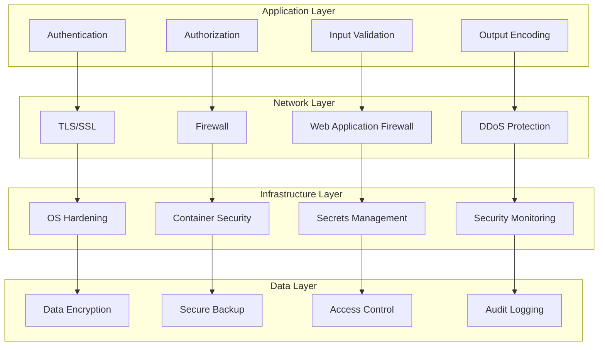

# Security Best Practices Guide

## Overview

This guide provides comprehensive security best practices for the Risk Assessment Service. It covers authentication, authorization, data protection, API security, infrastructure security, and compliance requirements to ensure the highest level of security for sensitive business data.

## Table of Contents

1. [Security Architecture](#security-architecture)
2. [Authentication and Authorization](#authentication-and-authorization)
3. [Data Protection](#data-protection)
4. [API Security](#api-security)
5. [Infrastructure Security](#infrastructure-security)
6. [Compliance and Governance](#compliance-and-governance)
7. [Security Monitoring](#security-monitoring)
8. [Incident Response](#incident-response)

## Security Architecture

### Security Layers



### Security Principles

#### 1. Defense in Depth
- Multiple layers of security controls
- Fail-safe defaults
- Principle of least privilege
- Separation of duties

#### 2. Zero Trust Architecture
- Never trust, always verify
- Continuous authentication
- Micro-segmentation
- Least privilege access

#### 3. Security by Design
- Security built into every component
- Threat modeling
- Secure coding practices
- Regular security assessments

## Authentication and Authorization

### 1. Authentication Mechanisms

#### JWT Token Authentication
```go
type JWTManager struct {
    secretKey     []byte
    issuer        string
    audience      string
    accessTTL     time.Duration
    refreshTTL    time.Duration
    refreshTokens map[string]RefreshToken
    mutex         sync.RWMutex
}

type Claims struct {
    UserID      string   `json:"user_id"`
    Email       string   `json:"email"`
    Permissions []string `json:"permissions"`
    Roles       []string `json:"roles"`
    jwt.RegisteredClaims
}

func (jm *JWTManager) GenerateTokenPair(userID, email string, permissions, roles []string) (*TokenPair, error) {
    now := time.Now()
    
    // Access token
    accessClaims := &Claims{
        UserID:      userID,
        Email:       email,
        Permissions: permissions,
        Roles:       roles,
        RegisteredClaims: jwt.RegisteredClaims{
            Issuer:    jm.issuer,
            Audience:  jwt.ClaimStrings{jm.audience},
            Subject:   userID,
            IssuedAt:  jwt.NewNumericDate(now),
            ExpiresAt: jwt.NewNumericDate(now.Add(jm.accessTTL)),
            NotBefore: jwt.NewNumericDate(now),
        },
    }
    
    accessToken := jwt.NewWithClaims(jwt.SigningMethodHS256, accessClaims)
    accessTokenString, err := accessToken.SignedString(jm.secretKey)
    if err != nil {
        return nil, err
    }
    
    // Refresh token
    refreshToken := generateSecureToken(32)
    refreshTokenData := RefreshToken{
        Token:     refreshToken,
        UserID:    userID,
        ExpiresAt: now.Add(jm.refreshTTL),
        CreatedAt: now,
    }
    
    jm.mutex.Lock()
    jm.refreshTokens[refreshToken] = refreshTokenData
    jm.mutex.Unlock()
    
    return &TokenPair{
        AccessToken:  accessTokenString,
        RefreshToken: refreshToken,
        ExpiresIn:    int(jm.accessTTL.Seconds()),
        TokenType:    "Bearer",
    }, nil
}

func (jm *JWTManager) ValidateToken(tokenString string) (*Claims, error) {
    token, err := jwt.ParseWithClaims(tokenString, &Claims{}, func(token *jwt.Token) (interface{}, error) {
        if _, ok := token.Method.(*jwt.SigningMethodHMAC); !ok {
            return nil, fmt.Errorf("unexpected signing method: %v", token.Header["alg"])
        }
        return jm.secretKey, nil
    })
    
    if err != nil {
        return nil, err
    }
    
    if claims, ok := token.Claims.(*Claims); ok && token.Valid {
        // Validate issuer and audience
        if claims.Issuer != jm.issuer {
            return nil, errors.New("invalid issuer")
        }
        
        if !claims.VerifyAudience(jm.audience, true) {
            return nil, errors.New("invalid audience")
        }
        
        return claims, nil
    }
    
    return nil, errors.New("invalid token")
}
```

#### Multi-Factor Authentication
```go
type MFAManager struct {
    totpSecretLength int
    backupCodesCount int
    smsProvider      SMSProvider
    emailProvider    EmailProvider
}

func (mfa *MFAManager) SetupTOTP(userID string) (*TOTPSetup, error) {
    secret := generateSecureSecret(mfa.totpSecretLength)
    
    // Generate QR code URL
    qrURL := fmt.Sprintf("otpauth://totp/RiskAssessment:%s?secret=%s&issuer=RiskAssessment",
        userID, secret)
    
    // Generate backup codes
    backupCodes := make([]string, mfa.backupCodesCount)
    for i := range backupCodes {
        backupCodes[i] = generateSecureToken(8)
    }
    
    return &TOTPSetup{
        Secret:      secret,
        QRCodeURL:   qrURL,
        BackupCodes: backupCodes,
    }, nil
}

func (mfa *MFAManager) VerifyTOTP(userID, token string) (bool, error) {
    // Get user's TOTP secret from secure storage
    secret, err := mfa.getUserTOTPSecret(userID)
    if err != nil {
        return false, err
    }
    
    // Verify TOTP token
    return totp.Validate(token, secret), nil
}

func (mfa *MFAManager) SendSMSCode(userID, phoneNumber string) error {
    code := generateSMSCode()
    
    // Store code with expiration
    err := mfa.storeSMSCode(userID, code, 5*time.Minute)
    if err != nil {
        return err
    }
    
    // Send SMS
    return mfa.smsProvider.SendSMS(phoneNumber, fmt.Sprintf("Your verification code is: %s", code))
}
```

### 2. Authorization Framework

#### Role-Based Access Control (RBAC)
```go
type RBACManager struct {
    roles       map[string]*Role
    permissions map[string]*Permission
    userRoles   map[string][]string
    mutex       sync.RWMutex
}

type Role struct {
    ID          string   `json:"id"`
    Name        string   `json:"name"`
    Description string   `json:"description"`
    Permissions []string `json:"permissions"`
    CreatedAt   time.Time `json:"created_at"`
    UpdatedAt   time.Time `json:"updated_at"`
}

type Permission struct {
    ID          string `json:"id"`
    Name        string `json:"name"`
    Resource    string `json:"resource"`
    Action      string `json:"action"`
    Description string `json:"description"`
}

func (rbac *RBACManager) CheckPermission(userID, resource, action string) (bool, error) {
    rbac.mutex.RLock()
    defer rbac.mutex.RUnlock()
    
    userRoles := rbac.userRoles[userID]
    if len(userRoles) == 0 {
        return false, nil
    }
    
    for _, roleID := range userRoles {
        role := rbac.roles[roleID]
        if role == nil {
            continue
        }
        
        for _, permissionID := range role.Permissions {
            permission := rbac.permissions[permissionID]
            if permission == nil {
                continue
            }
            
            if permission.Resource == resource && permission.Action == action {
                return true, nil
            }
        }
    }
    
    return false, nil
}

func (rbac *RBACManager) AssignRole(userID, roleID string) error {
    rbac.mutex.Lock()
    defer rbac.mutex.Unlock()
    
    if _, exists := rbac.roles[roleID]; !exists {
        return errors.New("role not found")
    }
    
    rbac.userRoles[userID] = append(rbac.userRoles[userID], roleID)
    return nil
}
```

#### Attribute-Based Access Control (ABAC)
```go
type ABACManager struct {
    policies []Policy
    mutex    sync.RWMutex
}

type Policy struct {
    ID          string                 `json:"id"`
    Name        string                 `json:"name"`
    Description string                 `json:"description"`
    Rules       []Rule                 `json:"rules"`
    Effect      string                 `json:"effect"` // "allow" or "deny"
    Priority    int                    `json:"priority"`
    Metadata    map[string]interface{} `json:"metadata"`
}

type Rule struct {
    Subject    map[string]interface{} `json:"subject"`
    Resource   map[string]interface{} `json:"resource"`
    Action     map[string]interface{} `json:"action"`
    Environment map[string]interface{} `json:"environment"`
}

func (abac *ABACManager) EvaluateAccess(request *AccessRequest) (*AccessDecision, error) {
    abac.mutex.RLock()
    defer rbac.mutex.RUnlock()
    
    // Sort policies by priority
    sortedPolicies := make([]Policy, len(abac.policies))
    copy(sortedPolicies, abac.policies)
    sort.Slice(sortedPolicies, func(i, j int) bool {
        return sortedPolicies[i].Priority > sortedPolicies[j].Priority
    })
    
    for _, policy := range sortedPolicies {
        if abac.evaluatePolicy(policy, request) {
            return &AccessDecision{
                Decision: policy.Effect,
                PolicyID: policy.ID,
                Reason:   fmt.Sprintf("Policy %s matched", policy.Name),
            }, nil
        }
    }
    
    // Default deny
    return &AccessDecision{
        Decision: "deny",
        Reason:   "No matching policy found",
    }, nil
}

func (abac *ABACManager) evaluatePolicy(policy Policy, request *AccessRequest) bool {
    for _, rule := range policy.Rules {
        if abac.evaluateRule(rule, request) {
            return true
        }
    }
    return false
}
```

### 3. Session Management

#### Secure Session Handling
```go
type SessionManager struct {
    store       SessionStore
    cookieName  string
    secureOnly  bool
    httpOnly    bool
    sameSite    http.SameSite
    maxAge      int
    encryption  *AESEncryption
}

type Session struct {
    ID        string                 `json:"id"`
    UserID    string                 `json:"user_id"`
    Data      map[string]interface{} `json:"data"`
    CreatedAt time.Time              `json:"created_at"`
    ExpiresAt time.Time              `json:"expires_at"`
    IPAddress string                 `json:"ip_address"`
    UserAgent string                 `json:"user_agent"`
}

func (sm *SessionManager) CreateSession(userID, ipAddress, userAgent string) (*Session, error) {
    sessionID := generateSecureToken(32)
    
    session := &Session{
        ID:        sessionID,
        UserID:    userID,
        Data:      make(map[string]interface{}),
        CreatedAt: time.Now(),
        ExpiresAt: time.Now().Add(time.Duration(sm.maxAge) * time.Second),
        IPAddress: ipAddress,
        UserAgent: userAgent,
    }
    
    // Encrypt session data
    encryptedData, err := sm.encryption.Encrypt(session)
    if err != nil {
        return nil, err
    }
    
    // Store session
    err = sm.store.Set(sessionID, encryptedData, time.Duration(sm.maxAge)*time.Second)
    if err != nil {
        return nil, err
    }
    
    return session, nil
}

func (sm *SessionManager) GetSession(sessionID string) (*Session, error) {
    encryptedData, err := sm.store.Get(sessionID)
    if err != nil {
        return nil, err
    }
    
    var session Session
    err = sm.encryption.Decrypt(encryptedData, &session)
    if err != nil {
        return nil, err
    }
    
    // Check expiration
    if time.Now().After(session.ExpiresAt) {
        sm.store.Delete(sessionID)
        return nil, errors.New("session expired")
    }
    
    return &session, nil
}

func (sm *SessionManager) SetCookie(w http.ResponseWriter, sessionID string) {
    cookie := &http.Cookie{
        Name:     sm.cookieName,
        Value:    sessionID,
        Path:     "/",
        MaxAge:   sm.maxAge,
        Secure:   sm.secureOnly,
        HttpOnly: sm.httpOnly,
        SameSite: sm.sameSite,
    }
    
    http.SetCookie(w, cookie)
}
```

## Data Protection

### 1. Data Encryption

#### Encryption at Rest
```go
type DataEncryption struct {
    keyManager *KeyManager
    algorithm  string
}

func (de *DataEncryption) EncryptData(data []byte, keyID string) (*EncryptedData, error) {
    key, err := de.keyManager.GetKey(keyID)
    if err != nil {
        return nil, err
    }
    
    // Generate random IV
    iv := make([]byte, 12) // GCM nonce size
    if _, err := rand.Read(iv); err != nil {
        return nil, err
    }
    
    // Encrypt data
    block, err := aes.NewCipher(key)
    if err != nil {
        return nil, err
    }
    
    aesGCM, err := cipher.NewGCM(block)
    if err != nil {
        return nil, err
    }
    
    ciphertext := aesGCM.Seal(nil, iv, data, nil)
    
    return &EncryptedData{
        Ciphertext: ciphertext,
        IV:         iv,
        KeyID:      keyID,
        Algorithm:  de.algorithm,
    }, nil
}

func (de *DataEncryption) DecryptData(encryptedData *EncryptedData) ([]byte, error) {
    key, err := de.keyManager.GetKey(encryptedData.KeyID)
    if err != nil {
        return nil, err
    }
    
    block, err := aes.NewCipher(key)
    if err != nil {
        return nil, err
    }
    
    aesGCM, err := cipher.NewGCM(block)
    if err != nil {
        return nil, err
    }
    
    plaintext, err := aesGCM.Open(nil, encryptedData.IV, encryptedData.Ciphertext, nil)
    if err != nil {
        return nil, err
    }
    
    return plaintext, nil
}
```

#### Encryption in Transit
```go
type TLSConfig struct {
    CertFile    string
    KeyFile     string
    CAFile      string
    MinVersion  uint16
    CipherSuites []uint16
}

func NewSecureTLSConfig() *TLSConfig {
    return &TLSConfig{
        MinVersion: tls.VersionTLS12,
        CipherSuites: []uint16{
            tls.TLS_ECDHE_RSA_WITH_AES_256_GCM_SHA384,
            tls.TLS_ECDHE_RSA_WITH_CHACHA20_POLY1305,
            tls.TLS_ECDHE_ECDSA_WITH_AES_256_GCM_SHA384,
            tls.TLS_ECDHE_ECDSA_WITH_CHACHA20_POLY1305,
        },
    }
}

func (tc *TLSConfig) GetTLSConfig() (*tls.Config, error) {
    config := &tls.Config{
        MinVersion:         tc.MinVersion,
        CipherSuites:       tc.CipherSuites,
        InsecureSkipVerify: false,
        ServerName:         "",
    }
    
    if tc.CAFile != "" {
        caCert, err := ioutil.ReadFile(tc.CAFile)
        if err != nil {
            return nil, err
        }
        
        caCertPool := x509.NewCertPool()
        if !caCertPool.AppendCertsFromPEM(caCert) {
            return nil, errors.New("failed to parse CA certificate")
        }
        
        config.RootCAs = caCertPool
    }
    
    return config, nil
}
```

### 2. Data Masking and Anonymization

#### Data Masking
```go
type DataMasker struct {
    rules map[string]MaskingRule
}

type MaskingRule struct {
    Pattern     string
    Replacement string
    Type        string // "regex", "hash", "encrypt"
}

func (dm *DataMasker) MaskSensitiveData(data map[string]interface{}) map[string]interface{} {
    masked := make(map[string]interface{})
    
    for key, value := range data {
        if rule, exists := dm.rules[key]; exists {
            masked[key] = dm.applyMaskingRule(value, rule)
        } else {
            masked[key] = value
        }
    }
    
    return masked
}

func (dm *DataMasker) applyMaskingRule(value interface{}, rule MaskingRule) interface{} {
    switch rule.Type {
    case "regex":
        return dm.maskWithRegex(value, rule.Pattern, rule.Replacement)
    case "hash":
        return dm.maskWithHash(value)
    case "encrypt":
        return dm.maskWithEncryption(value)
    default:
        return value
    }
}

func (dm *DataMasker) maskWithRegex(value interface{}, pattern, replacement string) string {
    str := fmt.Sprintf("%v", value)
    regex := regexp.MustCompile(pattern)
    return regex.ReplaceAllString(str, replacement)
}
```

#### Data Anonymization
```go
type DataAnonymizer struct {
    kValue int // k-anonymity parameter
}

func (da *DataAnonymizer) AnonymizeDataset(dataset []map[string]interface{}, quasiIdentifiers []string) ([]map[string]interface{}, error) {
    // Group records by quasi-identifiers
    groups := make(map[string][]map[string]interface{})
    
    for _, record := range dataset {
        key := da.generateGroupKey(record, quasiIdentifiers)
        groups[key] = append(groups[key], record)
    }
    
    // Check k-anonymity
    var anonymized []map[string]interface{}
    for _, group := range groups {
        if len(group) >= da.kValue {
            // Apply generalization and suppression
            anonymizedGroup := da.anonymizeGroup(group, quasiIdentifiers)
            anonymized = append(anonymized, anonymizedGroup...)
        }
        // Suppress groups with less than k records
    }
    
    return anonymized, nil
}

func (da *DataAnonymizer) anonymizeGroup(group []map[string]interface{}, quasiIdentifiers []string) []map[string]interface{} {
    // Apply generalization techniques
    for _, identifier := range quasiIdentifiers {
        da.generalizeAttribute(group, identifier)
    }
    
    return group
}
```

### 3. Data Loss Prevention

#### DLP Scanner
```go
type DLPScanner struct {
    patterns map[string]*regexp.Regexp
    rules    []DLPRule
}

type DLPRule struct {
    ID          string
    Name        string
    Pattern     string
    Severity    string
    Action      string // "block", "warn", "log"
    Description string
}

func (dlp *DLPScanner) ScanData(data string) []DLPMatch {
    var matches []DLPMatch
    
    for _, rule := range dlp.rules {
        pattern := dlp.patterns[rule.ID]
        if pattern == nil {
            continue
        }
        
        found := pattern.FindAllStringIndex(data, -1)
        for _, match := range found {
            matches = append(matches, DLPMatch{
                RuleID:      rule.ID,
                RuleName:    rule.Name,
                Severity:    rule.Severity,
                Action:      rule.Action,
                Start:       match[0],
                End:         match[1],
                MatchedText: data[match[0]:match[1]],
            })
        }
    }
    
    return matches
}

func (dlp *DLPScanner) ProcessData(data string) (*ProcessedData, error) {
    matches := dlp.ScanData(data)
    
    result := &ProcessedData{
        OriginalData: data,
        Matches:      matches,
        Action:       "allow",
    }
    
    // Check for blocking rules
    for _, match := range matches {
        if match.Action == "block" {
            result.Action = "block"
            result.Reason = fmt.Sprintf("Blocked by rule: %s", match.RuleName)
            return result, nil
        }
    }
    
    // Apply masking for warning rules
    maskedData := data
    for _, match := range matches {
        if match.Action == "warn" {
            maskedData = strings.Replace(maskedData, match.MatchedText, "***MASKED***", 1)
        }
    }
    
    result.ProcessedData = maskedData
    return result, nil
}
```

## API Security

### 1. Input Validation and Sanitization

#### Input Validator
```go
type InputValidator struct {
    schemas map[string]*jsonschema.Schema
    rules   map[string]ValidationRule
}

type ValidationRule struct {
    Field       string
    Type        string
    Required    bool
    MinLength   int
    MaxLength   int
    Pattern     string
    Min         float64
    Max         float64
    Enum        []interface{}
    CustomRules []CustomRule
}

func (iv *InputValidator) ValidateRequest(data map[string]interface{}, schemaName string) (*ValidationResult, error) {
    schema, exists := iv.schemas[schemaName]
    if !exists {
        return nil, errors.New("schema not found")
    }
    
    result := &ValidationResult{
        Valid:   true,
        Errors:  make([]ValidationError, 0),
        Warnings: make([]ValidationWarning, 0),
    }
    
    // JSON Schema validation
    if err := schema.Validate(data); err != nil {
        result.Valid = false
        result.Errors = append(result.Errors, ValidationError{
            Field:   "schema",
            Message: err.Error(),
        })
    }
    
    // Custom validation rules
    for field, value := range data {
        if rule, exists := iv.rules[field]; exists {
            if err := iv.validateField(value, rule); err != nil {
                result.Valid = false
                result.Errors = append(result.Errors, ValidationError{
                    Field:   field,
                    Message: err.Error(),
                })
            }
        }
    }
    
    // Security checks
    securityIssues := iv.checkSecurityIssues(data)
    result.Warnings = append(result.Warnings, securityIssues...)
    
    return result, nil
}

func (iv *InputValidator) checkSecurityIssues(data map[string]interface{}) []ValidationWarning {
    var warnings []ValidationWarning
    
    for key, value := range data {
        strValue := fmt.Sprintf("%v", value)
        
        // Check for SQL injection patterns
        if iv.containsSQLInjection(strValue) {
            warnings = append(warnings, ValidationWarning{
                Field:   key,
                Message: "Potential SQL injection pattern detected",
                Severity: "high",
            })
        }
        
        // Check for XSS patterns
        if iv.containsXSS(strValue) {
            warnings = append(warnings, ValidationWarning{
                Field:   key,
                Message: "Potential XSS pattern detected",
                Severity: "medium",
            })
        }
        
        // Check for path traversal
        if iv.containsPathTraversal(strValue) {
            warnings = append(warnings, ValidationWarning{
                Field:   key,
                Message: "Potential path traversal pattern detected",
                Severity: "high",
            })
        }
    }
    
    return warnings
}
```

### 2. Rate Limiting and DDoS Protection

#### Advanced Rate Limiter
```go
type RateLimiter struct {
    limiters map[string]*Limiter
    mutex    sync.RWMutex
    config   *RateLimitConfig
}

type RateLimitConfig struct {
    DefaultLimit    int
    DefaultWindow   time.Duration
    BurstLimit      int
    CleanupInterval time.Duration
}

func (rl *RateLimiter) Allow(key string, limit int, window time.Duration) (bool, *RateLimitInfo) {
    rl.mutex.Lock()
    defer rl.mutex.Unlock()
    
    limiter, exists := rl.limiters[key]
    if !exists {
        limiter = rate.NewLimiter(rate.Limit(limit)/rate.Limit(window.Seconds()), limit)
        rl.limiters[key] = limiter
    }
    
    allowed := limiter.Allow()
    
    info := &RateLimitInfo{
        Allowed:    allowed,
        Remaining:  int(limiter.Tokens()),
        ResetTime:  time.Now().Add(window),
        Limit:      limit,
    }
    
    return allowed, info
}

func (rl *RateLimiter) AllowN(key string, n int, limit int, window time.Duration) (bool, *RateLimitInfo) {
    rl.mutex.Lock()
    defer rl.mutex.Unlock()
    
    limiter, exists := rl.limiters[key]
    if !exists {
        limiter = rate.NewLimiter(rate.Limit(limit)/rate.Limit(window.Seconds()), limit)
        rl.limiters[key] = limiter
    }
    
    allowed := limiter.AllowN(time.Now(), n)
    
    info := &RateLimitInfo{
        Allowed:    allowed,
        Remaining:  int(limiter.Tokens()),
        ResetTime:  time.Now().Add(window),
        Limit:      limit,
    }
    
    return allowed, info
}
```

#### DDoS Protection
```go
type DDoSProtection struct {
    ipLimits    map[string]*IPLimit
    globalLimit *GlobalLimit
    mutex       sync.RWMutex
    config      *DDoSConfig
}

type IPLimit struct {
    RequestCount int
    LastRequest  time.Time
    Blocked      bool
    BlockUntil   time.Time
}

type GlobalLimit struct {
    RequestCount int
    LastRequest  time.Time
    Threshold    int
}

func (ddp *DDoSProtection) CheckRequest(ip string) (bool, error) {
    ddp.mutex.Lock()
    defer ddp.mutex.Unlock()
    
    now := time.Now()
    
    // Check global limit
    if ddp.globalLimit.RequestCount > ddp.globalLimit.Threshold {
        return false, errors.New("global rate limit exceeded")
    }
    
    // Check IP-specific limit
    limit, exists := ddp.ipLimits[ip]
    if !exists {
        limit = &IPLimit{
            RequestCount: 0,
            LastRequest:  now,
            Blocked:      false,
        }
        ddp.ipLimits[ip] = limit
    }
    
    // Check if IP is blocked
    if limit.Blocked && now.Before(limit.BlockUntil) {
        return false, errors.New("IP is temporarily blocked")
    }
    
    // Reset counter if window has passed
    if now.Sub(limit.LastRequest) > ddp.config.Window {
        limit.RequestCount = 0
    }
    
    // Increment counter
    limit.RequestCount++
    limit.LastRequest = now
    ddp.globalLimit.RequestCount++
    ddp.globalLimit.LastRequest = now
    
    // Check if IP should be blocked
    if limit.RequestCount > ddp.config.IPLimit {
        limit.Blocked = true
        limit.BlockUntil = now.Add(ddp.config.BlockDuration)
        return false, errors.New("IP rate limit exceeded")
    }
    
    return true, nil
}
```

### 3. API Gateway Security

#### Security Middleware
```go
type SecurityMiddleware struct {
    authManager    *AuthManager
    rateLimiter    *RateLimiter
    inputValidator *InputValidator
    logger         *Logger
}

func (sm *SecurityMiddleware) SecurityChain() gin.HandlerFunc {
    return gin.HandlerFunc(func(c *gin.Context) {
        // 1. Rate limiting
        if !sm.checkRateLimit(c) {
            c.JSON(429, gin.H{"error": "Rate limit exceeded"})
            c.Abort()
            return
        }
        
        // 2. Authentication
        if !sm.checkAuthentication(c) {
            c.JSON(401, gin.H{"error": "Authentication required"})
            c.Abort()
            return
        }
        
        // 3. Authorization
        if !sm.checkAuthorization(c) {
            c.JSON(403, gin.H{"error": "Insufficient permissions"})
            c.Abort()
            return
        }
        
        // 4. Input validation
        if !sm.validateInput(c) {
            c.JSON(400, gin.H{"error": "Invalid input"})
            c.Abort()
            return
        }
        
        // 5. Security headers
        sm.setSecurityHeaders(c)
        
        c.Next()
    })
}

func (sm *SecurityMiddleware) checkRateLimit(c *gin.Context) bool {
    ip := c.ClientIP()
    allowed, info := sm.rateLimiter.Allow(ip, 100, time.Minute)
    
    c.Header("X-RateLimit-Limit", strconv.Itoa(info.Limit))
    c.Header("X-RateLimit-Remaining", strconv.Itoa(info.Remaining))
    c.Header("X-RateLimit-Reset", strconv.FormatInt(info.ResetTime.Unix(), 10))
    
    return allowed
}

func (sm *SecurityMiddleware) setSecurityHeaders(c *gin.Context) {
    c.Header("X-Content-Type-Options", "nosniff")
    c.Header("X-Frame-Options", "DENY")
    c.Header("X-XSS-Protection", "1; mode=block")
    c.Header("Strict-Transport-Security", "max-age=31536000; includeSubDomains")
    c.Header("Content-Security-Policy", "default-src 'self'")
    c.Header("Referrer-Policy", "strict-origin-when-cross-origin")
}
```

## Infrastructure Security

### 1. Container Security

#### Secure Container Configuration
```dockerfile
# Use minimal base image
FROM alpine:3.18

# Create non-root user
RUN addgroup -g 1001 -S appgroup && \
    adduser -u 1001 -S appuser -G appgroup

# Install only necessary packages
RUN apk add --no-cache ca-certificates tzdata

# Copy application
COPY --chown=appuser:appgroup ./risk-assessment-service /app/
WORKDIR /app

# Set security options
USER appuser

# Expose port
EXPOSE 8080

# Health check
HEALTHCHECK --interval=30s --timeout=3s --start-period=5s --retries=3 \
    CMD curl -f http://localhost:8080/health || exit 1

# Run application
CMD ["./risk-assessment-service"]
```

#### Container Security Scanning
```go
type ContainerSecurityScanner struct {
    trivyClient *TrivyClient
    policies    []SecurityPolicy
}

type SecurityPolicy struct {
    ID          string
    Name        string
    Severity    string
    Description string
    Rules       []PolicyRule
}

func (css *ContainerSecurityScanner) ScanImage(imageName string) (*SecurityScanResult, error) {
    // Scan for vulnerabilities
    vulnerabilities, err := css.trivyClient.ScanVulnerabilities(imageName)
    if err != nil {
        return nil, err
    }
    
    // Scan for misconfigurations
    misconfigurations, err := css.trivyClient.ScanMisconfigurations(imageName)
    if err != nil {
        return nil, err
    }
    
    // Scan for secrets
    secrets, err := css.trivyClient.ScanSecrets(imageName)
    if err != nil {
        return nil, err
    }
    
    result := &SecurityScanResult{
        ImageName:         imageName,
        Vulnerabilities:   vulnerabilities,
        Misconfigurations: misconfigurations,
        Secrets:          secrets,
        ScanTime:         time.Now(),
    }
    
    // Evaluate against policies
    result.PolicyViolations = css.evaluatePolicies(result)
    
    return result, nil
}
```

### 2. Secrets Management

#### Secure Secrets Manager
```go
type SecretsManager struct {
    vaultClient *vault.Client
    cache       map[string]*Secret
    mutex       sync.RWMutex
    ttl         time.Duration
}

type Secret struct {
    Key       string
    Value     string
    ExpiresAt time.Time
    Metadata  map[string]interface{}
}

func (sm *SecretsManager) GetSecret(key string) (*Secret, error) {
    sm.mutex.RLock()
    cached, exists := sm.cache[key]
    sm.mutex.RUnlock()
    
    if exists && time.Now().Before(cached.ExpiresAt) {
        return cached, nil
    }
    
    // Fetch from Vault
    secret, err := sm.vaultClient.Logical().Read(fmt.Sprintf("secret/data/%s", key))
    if err != nil {
        return nil, err
    }
    
    if secret == nil || secret.Data == nil {
        return nil, errors.New("secret not found")
    }
    
    data := secret.Data["data"].(map[string]interface{})
    value := data["value"].(string)
    
    newSecret := &Secret{
        Key:       key,
        Value:     value,
        ExpiresAt: time.Now().Add(sm.ttl),
        Metadata:  data,
    }
    
    // Cache the secret
    sm.mutex.Lock()
    sm.cache[key] = newSecret
    sm.mutex.Unlock()
    
    return newSecret, nil
}

func (sm *SecretsManager) RotateSecret(key string) error {
    // Generate new secret
    newValue := generateSecureToken(32)
    
    // Update in Vault
    data := map[string]interface{}{
        "value": newValue,
        "rotated_at": time.Now().Unix(),
    }
    
    _, err := sm.vaultClient.Logical().Write(fmt.Sprintf("secret/data/%s", key), map[string]interface{}{
        "data": data,
    })
    if err != nil {
        return err
    }
    
    // Invalidate cache
    sm.mutex.Lock()
    delete(sm.cache, key)
    sm.mutex.Unlock()
    
    return nil
}
```

### 3. Network Security

#### Network Security Configuration
```yaml
# Kubernetes Network Policy
apiVersion: networking.k8s.io/v1
kind: NetworkPolicy
metadata:
  name: risk-assessment-network-policy
spec:
  podSelector:
    matchLabels:
      app: risk-assessment-service
  policyTypes:
  - Ingress
  - Egress
  ingress:
  - from:
    - namespaceSelector:
        matchLabels:
          name: ingress-nginx
    ports:
    - protocol: TCP
      port: 8080
  egress:
  - to:
    - namespaceSelector:
        matchLabels:
          name: database
    ports:
    - protocol: TCP
      port: 5432
  - to:
    - namespaceSelector:
        matchLabels:
          name: redis
    ports:
    - protocol: TCP
      port: 6379
  - to: [] # Allow DNS
    ports:
    - protocol: UDP
      port: 53
```

#### Firewall Rules
```bash
#!/bin/bash
# iptables firewall rules

# Clear existing rules
iptables -F
iptables -X
iptables -t nat -F
iptables -t nat -X

# Set default policies
iptables -P INPUT DROP
iptables -P FORWARD DROP
iptables -P OUTPUT ACCEPT

# Allow loopback
iptables -A INPUT -i lo -j ACCEPT
iptables -A OUTPUT -o lo -j ACCEPT

# Allow established connections
iptables -A INPUT -m state --state ESTABLISHED,RELATED -j ACCEPT

# Allow SSH (change port as needed)
iptables -A INPUT -p tcp --dport 22 -j ACCEPT

# Allow HTTP/HTTPS
iptables -A INPUT -p tcp --dport 80 -j ACCEPT
iptables -A INPUT -p tcp --dport 443 -j ACCEPT

# Allow application port
iptables -A INPUT -p tcp --dport 8080 -j ACCEPT

# Rate limiting for SSH
iptables -A INPUT -p tcp --dport 22 -m state --state NEW -m recent --set
iptables -A INPUT -p tcp --dport 22 -m state --state NEW -m recent --update --seconds 60 --hitcount 4 -j DROP

# Log dropped packets
iptables -A INPUT -j LOG --log-prefix "DROPPED: " --log-level 4
```

## Compliance and Governance

### 1. SOC 2 Compliance

#### SOC 2 Controls Implementation
```go
type SOC2Compliance struct {
    controls map[string]*Control
    auditor  *ComplianceAuditor
}

type Control struct {
    ID          string
    Name        string
    Category    string
    Description string
    Evidence    []Evidence
    Status      string
    LastAudit   time.Time
}

type Evidence struct {
    ID          string
    Type        string
    Description string
    Timestamp   time.Time
    Data        interface{}
}

func (soc2 *SOC2Compliance) ImplementControl(controlID string) error {
    control := soc2.controls[controlID]
    if control == nil {
        return errors.New("control not found")
    }
    
    switch controlID {
    case "CC6.1":
        return soc2.implementLogicalAccessControl()
    case "CC6.2":
        return soc2.implementAuthenticationControl()
    case "CC6.3":
        return soc2.implementAuthorizationControl()
    case "CC7.1":
        return soc2.implementSystemAccessControl()
    case "CC7.2":
        return soc2.implementDataAccessControl()
    case "CC7.3":
        return soc2.implementNetworkAccessControl()
    case "CC7.4":
        return soc2.implementUserAccessControl()
    case "CC7.5":
        return soc2.implementPrivilegedAccessControl()
    default:
        return errors.New("unknown control")
    }
}

func (soc2 *SOC2Compliance) implementLogicalAccessControl() error {
    // Implement logical access controls
    // - Role-based access control
    // - Principle of least privilege
    // - Regular access reviews
    // - Access provisioning and deprovisioning
    
    return nil
}
```

### 2. GDPR Compliance

#### GDPR Data Protection
```go
type GDPRCompliance struct {
    dataProcessor *DataProcessor
    consentManager *ConsentManager
    dataSubjectRights *DataSubjectRights
}

type DataSubjectRights struct {
    processor *DataProcessor
}

func (dsr *DataSubjectRights) HandleRightToAccess(dataSubjectID string) (*DataAccessResponse, error) {
    // Collect all personal data for the data subject
    personalData, err := dsr.processor.CollectPersonalData(dataSubjectID)
    if err != nil {
        return nil, err
    }
    
    // Anonymize or pseudonymize sensitive data
    processedData := dsr.processor.AnonymizeData(personalData)
    
    return &DataAccessResponse{
        DataSubjectID: dataSubjectID,
        PersonalData:  processedData,
        ProcessedAt:   time.Now(),
    }, nil
}

func (dsr *DataSubjectRights) HandleRightToErasure(dataSubjectID string) error {
    // Delete all personal data for the data subject
    return dsr.processor.DeletePersonalData(dataSubjectID)
}

func (dsr *DataSubjectRights) HandleRightToPortability(dataSubjectID string) (*DataPortabilityResponse, error) {
    // Export personal data in a machine-readable format
    personalData, err := dsr.processor.CollectPersonalData(dataSubjectID)
    if err != nil {
        return nil, err
    }
    
    // Convert to JSON format
    jsonData, err := json.Marshal(personalData)
    if err != nil {
        return nil, err
    }
    
    return &DataPortabilityResponse{
        DataSubjectID: dataSubjectID,
        Data:          jsonData,
        Format:        "json",
        ExportedAt:    time.Now(),
    }, nil
}
```

### 3. Audit Logging

#### Comprehensive Audit Logger
```go
type AuditLogger struct {
    logger    *Logger
    storage   AuditStorage
    encryptor *AuditEncryptor
}

type AuditEvent struct {
    ID          string                 `json:"id"`
    Timestamp   time.Time              `json:"timestamp"`
    UserID      string                 `json:"user_id"`
    SessionID   string                 `json:"session_id"`
    Action      string                 `json:"action"`
    Resource    string                 `json:"resource"`
    ResourceID  string                 `json:"resource_id"`
    IPAddress   string                 `json:"ip_address"`
    UserAgent   string                 `json:"user_agent"`
    Result      string                 `json:"result"` // "success", "failure", "error"
    Details     map[string]interface{} `json:"details"`
    RiskLevel   string                 `json:"risk_level"`
    Compliance  []string               `json:"compliance"`
}

func (al *AuditLogger) LogEvent(event *AuditEvent) error {
    // Encrypt sensitive details
    encryptedDetails, err := al.encryptor.Encrypt(event.Details)
    if err != nil {
        return err
    }
    
    event.Details = map[string]interface{}{
        "encrypted": true,
        "data":      encryptedDetails,
    }
    
    // Store audit event
    err = al.storage.Store(event)
    if err != nil {
        return err
    }
    
    // Log to application logs
    al.logger.Info("Audit event",
        zap.String("event_id", event.ID),
        zap.String("user_id", event.UserID),
        zap.String("action", event.Action),
        zap.String("resource", event.Resource),
        zap.String("result", event.Result),
        zap.String("risk_level", event.RiskLevel),
    )
    
    return nil
}

func (al *AuditLogger) QueryEvents(query *AuditQuery) ([]*AuditEvent, error) {
    return al.storage.Query(query)
}
```

## Security Monitoring

### 1. Security Event Monitoring

#### SIEM Integration
```go
type SIEMConnector struct {
    client    *http.Client
    endpoint  string
    apiKey    string
    queue     chan SecurityEvent
    workers   int
}

type SecurityEvent struct {
    ID          string                 `json:"id"`
    Timestamp   time.Time              `json:"timestamp"`
    EventType   string                 `json:"event_type"`
    Severity    string                 `json:"severity"`
    Source      string                 `json:"source"`
    UserID      string                 `json:"user_id,omitempty"`
    IPAddress   string                 `json:"ip_address,omitempty"`
    Details     map[string]interface{} `json:"details"`
    Indicators  []Indicator            `json:"indicators"`
}

type Indicator struct {
    Type  string `json:"type"`
    Value string `json:"value"`
    IOC   bool   `json:"ioc"`
}

func (sc *SIEMConnector) SendEvent(event *SecurityEvent) error {
    select {
    case sc.queue <- *event:
        return nil
    default:
        return errors.New("SIEM queue full")
    }
}

func (sc *SIEMConnector) worker() {
    for event := range sc.queue {
        if err := sc.sendToSIEM(&event); err != nil {
            log.Printf("Failed to send event to SIEM: %v", err)
        }
    }
}

func (sc *SIEMConnector) sendToSIEM(event *SecurityEvent) error {
    data, err := json.Marshal(event)
    if err != nil {
        return err
    }
    
    req, err := http.NewRequest("POST", sc.endpoint, bytes.NewBuffer(data))
    if err != nil {
        return err
    }
    
    req.Header.Set("Content-Type", "application/json")
    req.Header.Set("Authorization", "Bearer "+sc.apiKey)
    
    resp, err := sc.client.Do(req)
    if err != nil {
        return err
    }
    defer resp.Body.Close()
    
    if resp.StatusCode != http.StatusOK {
        return fmt.Errorf("SIEM returned status %d", resp.StatusCode)
    }
    
    return nil
}
```

### 2. Threat Detection

#### Anomaly Detection
```go
type AnomalyDetector struct {
    models    map[string]AnomalyModel
    threshold float64
    logger    *Logger
}

type AnomalyModel struct {
    Name        string
    Type        string
    Features    []string
    Model       interface{}
    LastTrained time.Time
}

func (ad *AnomalyDetector) DetectAnomalies(event *SecurityEvent) ([]Anomaly, error) {
    var anomalies []Anomaly
    
    for modelName, model := range ad.models {
        score, err := ad.calculateAnomalyScore(event, model)
        if err != nil {
            continue
        }
        
        if score > ad.threshold {
            anomaly := Anomaly{
                ID:          generateID(),
                ModelName:   modelName,
                Score:       score,
                Event:       event,
                DetectedAt:  time.Now(),
                Severity:    ad.calculateSeverity(score),
            }
            
            anomalies = append(anomalies, anomaly)
        }
    }
    
    return anomalies, nil
}

func (ad *AnomalyDetector) calculateAnomalyScore(event *SecurityEvent, model AnomalyModel) (float64, error) {
    // Extract features from event
    features := ad.extractFeatures(event, model.Features)
    
    // Calculate anomaly score based on model type
    switch model.Type {
    case "isolation_forest":
        return ad.isolationForestScore(features, model.Model)
    case "one_class_svm":
        return ad.oneClassSVMScore(features, model.Model)
    case "statistical":
        return ad.statisticalScore(features, model.Model)
    default:
        return 0, errors.New("unknown model type")
    }
}
```

## Incident Response

### 1. Incident Response Plan

#### Incident Response Manager
```go
type IncidentResponseManager struct {
    incidents    map[string]*Incident
    playbooks    map[string]*Playbook
    notifications *NotificationManager
    mutex        sync.RWMutex
}

type Incident struct {
    ID          string
    Title       string
    Description string
    Severity    string
    Status      string
    CreatedAt   time.Time
    UpdatedAt   time.Time
    AssignedTo  string
    Timeline    []IncidentEvent
    Evidence    []Evidence
    Resolution  *Resolution
}

type Playbook struct {
    ID          string
    Name        string
    Description string
    Triggers    []Trigger
    Steps       []PlaybookStep
    Severity    string
}

func (irm *IncidentResponseManager) CreateIncident(incident *Incident) error {
    irm.mutex.Lock()
    defer irm.mutex.Unlock()
    
    incident.ID = generateID()
    incident.CreatedAt = time.Now()
    incident.UpdatedAt = time.Now()
    incident.Status = "open"
    
    irm.incidents[incident.ID] = incident
    
    // Notify incident response team
    err := irm.notifications.NotifyIncidentCreated(incident)
    if err != nil {
        log.Printf("Failed to send incident notification: %v", err)
    }
    
    // Execute automated playbook if available
    playbook := irm.findMatchingPlaybook(incident)
    if playbook != nil {
        go irm.executePlaybook(incident, playbook)
    }
    
    return nil
}

func (irm *IncidentResponseManager) executePlaybook(incident *Incident, playbook *Playbook) {
    for _, step := range playbook.Steps {
        if err := irm.executeStep(incident, step); err != nil {
            log.Printf("Failed to execute playbook step %s: %v", step.Name, err)
        }
    }
}
```

### 2. Security Automation

#### Automated Response System
```go
type AutomatedResponseSystem struct {
    rules       []ResponseRule
    actions     map[string]ResponseAction
    executor    *ActionExecutor
    logger      *Logger
}

type ResponseRule struct {
    ID          string
    Name        string
    Conditions  []Condition
    Actions     []string
    Priority    int
    Enabled     bool
}

type Condition struct {
    Field    string
    Operator string
    Value    interface{}
}

func (ars *AutomatedResponseSystem) ProcessEvent(event *SecurityEvent) error {
    for _, rule := range ars.rules {
        if !rule.Enabled {
            continue
        }
        
        if ars.evaluateRule(rule, event) {
            for _, actionID := range rule.Actions {
                action := ars.actions[actionID]
                if action != nil {
                    if err := ars.executor.Execute(action, event); err != nil {
                        ars.logger.Error("Failed to execute response action",
                            zap.String("action_id", actionID),
                            zap.String("event_id", event.ID),
                            zap.Error(err))
                    }
                }
            }
        }
    }
    
    return nil
}

func (ars *AutomatedResponseSystem) evaluateRule(rule ResponseRule, event *SecurityEvent) bool {
    for _, condition := range rule.Conditions {
        if !ars.evaluateCondition(condition, event) {
            return false
        }
    }
    return true
}
```

## Best Practices Summary

### 1. Security Development Lifecycle

#### Secure Coding Practices
- Input validation and sanitization
- Output encoding
- Secure authentication and authorization
- Secure session management
- Secure error handling
- Secure logging
- Secure configuration management

#### Security Testing
- Static application security testing (SAST)
- Dynamic application security testing (DAST)
- Interactive application security testing (IAST)
- Software composition analysis (SCA)
- Penetration testing
- Security code reviews

### 2. Operational Security

#### Security Monitoring
- Continuous security monitoring
- Log analysis and correlation
- Threat detection and response
- Vulnerability management
- Incident response
- Security metrics and KPIs

#### Security Maintenance
- Regular security updates
- Patch management
- Configuration management
- Access reviews
- Security training
- Compliance audits

### 3. Compliance and Governance

#### Regulatory Compliance
- SOC 2 Type II
- GDPR
- PCI DSS
- HIPAA (if applicable)
- ISO 27001

#### Security Governance
- Security policies and procedures
- Risk management
- Security awareness training
- Third-party risk management
- Business continuity planning

---

**Last Updated**: January 15, 2024  
**Version**: 2.0.0  
**Next Review**: April 15, 2024
