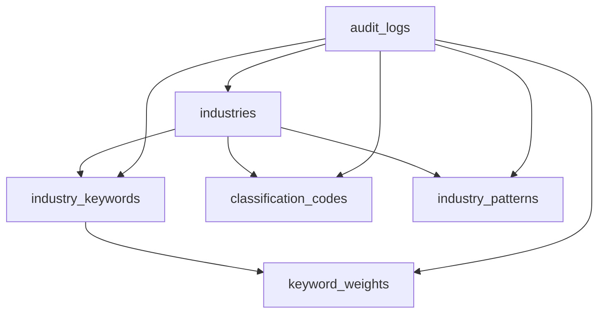

# 🗄️ **Supabase Migration Scripts for Keyword Classification System**

## 📋 **Overview**

This directory contains SQL migration scripts for implementing the keyword classification system in Supabase. The migrations create a comprehensive 7-table schema optimized for dynamic keyword management and industry classification.

## 🚀 **Quick Start**

### **1. Apply the Schema Migration**

1. **Open your Supabase project dashboard**
2. **Navigate to SQL Editor**
3. **Copy and paste the contents of `001_initial_keyword_classification_schema.sql`**
4. **Click "Run" to execute the migration**

### **2. Apply the Data Seeding Migration**

1. **In the same SQL Editor session**
2. **Copy and paste the contents of `002_seed_initial_data.sql`**
3. **Click "Run" to execute the data seeding**

### **3. Verify the Setup**

After running both migrations, you should see:
- **7 tables created** with proper structure
- **26 industries** populated across different categories
- **100+ keywords** with appropriate weights
- **Classification codes** (NAICS, MCC, SIC) for major industries
- **Performance indexes** for optimal queries
- **Security policies** (RLS) for data protection

## 📁 **Migration Files**

### **001_initial_keyword_classification_schema.sql**
- **Purpose**: Creates the complete database schema
- **Tables**: 7 tables with relationships and constraints
- **Features**: Indexes, triggers, RLS policies, audit logging
- **Rollback**: `001_initial_keyword_classification_schema_rollback.sql`

### **002_seed_initial_data.sql**
- **Purpose**: Populates the database with initial data
- **Content**: Industries, keywords, classification codes, patterns
- **Coverage**: Technology, Healthcare, Finance, Retail, Manufacturing, etc.
- **Rollback**: `002_seed_initial_data_rollback.sql`

## 🗂️ **Database Schema Overview**

### **Core Tables**

| Table | Purpose | Key Features |
|-------|---------|--------------|
| `industries` | Industry definitions | Categories, confidence thresholds |
| `industry_keywords` | Keywords per industry | Weights, activation status |
| `classification_codes` | NAICS/MCC/SIC codes | Industry mapping, descriptions |
| `industry_patterns` | Phrase patterns | Pattern matching, confidence scores |
| `keyword_weights` | Dynamic keyword scoring | Usage tracking, context multipliers |
| `audit_logs` | Change tracking | Full audit trail, versioning |
| `migrations` | Migration history | Version control, rollback support |

### **Key Relationships**



## 🔧 **Migration Process**

### **Step-by-Step Execution**

1. **Schema Creation**
   ```sql
   -- Run the schema migration first
   \i 001_initial_keyword_classification_schema.sql
   ```

2. **Data Seeding**
   ```sql
   -- Run the data seeding after schema is created
   \i 002_seed_initial_data.sql
   ```

3. **Verification**
   ```sql
   -- Check that all tables exist
   SELECT table_name FROM information_schema.tables 
   WHERE table_schema = 'public' 
   ORDER BY table_name;
   
   -- Check data population
   SELECT 'industries' as table_name, COUNT(*) as count FROM industries
   UNION ALL
   SELECT 'industry_keywords', COUNT(*) FROM industry_keywords
   UNION ALL
   SELECT 'classification_codes', COUNT(*) FROM classification_codes;
   ```

## 🚨 **Troubleshooting**

### **Common Issues**

#### **1. Migration Fails**
- **Check**: Ensure you have admin access to the database
- **Solution**: Use the service role key for migrations

#### **2. Tables Already Exist**
- **Check**: Verify if previous migrations were run
- **Solution**: Use rollback scripts to reset, then re-run

#### **3. Permission Denied**
- **Check**: Verify RLS policies are correctly configured
- **Solution**: Ensure service role key has full access

### **Debug Commands**

```sql
-- Check migration status
SELECT * FROM migrations ORDER BY applied_at DESC;

-- Verify table structure
\d industries
\d industry_keywords

-- Check RLS policies
SELECT schemaname, tablename, policyname, permissive, roles, cmd, qual 
FROM pg_policies WHERE schemaname = 'public';
```

## 🔄 **Rollback Procedures**

### **Complete Reset**
```sql
-- Rollback data seeding
\i 002_seed_initial_data_rollback.sql

-- Rollback schema (WARNING: This will delete all data!)
\i 001_initial_keyword_classification_schema_rollback.sql
```

### **Partial Reset**
```sql
-- Remove only specific data
DELETE FROM industry_keywords WHERE industry_id IN (SELECT id FROM industries WHERE name != 'General Business');
DELETE FROM industries WHERE name != 'General Business';
```

## 📊 **Post-Migration Verification**

### **Data Validation**

1. **Industry Count**: Should have 26 industries
2. **Keyword Count**: Should have 100+ keywords
3. **Classification Codes**: Should have codes for major industries
4. **Patterns**: Should have phrase patterns for matching

### **Performance Check**

```sql
-- Test keyword search performance
EXPLAIN ANALYZE 
SELECT i.name, ik.keyword, ik.weight 
FROM industries i 
JOIN industry_keywords ik ON i.id = ik.industry_id 
WHERE ik.keyword ILIKE '%tech%' 
AND ik.is_active = true;
```

## 🎯 **Next Steps**

After successful migration:

1. **Test Go Code Connection**: Run the test script
2. **Verify API Endpoints**: Test repository operations
3. **Add Custom Industries**: Extend the system for your needs
4. **Monitor Performance**: Track query performance and optimize
5. **Scale Up**: Add more keywords and industries as needed

## 📚 **Additional Resources**

- **Supabase Documentation**: [supabase.com/docs](https://supabase.com/docs)
- **PostgreSQL Documentation**: [postgresql.org/docs](https://postgresql.org/docs)
- **Row Level Security**: [supabase.com/docs/guides/auth/row-level-security](https://supabase.com/docs/guides/auth/row-level-security)

---

**🎉 Ready to go!** Your keyword classification system is now set up with a robust database foundation.
